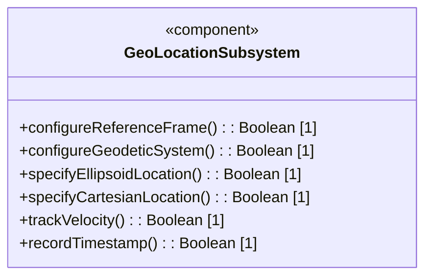
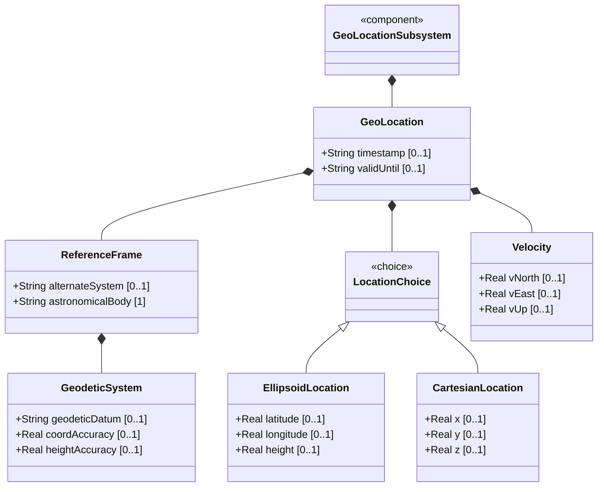
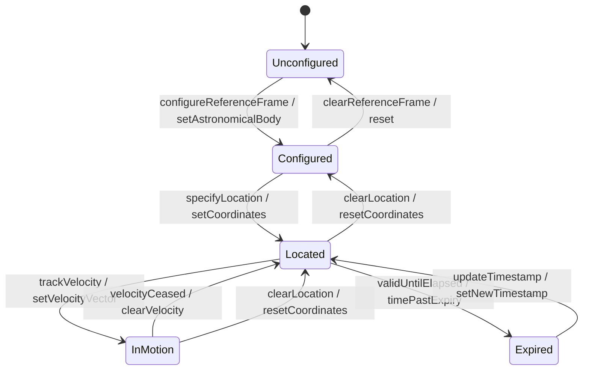

# Epic: ietf-geo-location: Geographic Location

## 1. Context
The IETF has standardized a YANG grouping for specifying geographic locations on or around any astronomical object. RFC 9179 defines the `ietf-geo-location` module which provides a reusable `geo-location` grouping. This grouping captures a frame of reference (astronomical body, geodetic datum, accuracy), location coordinates (ellipsoid or Cartesian), velocity vectors, and temporal metadata. The module supports both Earth-based locations (defaulting to WGS-84) and extraterrestrial contexts (Moon, Mars, comets), as well as alternate coordinate systems for virtual realities.

This Epic covers the complete structural extraction of all container, leaf, choice, and case nodes defined in the `ietf-geo-location@2022-02-11.yang` schema, translating them into platform-independent, implementation-ready Agile feature specifications.

## 2. Requirements & Checklist
- [ ] #1 - [Configure Reference Frame](https://github.com/gintatkinson/dep-tst40/blob/main/docs/features/feat-01-reference-frame.md) (Foundational container for frame of reference: astronomical body selection and alternate system support)
- [ ] #2 - [Configure Geodetic System](https://github.com/gintatkinson/dep-tst40/blob/main/docs/features/feat-02-geodetic-system.md) (Defines coordinate meaning via geodetic-datum and accuracy parameters)
- [ ] #3 - [Specify Ellipsoid Location Coordinates](https://github.com/gintatkinson/dep-tst40/blob/main/docs/features/feat-03-ellipsoid-location.md) (Latitude/longitude/height coordinate capture with ISO 6709:2008 conformance)
- [ ] #4 - [Specify Cartesian Location Coordinates](https://github.com/gintatkinson/dep-tst40/blob/main/docs/features/feat-04-cartesian-location.md) (X/Y/Z Cartesian coordinate capture, mutually exclusive with ellipsoid)
- [ ] #5 - [Track Velocity Vector](https://github.com/gintatkinson/dep-tst40/blob/main/docs/features/feat-05-velocity-vector.md) (3D velocity vector with speed and heading derivation formulas)
- [ ] #6 - [Record Temporal Metadata](https://github.com/gintatkinson/dep-tst40/blob/main/docs/features/feat-06-temporal-metadata.md) (Timestamp and validity window for location data lifecycle management)

### Associated Use Cases & User Stories

#### Associated Use Cases
- [ ] #13 - [Record Geographic Location Using Ellipsoid Coordinates](https://github.com/gintatkinson/dep-tst40/blob/main/docs/use-cases/uc-01-record-ellipsoid-location.md) (Primary deployment scenario for Earth-based geolocation with ISO 6709:2008 conformance)
- [ ] #14 - [Record Geographic Location Using Cartesian Coordinates](https://github.com/gintatkinson/dep-tst40/blob/main/docs/use-cases/uc-02-record-cartesian-location.md) (Non-Earth and virtual reality coordinate system deployment scenario)
- [ ] #15 - [Track Object Motion Using Velocity Vector](https://github.com/gintatkinson/dep-tst40/blob/main/docs/use-cases/uc-03-track-object-motion.md) (Motion tracking with speed/heading derivation and continental drift analysis)
- [ ] #16 - [Export Geolocation to External Portability Formats](https://github.com/gintatkinson/dep-tst40/blob/main/docs/use-cases/uc-04-export-location-formats.md) (Format export to IETF geo: URI, W3C, OGC GML, and Google KML standards)

#### Associated User Stories
- [ ] #8 - [Derive Speed and Heading from Velocity Vector](https://github.com/gintatkinson/dep-tst40/blob/main/docs/user-stories/us-01-derive-speed-heading.md) (Calculates 2D speed and heading from v-north/v-east velocity components using RFC 9179 formulas)
- [ ] #9 - [Manage Location Data Temporal Lifecycle](https://github.com/gintatkinson/dep-tst40/blob/main/docs/user-stories/us-02-temporal-lifecycle.md) (Manages validity windows and expiration detection using timestamp and valid-until)
- [ ] #10 - [Inherit Reference Frame in Nested Locations](https://github.com/gintatkinson/dep-tst40/blob/main/docs/user-stories/us-03-nested-reference-frame.md) (Enables hierarchical reference-frame inheritance for nested location containers)
- [ ] #11 - [Export Geolocation to IETF geo: URI Format](https://github.com/gintatkinson/dep-tst40/blob/main/docs/user-stories/us-04-geo-uri-mapping.md) (Maps YANG geolocation to RFC 5870 geo: URI format for URI-based interoperability)
- [ ] #12 - [Export Geolocation to W3C, GML, and KML Portability Formats](https://github.com/gintatkinson/dep-tst40/blob/main/docs/user-stories/us-05-portability-formats.md) (Maps YANG geolocation to W3C, OGC GML, and Google KML standard portability formats)

## 3. Architecture and System Interaction Diagrams

### Subsystem Component Definition
The Geo Location subsystem provides a standardized interface for specifying and querying geographic locations on any astronomical body, with support for multiple coordinate systems and motion tracking.

### System-Level UML Class Diagram

## 4. State Machine Definitions

### System State Machine Diagram

## 5. Specification Context
The `ietf-geo-location` YANG module (RFC 9179) defines a grouping of a container object for specifying a location on or around an astronomical object (e.g., 'earth'). The module conforms to ISO 6709:2008 for standard representation of geographic point location by coordinates. It supports ellipsoidal coordinates (latitude, longitude, height) and Cartesian coordinates (x, y, z), velocity vectors for motion tracking, and temporal metadata for location staleness detection. The module imports `ietf-yang-types` (RFC 6991) for the `date-and-time` type used in timestamp and valid-until leaves.

Key design decisions:
- Default astronomical body is 'earth' with geodetic-datum 'wgs-84' (World Geodetic System 1984)
- An optional `alternate-systems` feature flag enables specification of alternate coordinate systems (e.g., virtual realities)
- Location is specified via a YANG choice between ellipsoid (latitude/longitude/height) and Cartesian (x/y/z) coordinate forms
- A dedicated IANA registry ("Geodetic System Values") allocates standard names for geodetic systems
- The velocity vector tracks relatively stable motion (including continental drift) and provides formulas for deriving 2D speed and heading

## 6. Source References
Structural Schema: [ietf-geo-location@2022-02-11.yang](https://github.com/YangModels/yang/blob/main/standard/ietf/RFC/ietf-geo-location%402022-02-11.yang)
Normative Specification: [RFC 9179 - A YANG Grouping for Geographic Locations](https://datatracker.ietf.org/doc/rfc9179/)
