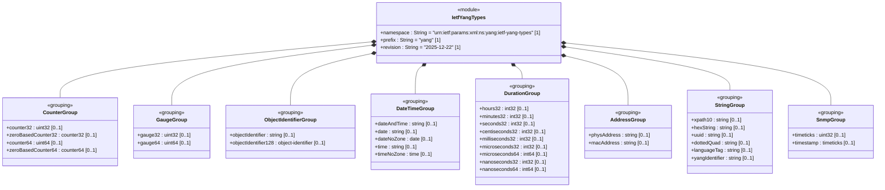
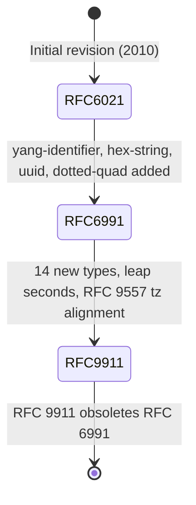

# Epic: ietf-yang-types: Common YANG Data Types

## 1. Context
RFC 9911 defines the `ietf-yang-types` YANG module, a collection of 32 generally useful derived YANG data types organized into logical categories: counter and gauge types for network monitoring, object identifier types for registration hierarchies, date and time types for ISO 8601 temporal representation, time duration types across multiple granularities (hours to nanoseconds), physical address types for hardware addressing, general string types (UUID, dotted-quad, language tags, XPath, YANG identifiers), and SNMP temporal types (timeticks, timestamp). This module obsoletes RFC 6991 and adds 14 new type definitions (date, date-no-zone, time, time-no-zone, hours32, minutes32, seconds32, centiseconds32, milliseconds32, microseconds32, microseconds64, nanoseconds32, nanoseconds64, language-tag) while improving patterns, leap second support, and timezone offset semantics per RFC 9557.

## 2. Requirements & Checklist
- [ ] #17 - [Define Counter Types](https://github.com/gintatkinson/dep-tst40/blob/main/docs/features/feat-17-counter-types.md) (counter32, zero-based-counter32, counter64, zero-based-counter64)
- [ ] #18 - [Define Gauge Types](https://github.com/gintatkinson/dep-tst40/blob/main/docs/features/feat-18-gauge-types.md) (gauge32, gauge64)
- [ ] #19 - [Define Object Identifier Types](https://github.com/gintatkinson/dep-tst40/blob/main/docs/features/feat-19-object-identifier-types.md) (object-identifier, object-identifier-128)
- [ ] #20 - [Define Date and Time Types](https://github.com/gintatkinson/dep-tst40/blob/main/docs/features/feat-20-date-time-types.md) (date-and-time, date, date-no-zone, time, time-no-zone)
- [ ] #21 - [Define Time Duration Types](https://github.com/gintatkinson/dep-tst40/blob/main/docs/features/feat-21-duration-types.md) (hours32, minutes32, seconds32, centiseconds32, milliseconds32, microseconds32, microseconds64, nanoseconds32, nanoseconds64)
- [ ] #22 - [Define Physical Address Types](https://github.com/gintatkinson/dep-tst40/blob/main/docs/features/feat-22-address-types.md) (phys-address, mac-address)
- [ ] #23 - [Define General String Types](https://github.com/gintatkinson/dep-tst40/blob/main/docs/features/feat-23-string-types.md) (xpath1.0, hex-string, uuid, dotted-quad, language-tag, yang-identifier)
- [ ] #24 - [Define SNMP Temporal Types](https://github.com/gintatkinson/dep-tst40/blob/main/docs/features/feat-24-snmp-temporal-types.md) (timeticks, timestamp)

### Associated Use Cases & User Stories
*(To be linked after Phases 2 and 3)*

## 3. Architecture and System Interaction Diagrams

### System-Level UML Class Diagram

### System State Machine Diagram

## 4. Operational Considerations
The `ietf-yang-types` module is a foundational dependency for all YANG data models. It provides the common type vocabulary used throughout the IETF YANG ecosystem. Operational considerations include:

- **SMIv2 Equivalence:** Many types have direct SMIv2 equivalents (Counter32, Gauge32, TimeTicks, etc.), enabling translation between SNMP MIBs and YANG data models. Schema designers must be aware of equivalence constraints.
- **Counter Wrap Awareness:** Monitoring applications must account for counter wrap at 2^32 (497+ days for centisecond timeticks) and 2^64 for counter64 types. Delta calculations must detect wrap discontinuities.
- **Timestamp Lifecycle:** All timestamp values reset to zero when the associated timeticks wraps. Downstream applications must handle this.
- **Timezone Semantics:** The distinction between Z (UTC, unknown local tz) and +00:00 (UTC, known local tz) per RFC 9557 affects date-time comparison logic.
- **Duration Range Selection:** Schema designers must choose between 32-bit and 64-bit duration types based on expected time ranges. nanoseconds32 (±2 seconds) vs nanoseconds64 (±106753 days).

## 5. Security & Governance
These types do not define any protocol-accessible nodes; they only define typedefs. Security considerations arise from how schema designers use these types in actual YANG data models. The same type definitions are used across all IETF YANG modules, making them a single point of governance. The module is maintained by the IETF NETMOD Working Group. RFC 9911 obsoletes RFC 6991, and implementations should migrate to the updated definitions with improved patterns and new types.

## 6. Source References
Structural Schema: [ietf-yang-types@2025-12-22.yang](https://github.com/YangModels/yang/blob/main/standard/ietf/RFC/ietf-yang-types%402025-12-22.yang)
Normative Specification: [RFC 9911 - Common YANG Data Types](https://datatracker.ietf.org/doc/rfc9911/)
