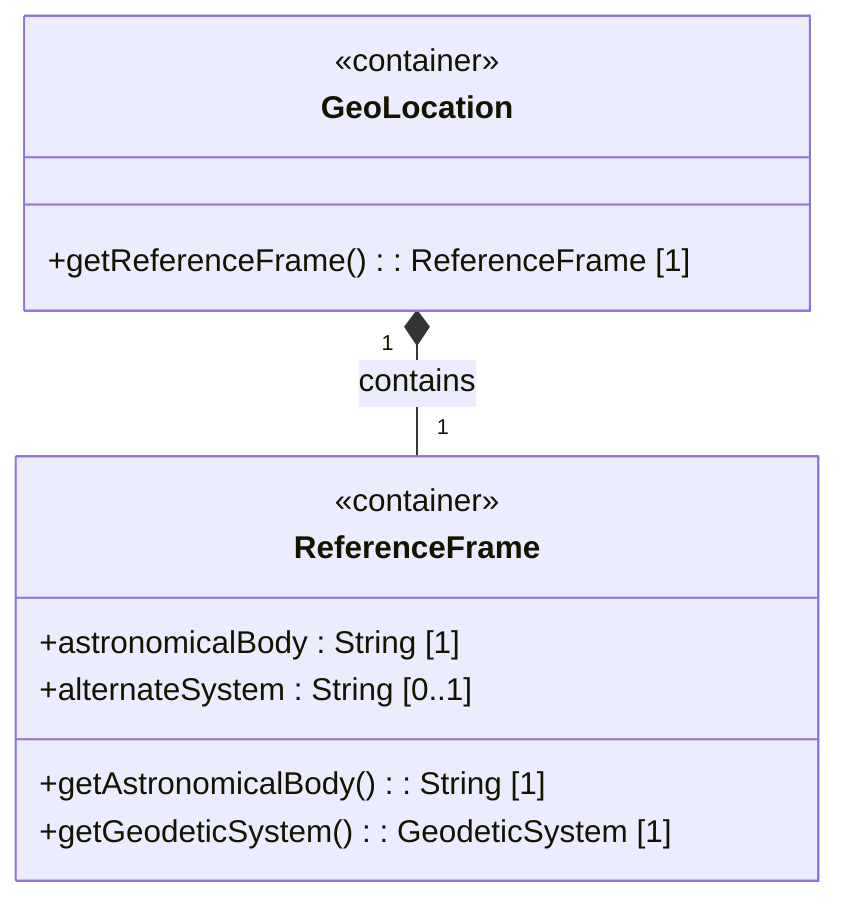

# Feature: Configure Reference Frame

## Parent Epic
- [ ] #1 - [IETF Geo-Location YANG Module](https://github.com/gintatkinson/dep-tst40/blob/main/docs/epics/epic-01-ietf-geo-location.md) (Reference frame is the foundational container for all geolocation data — every location's coordinates and velocity derive their meaning from the reference frame)

## Description
The Reference Frame defines the coordinate system in which all geolocation values are interpreted. It specifies the astronomical body (e.g., Earth, Mars, Enceladus) against which positions and velocities are measured, defaulting to Earth. An optional alternate-system leaf allows for non-natural-universe contexts such as virtual realities, gated behind a feature flag. The reference-frame container is the semantic root of all location data: without it, coordinates and velocities have no meaning.

## UML Class Diagram


## Interface Requirements

### 1. Payload Schema (JSON Example)
```json
{
  "reference-frame": {
    "astronomical-body": "mars",
    "alternate-system": "stargate-grid-7"
  }
}
```
```json
{
  "reference-frame": {
    "astronomical-body": "earth"
  }
}
```

### 2. Validation & Constraints

| Field | Type | Multiplicity | Default | Constraints |
|---|---|---|---|---|
| reference-frame | container | 1 | — | Mandatory when any location data is present |
| astronomical-body | String | 1 | "earth" | Pattern: `[ -@\[-\^_-~]*` (ASCII 32–64, 91–126). No control characters. Uppercase SHOULD be lowercased. Leading "the" SHOULD be stripped. |
| alternate-system | String | 0..1 | absent | Conditionally present only when feature flag `alternate-systems` is enabled. When absent, the natural universe is implied. |

### 3. Logical Operations & Interface Messages

| Operation | Request | Response |
|---|---|---|
| Read Reference Frame | `GET /reference-frame` | Returns current reference-frame container with astronomical-body and optional alternate-system |
| Write / Update Reference Frame | `PUT /reference-frame` | Creates or replaces the reference-frame container; returns the persisted reference-frame |
| Delete Reference Frame | `DELETE /reference-frame` | Removes the reference-frame container; returns confirmation. Must fail if location data (coordinates or velocity) is still present. |

### 4. Logical Exception States & Validation Failures

| Error Code | Condition | Message |
|---|---|---|
| 422 | astronomical-body contains control characters (ASCII < 32 or 127) | "astronomical-body contains invalid control characters" |
| 422 | astronomical-body contains characters outside the allowed pattern | "astronomical-body violates pattern [ -@\\[-\\^_-~]*" |
| 422 | alternate-system provided but feature flag `alternate-systems` is disabled | "alternate-systems feature is not enabled" |
| 409 | Attempt to delete reference-frame while location data (coordinates or velocity) is present | "Cannot delete reference-frame: child location data exists" |
| 422 | reference-frame is absent but coordinates or velocity data is provided | "reference-frame is required when location data is present" |

## Given-When-Then Acceptance Criteria

### AC-01: Default Reference Frame (Earth)
- **Given** no reference-frame has been explicitly configured
- **When** the reference frame is read
- **Then** astronomical-body defaults to "earth" and alternate-system is absent

### AC-02: Set Custom Astronomical Body
- **Given** the system is configured with an alternate-systems feature flag
- **When** the reference frame is written with astronomical-body set to "mars"
- **Then** the stored reference frame contains astronomical-body = "mars" and no alternate-system

### AC-03: Set Reference Frame with Alternate System
- **Given** the alternate-systems feature flag is enabled
- **When** the reference frame is written with astronomical-body = "earth" and alternate-system = "holodeck-alpha"
- **Then** the stored reference frame contains both astronomical-body = "earth" and alternate-system = "holodeck-alpha"

### AC-04: Read Reference Frame Returns Full State
- **Given** a reference frame is configured with astronomical-body = "enceladus" and alternate-system = "virtual-orrery"
- **When** the reference frame is read
- **Then** the response includes both astronomical-body = "enceladus" and alternate-system = "virtual-orrery"

### AC-05: Alternate System Rejected When Feature Is Disabled
- **Given** the alternate-systems feature flag is disabled
- **When** the reference frame is written with alternate-system = "some-system"
- **Then** the operation fails with error 422 and message "alternate-systems feature is not enabled"

### AC-06: Astronomical Body Pattern — Valid Lowercase Name
- **Given** no prior reference frame
- **When** astronomical-body is set to "67p/churyumov-gerasimenko"
- **Then** the value is accepted and stored as "67p/churyumov-gerasimenko"

### AC-07: Astronomical Body Pattern — Control Character Rejected
- **Given** no prior reference frame
- **When** astronomical-body is set to a string containing ASCII 0x07 (BEL)
- **Then** the operation fails with error 422 and message "astronomical-body contains invalid control characters"

### AC-08: Astronomical Body Pattern — DEL Character Rejected
- **Given** no prior reference frame
- **When** astronomical-body is set to "earth\x7F"
- **Then** the operation fails with error 422 and message "astronomical-body contains invalid control characters"

### AC-09: Astronomical Body Pattern — Valid ASCII Range Characters
- **Given** no prior reference frame
- **When** astronomical-body is set to "1p/halley" (characters within ASCII 32–64 and 91–126)
- **Then** the value is accepted and stored

### AC-10: Astronomical Body — Uppercase Normalized to Lowercase
- **Given** no prior reference frame
- **When** astronomical-body is set to "Earth"
- **Then** the stored value is "earth" (uppercase E lowercased)

### AC-11: Astronomical Body — Leading "the" Stripped
- **Given** no prior reference frame
- **When** astronomical-body is set to "the moon"
- **Then** the stored value is "moon" (leading "the " removed)

### AC-12: Astronomical Body — Mixed Case with Leading "the"
- **Given** no prior reference frame
- **When** astronomical-body is set to "The Moon"
- **Then** the stored value is "moon" (leading "the " removed, remaining characters lowercased)

### AC-13: Delete Reference Frame When No Child Location Data
- **Given** a reference frame is configured with astronomical-body = "ceres"
- **When** the reference frame is deleted
- **Then** the operation succeeds and the reference frame is removed

### AC-14: Delete Reference Frame Rejected When Location Data Exists
- **Given** a reference frame is configured and child coordinates or velocity data exists
- **When** an attempt is made to delete the reference frame
- **Then** the operation fails with error 409 and message "Cannot delete reference-frame: child location data exists"

### AC-15: Write Location Data Without Reference Frame Rejected
- **Given** no reference-frame exists
- **When** coordinates or velocity data is written
- **Then** the operation fails with error 422 and message "reference-frame is required when location data is present"

### AC-16: Update Reference Frame Preserves Unmodified Fields
- **Given** a reference frame is configured with astronomical-body = "ceres" and alternate-system = "vr-grid"
- **When** astronomical-body is updated to "mars" without providing alternate-system
- **Then** the stored reference frame has astronomical-body = "mars" and alternate-system remains "vr-grid"

### AC-17: Full Replacement via PUT Discards Unspecified Fields
- **Given** a reference frame is configured with astronomical-body = "enceladus" and alternate-system = "test-sys"
- **When** a PUT operation provides only astronomical-body = "titan"
- **Then** the stored reference frame has astronomical-body = "titan" and alternate-system is absent (full replacement)

### AC-18: Non-ASCII Unicode Rejected in Astronomical Body
- **Given** no prior reference frame
- **When** astronomical-body is set to a string containing a non-ASCII Unicode character (e.g., U+00E9)
- **Then** the operation fails with error 422 and message "astronomical-body violates pattern [ -@\\[-\\^_-~]*"

### AC-19: No Alternate System Implies Natural Universe
- **Given** a reference frame is configured with astronomical-body = "earth" and no alternate-system
- **When** the reference frame is read
- **Then** alternate-system is absent, which semantically implies the natural universe

### AC-20: Orientation Attributes Are Out of Scope
- **Given** the reference-frame container
- **When** a consumer requests orientation data (e.g., heading, pitch, roll) through the reference frame
- **Then** such data is not available, as orientation is outside the scope of this grouping per RFC 9179 Section 2.5

## Specification Context (Verbatim)
The following paragraphs are quoted from RFC 9179.

**Section 2.1:** "The frame of reference ('reference-frame') defines what the location values refer to and their meaning. The referred-to object can be any astronomical body. It could be a planet such as Earth or Mars, a moon such as Enceladus, an asteroid such as Ceres, or even a comet such as 1P/Halley. This value is specified in 'astronomical-body' and is defined by the International Astronomical Union. The default 'astronomical-body' value is 'earth'. Finally, we define an optional feature that allows for changing the system for which the above values are defined. This optional feature adds an 'alternate-system' value to the reference frame. This value is normally not present, which implies the natural universe is the system. The use of this value is intended to allow for creating virtual realities or perhaps alternate coordinate systems. The definition of alternate systems is outside the scope of this document."

**Section 2.5:** "During the development of this module, the question of whether it would support data such as orientation arose. These types of attributes are outside the scope of this grouping because they do not deal with a location but rather describe something more about the object that is at the location."

## 4. Source References
Structural Schema: [ietf-geo-location@2022-02-11.yang](https://github.com/YangModels/yang/blob/main/standard/ietf/RFC/ietf-geo-location%402022-02-11.yang)
Normative Specification: [RFC 9179](https://datatracker.ietf.org/doc/rfc9179/)
