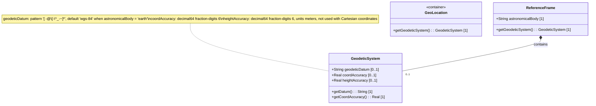

# Feature: Configure Geodetic System

## Parent Epic
- [ ] #7 - [ietf-geo-location: Geographic Location](https://github.com/gintatkinson/dep-tst40/blob/main/docs/epics/epic-01-ietf-geo-location.md) (Geodetic system defines the coordinate meaning, accuracy, and height reference within the reference frame)

## Description
Configures the geodetic system for a location's reference frame. The geodetic system defines how latitude, longitude, and height coordinates are interpreted by specifying a geodetic-datum. It also captures the precision of those coordinates (coord-accuracy) and the precision of height measurements (height-accuracy). When the astronomical body is earth and no geodetic-datum is supplied, the system defaults to WGS-84, the datum used by GPS. Valid geodetic-datum values are drawn from the IANA "Geodetic System Values" registry, which enforces lowercase conversion and space-to-dash normalization on all registered values.

## UML Class Diagram


## Interface Requirements
### 1. Payload Schema (JSON Example)
```json
{
  "reference-frame": {
    "astronomical-body": "earth",
    "geodetic-system": {
      "geodetic-datum": "wgs-84",
      "coord-accuracy": 0.000001,
      "height-accuracy": 0.001
    }
  }
}
```

### 2. Validation & Constraints
- **geodetic-datum**: String matching pattern `[ -@\[-\^_-~]*` (ASCII values 32..64 and 91..126). Control characters and non-ASCII codepoints are rejected. Uppercase letters SHOULD be converted to lowercase. Spaces SHOULD be converted to dashes (`-`) per the IANA registry normalization rules. Defaults to `"wgs-84"` when `astronomical-body` is `"earth"`. No default is implied for other astronomical bodies.
- **coord-accuracy**: decimal64 with exactly 6 fractional digits. Applies to latitude/longitude pairs for ellipsoidal coordinates and to X, Y, Z components for Cartesian coordinates. Overrides the accuracy implied by the geodetic-datum's definition when specified. Values with more than 6 fractional digits MUST be rejected.
- **height-accuracy**: decimal64 with exactly 6 fractional digits. Unit is meters. Overrides the height accuracy implied by the geodetic-datum's definition when specified. Applies only to ellipsoidal coordinates; MUST NOT be applied to Cartesian coordinate systems. Values with more than 6 fractional digits MUST be rejected.
- **IANA Registry**: geodetic-datum values are registered in the IANA "Geodetic System Values" registry under the "YANG Geographic Location Parameters" group. The allocation policy is First Come First Served [RFC 8126]. Initial registered values include: `me` (Mean Earth/Polar Axis Moon), `wgs-84-96`, `wgs-84-08`, `wgs-84` (World Geodetic System 1984).

### 3. Logical Operations & Interface Messages
- **Read Geodetic System**: Retrieve the configured geodetic-datum, coord-accuracy, and height-accuracy for a given reference frame. If geodetic-datum is absent and astronomical-body is earth, the logical response SHALL resolve to `"wgs-84"`.
- **Write/Update Geodetic System**: Set or modify the geodetic-datum, coord-accuracy, and/or height-accuracy. Partial updates are permitted. The system SHALL normalize the geodetic-datum value by applying lowercase conversion and space-to-dash substitution before persisting.
- **Default Geodetic-Datum Resolution**: On read, if `astronomical-body` is `"earth"` and `geodetic-datum` is unset, the resolved value SHALL be `"wgs-84"`. For any other astronomical body, an unset geodetic-datum SHALL return a null/absent value with no default.

### 4. Logical Exception States & Validation Failures
- **INVALID_PATTERN**: geodetic-datum contains characters outside the permitted ASCII range (control characters, non-printable, or non-ASCII). Operation is rejected with a validation error.
- **PRECISION_EXCEEDED**: coord-accuracy or height-accuracy contains more than 6 fractional digits. Operation is rejected with a precision violation error.
- **CARTESIAN_HEIGHT_WARNING**: height-accuracy is specified but the coordinate system is Cartesian. The field SHOULD be ignored (no operational effect), and a warning-level diagnostic MAY be emitted. The write/mutate operation SHALL NOT fail solely due to this condition.
- **MISSING_DATUM_NO_DEFAULT**: geodetic-datum is requested but the astronomical body is not "earth" and no datum has been configured. The field resolves to null/absent.

## Given-When-Then Acceptance Criteria
**Scenario: Default WGS-84 when astronomical body is earth**
- Given a reference frame with astronomical-body set to "earth"
- And the geodetic-system container exists but geodetic-datum is not set
- When the geodetic-datum is read
- Then the resolved value is "wgs-84"

**Scenario: No default datum when astronomical body is not earth**
- Given a reference frame with astronomical-body set to "mars"
- And the geodetic-system container exists but geodetic-datum is not set
- When the geodetic-datum is read
- Then the resolved value is null/absent

**Scenario: Custom geodetic-datum with valid pattern**
- Given a reference frame with any astronomical body
- When the geodetic-datum is set to "wgs-84-08"
- Then the write succeeds and the stored value is "wgs-84-08"

**Scenario: IANA registry value with uppercase normalization**
- Given a reference frame with any astronomical body
- When the geodetic-datum is set to "WGS-84"
- Then the value is normalized to lowercase "wgs-84" before storage

**Scenario: IANA registry value with space-to-dash normalization**
- Given a reference frame with any astronomical body
- When the geodetic-datum is set to "WGS 84"
- Then the value is normalized to "wgs-84" (spaces become dashes, uppercase becomes lowercase)

**Scenario: Pattern validation failure — control character in geodetic-datum**
- Given a reference frame with any astronomical body
- When the geodetic-datum is set to a string containing a control character (e.g., ASCII value 0..31 or 127)
- Then the operation is rejected with error INVALID_PATTERN

**Scenario: Pattern validation failure — non-ASCII character in geodetic-datum**
- Given a reference frame with any astronomical body
- When the geodetic-datum is set to a string containing a non-ASCII character (e.g., "wgs-84é")
- Then the operation is rejected with error INVALID_PATTERN

**Scenario: Pattern validation success — all valid ASCII printable characters**
- Given a reference frame with any astronomical body
- When the geodetic-datum is set to a string using only characters from ASCII ranges 32..64 and 91..126 (e.g., "my-datum_v2.0")
- Then the write succeeds and the value is stored as provided (after normalization)

**Scenario: coord-accuracy with valid 6-fractional-digit precision**
- Given a reference frame with a geodetic system configured
- When coord-accuracy is set to 0.000001 (1e-6, exactly 6 fractional digits)
- Then the write succeeds and the value is stored as 0.000001

**Scenario: coord-accuracy boundary — maximum 6 fractional digits**
- Given a reference frame with a geodetic system configured
- When coord-accuracy is set to 0.123456 (exactly 6 fractional digits)
- Then the write succeeds

**Scenario: coord-accuracy precision violation — 7 fractional digits**
- Given a reference frame with a geodetic system configured
- When coord-accuracy is set to 0.1234567 (7 fractional digits)
- Then the operation is rejected with error PRECISION_EXCEEDED

**Scenario: height-accuracy with valid 6-fractional-digit precision**
- Given a reference frame with a geodetic system and ellipsoidal coordinates
- When height-accuracy is set to 0.001 (exactly 3 fractional digits, within 6-digit limit)
- Then the write succeeds and the value is stored as 0.001 with units "meters"

**Scenario: height-accuracy boundary — exactly 6 fractional digits**
- Given a reference frame with a geodetic system and ellipsoidal coordinates
- When height-accuracy is set to 0.123456
- Then the write succeeds

**Scenario: height-accuracy precision violation — 7 fractional digits**
- Given a reference frame with a geodetic system
- When height-accuracy is set to 0.1234567 (7 fractional digits)
- Then the operation is rejected with error PRECISION_EXCEEDED

**Scenario: height-accuracy with Cartesian coordinates produces warning**
- Given a reference frame with Cartesian coordinates (x, y, z)
- When height-accuracy is set to 0.001
- Then the write succeeds but a warning CARTESIAN_HEIGHT_WARNING is emitted indicating height-accuracy is not applicable

**Scenario: height-accuracy with Cartesian coordinates is ignored at read time**
- Given a reference frame with Cartesian coordinates
- And height-accuracy was previously set to 0.001
- When coordinates are read or processed
- Then the height-accuracy value has no effect on coordinate interpretation

**Scenario: coord-accuracy applies to ellipsoidal coordinates**
- Given a reference frame with ellipsoidal coordinates (latitude, longitude)
- When coord-accuracy is set to 0.0001
- Then the accuracy applies to both latitude and longitude values

**Scenario: coord-accuracy applies to Cartesian coordinates**
- Given a reference frame with Cartesian coordinates (x, y, z)
- When coord-accuracy is set to 0.0001
- Then the accuracy applies to the X, Y, and Z components

**Scenario: coord-accuracy overrides datum-implied defaults**
- Given a reference frame with geodetic-datum set to a datum that implies a default accuracy of 0.01
- When coord-accuracy is explicitly set to 0.001
- Then the explicit coord-accuracy (0.001) overrides the datum-implied default

**Scenario: height-accuracy overrides datum-implied defaults**
- Given a reference frame with geodetic-datum set to a datum that implies a default height accuracy of 0.01 meters
- When height-accuracy is explicitly set to 0.005
- Then the explicit height-accuracy (0.005 meters) overrides the datum-implied default

**Scenario: Geodetic system absent from reference frame**
- Given a reference frame without a geodetic-system container
- When geodetic-datum is read
- Then the resolved value follows the default rule: "wgs-84" if astronomical-body is "earth", otherwise null/absent

**Scenario: IANA registry registered value lookup — "me"**
- Given a reference frame with astronomical-body set to "moon"
- When the geodetic-datum is set to "me"
- Then the write succeeds (value "me" is registered in IANA as Mean Earth/Polar Axis, Moon)

**Scenario: IANA registry registered value lookup — "wgs-84-96"**
- Given a reference frame with astronomical-body set to "earth"
- When the geodetic-datum is set to "wgs-84-96"
- Then the write succeeds (value registered in IANA registry)

## Specification Context (Verbatim)
> Section 2.1: "In addition to identifying the astronomical body, we also need to define the meaning of the coordinates (e.g., latitude and longitude) and the definition of 0-height. This is done with a 'geodetic-datum' value. The default value for 'geodetic-datum' is 'wgs-84' (i.e., the World Geodetic System [WGS84]), which is used by the Global Positioning System (GPS) among many others. We define an IANA registry for specifying standard values for the 'geodetic-datum'. In addition to the 'geodetic-datum' value, we allow overriding the coordinate and height accuracy using 'coord-accuracy' and 'height-accuracy', respectively. When specified, these values override the defaults implied by the 'geodetic-datum' value."

> Section 6.1: "IANA has created the 'Geodetic System Values' registry under the 'YANG Geographic Location Parameters' registry. This registry allocates names for standard geodetic systems. The values SHOULD use an acronym when available, they MUST be converted to lowercase, and spaces MUST be changed to dashes '-'. Each entry should be sufficient to define the two coordinate values and to define height if height is required. The allocation policy for this registry is First Come First Served [RFC8126]. The initial values for this registry are: me (Mean Earth/Polar Axis Moon), wgs-84-96, wgs-84-08, wgs-84 (World Geodetic System 1984)."

## 4. Source References
Structural Schema: [ietf-geo-location@2022-02-11.yang](https://github.com/YangModels/yang/blob/main/standard/ietf/RFC/ietf-geo-location%402022-02-11.yang)
Normative Specification: [RFC 9179](https://datatracker.ietf.org/doc/rfc9179/)

## 5. Logical UI & Layout Bindings
- **Target LUI Component:** PropertyGrid
- **Target Layout Container ID:** sub_elements_table
- **Data Source Bindings:** schema:generic-topology/topology/element[@id='active_focused_element']/geodetic-system
