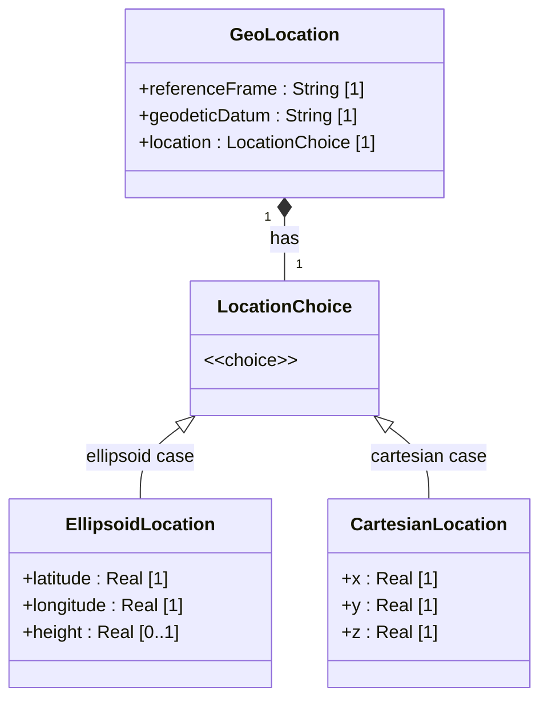

# Feature: Specify Ellipsoid Location Coordinates

## Parent Epic
- [ ] #[EpicIssueID] - [IETF Geo-Location Module](https://github.com/gintatkinson/dep-tst40/blob/main/docs/epics/epic-01-ietf-geo-location.md) (The ellipsoid location is one of two mutually exclusive coordinate forms within the location choice)

## Description
This feature defines ellipsoid (geodetic) coordinate specification on, or relative to, an astronomical body. It provides three coordinate values: latitude and longitude expressed as decimal degrees with 16 fractional digits of precision, and an optional height expressed in meters with 6 fractional digits. The ellipsoid location is one of two mutually exclusive coordinate forms within a `location` choice — the other being Cartesian coordinates (`x`, `y`, `z`). The exact meaning and reference datum for all values is defined by the associated `reference-frame` and `geodetic-datum` parameters, ensuring the coordinate system's origin, orientation, and zero-height surface are unambiguously established.

## UML Class Diagram


## Interface Requirements
### 1. Payload Schema (JSON Example)
```json
{
  "location": {
    "ellipsoid": {
      "latitude": 48.8583424,
      "longitude": 2.3375084,
      "height": 35.0
    }
  }
}
```

### 2. Validation & Constraints
- **latitude**: decimal64 with 16 fraction-digits, units "decimal degrees", implicitly constrained to [-90, +90], mandatory when ellipsoid case is selected
- **longitude**: decimal64 with 16 fraction-digits, units "decimal degrees", implicitly constrained to [-180, +180], mandatory when ellipsoid case is selected
- **height**: decimal64 with 6 fraction-digits, units "meters", optional ([0..1])
- **choice exclusion**: ellipsoid and cartesian coordinate forms are mutually exclusive — exactly one case MUST be selected within the `location` choice; specifying both simultaneously is invalid
- **reference-frame dependency**: the semantic interpretation of latitude, longitude, and height values (including the zero-height reference surface and coordinate origin) is defined by the associated `reference-frame` and `geodetic-datum` parameters
- **ISO 6709:2008**: latitude/longitude values conform to ISO 6709:2008 horizontal position representation (test A.1.2.4); height value conforms to ISO 6709:2008 vertical position representation (test A.1.2.5)

### 3. Logical Operations & Interface Messages
- **Read ellipsoid location**: retrieve the current latitude, longitude, and optional height values for a target entity
- **Write/Update ellipsoid location**: create or modify the ellipsoid coordinate triple, replacing any existing cartesian location (mutual exclusion enforced)
- **Delete ellipsoid location**: remove the ellipsoid case from the location choice, leaving no coordinate specification until a new case is written
- **Switch coordinate form**: transition from Cartesian to ellipsoid (or vice versa) by replacing the location choice case atomically

### 4. Logical Exception States & Validation Failures
- **ERR_LATITUDE_OUT_OF_RANGE**: latitude value is outside the valid range [-90, +90]; operation rejected
- **ERR_LONGITUDE_OUT_OF_RANGE**: longitude value is outside the valid range [-180, +180]; operation rejected
- **ERR_DUAL_COORDINATE_FORM**: both ellipsoid and cartesian location cases are specified simultaneously within the `location` choice; operation rejected
- **ERR_PRECISION_VIOLATION_LATITUDE**: latitude value exceeds 16 fractional digits of precision; operation rejected
- **ERR_PRECISION_VIOLATION_LONGITUDE**: longitude value exceeds 16 fractional digits of precision; operation rejected
- **ERR_PRECISION_VIOLATION_HEIGHT**: height value exceeds 6 fractional digits of precision; operation rejected
- **ERR_MISSING_REQUIRED_FIELD**: ellipsoid case selected but mandatory latitude or longitude is absent; operation rejected

## Given-When-Then Acceptance Criteria

### Valid Coordinate Specifications

**Scenario: Valid latitude and longitude with full 16-digit decimal precision**
- Given a geolocation entity exists with a valid reference-frame and geodetic-datum
- When the ellipsoid location is written with latitude=48.8583424000000000 and longitude=2.3375084000000000
- Then the system stores and returns both values with all 16 fractional digits preserved

**Scenario: Valid latitude and longitude with a positive height**
- Given a geolocation entity exists with a valid reference-frame and geodetic-datum
- When the ellipsoid location is written with latitude=40.73297, longitude=-74.007696, and height=35.0
- Then the system stores and returns latitude=40.73297, longitude=-74.007696, and height=35.000000 with 6 fractional digits preserved

**Scenario: Valid latitude and longitude without optional height**
- Given a geolocation entity exists with a valid reference-frame and geodetic-datum
- When the ellipsoid location is written with latitude=48.8583424 and longitude=2.3375084 (height omitted)
- Then the system stores and returns the latitude and longitude values, and the height field is absent/null

**Scenario: ISO 6709:2008 horizontal position conformance (A.1.2.4)**
- Given an ellipsoid location is configured with latitude and longitude values
- When the horizontal coordinate pair is validated against ISO 6709:2008 Annex A test criteria
- Then the latitude/longitude representation conforms to ISO 6709:2008 horizontal position requirements

**Scenario: ISO 6709:2008 vertical position conformance (A.1.2.5)**
- Given an ellipsoid location is configured with a height value
- When the vertical coordinate is validated against ISO 6709:2008 Annex A test criteria
- Then the height representation conforms to ISO 6709:2008 vertical position requirements

### Boundary Value Scenarios

**Scenario: Latitude at the maximum positive boundary (+90)**
- Given a geolocation entity is configured
- When an ellipsoid location is written with latitude=90.0000000000000000
- Then the system accepts and returns the value

**Scenario: Latitude at the minimum negative boundary (-90)**
- Given a geolocation entity is configured
- When an ellipsoid location is written with latitude=-90.0000000000000000
- Then the system accepts and returns the value

**Scenario: Longitude at the maximum positive boundary (+180)**
- Given a geolocation entity is configured
- When an ellipsoid location is written with longitude=180.0000000000000000
- Then the system accepts and returns the value

**Scenario: Longitude at the minimum negative boundary (-180)**
- Given a geolocation entity is configured
- When an ellipsoid location is written with longitude=-180.0000000000000000
- Then the system accepts and returns the value

**Scenario: Latitude at the equator (zero-degree parallel)**
- Given a geolocation entity is configured
- When an ellipsoid location is written with latitude=0.0000000000000000
- Then the system accepts and returns the value

**Scenario: Longitude at the zero-degree meridian (Prime Meridian crossing)**
- Given a geolocation entity is configured
- When an ellipsoid location is written with longitude=0.0000000000000000
- Then the system accepts and returns the value

**Scenario: Height at zero**
- Given a geolocation entity is configured
- When an ellipsoid location is written with height=0.000000
- Then the system accepts and returns height=0.000000

**Scenario: Height at 6-digit precision boundary**
- Given a geolocation entity is configured
- When an ellipsoid location is written with height=9999.999999 (6 fraction-digits)
- Then the system accepts and returns the value at full precision

**Scenario: Latitude at 16-digit precision boundary**
- Given a geolocation entity is configured
- When an ellipsoid location is written with latitude=89.1234567890123456 (16 fraction-digits)
- Then the system accepts and returns the value at full precision

### Negative / Error Scenarios

**Scenario: Latitude exceeds maximum positive range (+90)**
- Given a geolocation entity is configured
- When an ellipsoid location write is attempted with latitude=90.0000000000000001
- Then the operation is rejected with ERR_LATITUDE_OUT_OF_RANGE

**Scenario: Latitude exceeds maximum negative range (-90)**
- Given a geolocation entity is configured
- When an ellipsoid location write is attempted with latitude=-90.0000000000000001
- Then the operation is rejected with ERR_LATITUDE_OUT_OF_RANGE

**Scenario: Longitude exceeds maximum positive range (+180)**
- Given a geolocation entity is configured
- When an ellipsoid location write is attempted with longitude=180.0000000000000001
- Then the operation is rejected with ERR_LONGITUDE_OUT_OF_RANGE

**Scenario: Longitude exceeds maximum negative range (-180)**
- Given a geolocation entity is configured
- When an ellipsoid location write is attempted with longitude=-180.0000000000000001
- Then the operation is rejected with ERR_LONGITUDE_OUT_OF_RANGE

**Scenario: Both ellipsoid and cartesian coordinates specified simultaneously**
- Given a geolocation entity is configured
- When a location write is attempted with both ellipsoid (latitude, longitude, height) and cartesian (x, y, z) cases specified
- Then the operation is rejected with ERR_DUAL_COORDINATE_FORM

**Scenario: Latitude precision violation — exceeds 16 fraction-digits**
- Given a geolocation entity is configured
- When an ellipsoid location write is attempted with latitude=48.85834240000000009 (17 fractional digits)
- Then the operation is rejected with ERR_PRECISION_VIOLATION_LATITUDE

**Scenario: Longitude precision violation — exceeds 16 fraction-digits**
- Given a geolocation entity is configured
- When an ellipsoid location write is attempted with longitude=2.33750840000000009 (17 fractional digits)
- Then the operation is rejected with ERR_PRECISION_VIOLATION_LONGITUDE

**Scenario: Height precision violation — exceeds 6 fraction-digits**
- Given a geolocation entity is configured
- When an ellipsoid location write is attempted with height=35.0000001 (7 fractional digits)
- Then the operation is rejected with ERR_PRECISION_VIOLATION_HEIGHT

**Scenario: Missing mandatory latitude in ellipsoid case**
- Given a geolocation entity is configured
- When an ellipsoid location write is attempted with longitude=2.3375084 and height=35.0 but no latitude
- Then the operation is rejected with ERR_MISSING_REQUIRED_FIELD

**Scenario: Missing mandatory longitude in ellipsoid case**
- Given a geolocation entity is configured
- When an ellipsoid location write is attempted with latitude=48.8583424 and height=35.0 but no longitude
- Then the operation is rejected with ERR_MISSING_REQUIRED_FIELD

### State Mutation Scenarios

**Scenario: Switching from ellipsoid to Cartesian coordinate form**
- Given a geolocation entity has a stored ellipsoid location (latitude=48.8583424, longitude=2.3375084, height=35.0)
- When the location is updated to a Cartesian form (x=4200000, y=170000, z=4780000)
- Then the previous ellipsoid values are replaced, and only the Cartesian values are returned

**Scenario: Switching from Cartesian to ellipsoid coordinate form**
- Given a geolocation entity has a stored Cartesian location (x=4200000, y=170000, z=4780000)
- When the location is updated to an ellipsoid form (latitude=48.8583424, longitude=2.3375084, height=35.0)
- Then the previous Cartesian values are replaced, and only the ellipsoid values are returned

## Specification Context (Verbatim)

From RFC 9179, Section 2.2:
> "This is the location on, or relative to, the astronomical object. It is specified using two or three coordinate values. These values are given either as 'latitude', 'longitude', and an optional 'height', or as Cartesian coordinates of 'x', 'y', and 'z'. For the standard location choice, 'latitude' and 'longitude' are specified as decimal degrees, and the 'height' value is in fractions of meters. In both choices, the exact meanings of all the values are defined by the 'geodetic-datum' value in Section 2.1."

From RFC 9179, Section 4 (ISO 6709:2008 Conformance):
> "For test A.1.2.4, latitude/longitude values conform. For test A.1.2.5, height value conforms."

From RFC 9179, Appendix A — Examples:
> Example XML instances include latitude=40.73297, longitude=-74.007696 and latitude=48.8583424, longitude=2.3375084, height=35.

## 4. Source References
Structural Schema: [ietf-geo-location@2022-02-11.yang](https://github.com/YangModels/yang/blob/main/standard/ietf/RFC/ietf-geo-location%402022-02-11.yang)
Normative Specification: [RFC 9179](https://datatracker.ietf.org/doc/rfc9179/)

## 5. Logical UI & Layout Bindings
- **Target LUI Component:** PropertyGrid
- **Target Layout Container ID:** details_and_relations_tab
- **Data Source Bindings:** attribute binding from geolocation entity's location/ellipsoid leaf nodes; coordinate values displayed as Real-typed fields with the geodetic-datum and reference-frame shown as context metadata
