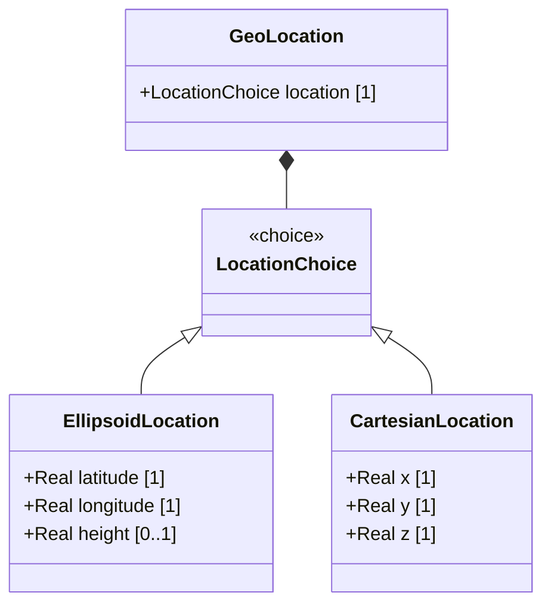

# Feature: Specify Cartesian Location Coordinates

## Parent Epic
- [ ] #[EpicIssueID] - [Epic Title](https://github.com/gintatkinson/dep-tst40/blob/main/docs/epics/epic-01-ietf-geo-location.md) (The Cartesian location is one of two mutually exclusive coordinate forms within the location choice)

## Description
This feature allows the specification of a geographic position using Cartesian (X, Y, Z) coordinates in fractions of meters. The Cartesian location is one alternative within the mutually exclusive `location` choice — the other being ellipsoidal (latitude/longitude/height). The exact semantic meaning of the X, Y, and Z values, including origin and axis orientation, is determined by the `reference-frame` context in which the coordinates are used. All three values share the same decimal precision: six fractional digits. This feature defines the validation rules, payload schema, logical operations, and error states for the Cartesian coordinate representation.

## UML Class Diagram



## Interface Requirements

### 1. Payload Schema (JSON Example)
```json
{
  "location": {
    "cartesian": {
      "x": 12345.678901,
      "y": -98765.432109,
      "z": 42.000000
    }
  }
}
```

### 2. Validation & Constraints
- `x`: decimal64 with 6 fraction-digits, units "meters"
- `y`: decimal64 with 6 fraction-digits, units "meters"
- `z`: decimal64 with 6 fraction-digits, units "meters"
- All three coordinates (x, y, z) use identical precision (6 fractional digits)
- Ellipsoid (latitude/longitude/height) and Cartesian (x/y/z) are mutually exclusive — only one alternative may be present within the `location` choice
- The semantic meaning of x, y, and z values (origin, axis orientation, coordinate system) is defined by the associated `reference-frame`
- `coord-accuracy` applies to Cartesian X/Y/Z components
- `height-accuracy` is NOT applicable to Cartesian coordinates (applies only to ellipsoidal height)

### 3. Logical Operations & Interface Messages
- **Read Cartesian Location**: Retrieve the current values of x, y, and z for the configured location in meters with 6-digit fractional precision
- **Write/Update Cartesian Location**: Set or modify the x, y, and z coordinate values, replacing any previously selected location alternative (ellipsoidal values, if present, are cleared)
- **Delete Cartesian Location**: Remove the Cartesian coordinate values, reverting the location choice to an undefined state

### 4. Logical Exception States & Validation Failures
- `PRECISION_EXCEEDED`: x, y, or z value supplied with more than 6 fractional digits
- `MUTUAL_EXCLUSION_VIOLATION`: both ellipsoidal (latitude/longitude) and Cartesian (x/y/z) coordinates specified simultaneously within the same location choice
- `INVALID_ACCURACY_APPLICATION`: `height-accuracy` applied to Cartesian coordinates (valid only for ellipsoidal height)
- `TYPE_MISMATCH`: non-numeric value supplied for x, y, or z
- `REFERENCE_FRAME_MISSING`: Cartesian coordinates specified without an associated `reference-frame` to define coordinate meaning

## Given-When-Then Acceptance Criteria

### Precision Constraints
- **Given** a Cartesian location payload with x = 123.456789, y = -50.123456, z = 10.987654 (each 6 fractional digits), **When** the system validates the payload, **Then** the validation succeeds and the values are accepted
- **Given** a Cartesian location payload with x = 100.0, y = 200.0, z = 300.0 (fewer than 6 fractional digits), **When** the system validates the payload, **Then** the validation succeeds (values are implicitly extended to 6 fractional digits as 100.000000, 200.000000, 300.000000)
- **Given** a Cartesian location payload with x = 1.2345678 (7 fractional digits), **When** the system validates the payload, **Then** the system returns a PRECISION_EXCEEDED error for the x field
- **Given** a Cartesian location payload with y = 5.1234567 (7 fractional digits), **When** the system validates the payload, **Then** the system returns a PRECISION_EXCEEDED error for the y field
- **Given** a Cartesian location payload with z = 99.1234567 (7 fractional digits), **When** the system validates the payload, **Then** the system returns a PRECISION_EXCEEDED error for the z field
- **Given** a Cartesian location payload with x having exactly 6 fractional digits (boundary valid) and x having 7 fractional digits (boundary invalid), **When** the system validates each, **Then** the 6-digit value is accepted and the 7-digit value is rejected with PRECISION_EXCEEDED

### Mutual Exclusivity (Choice Constraint)
- **Given** a location payload specifying only Cartesian coordinates (x, y, z), **When** the system processes the location, **Then** the Cartesian coordinates are stored and the ellipsoidal coordinates remain unset
- **Given** a location payload specifying only ellipsoidal coordinates (latitude, longitude), **When** the system processes the location, **Then** the ellipsoidal coordinates are stored and the Cartesian coordinates remain unset
- **Given** a location payload specifying both Cartesian (x, y, z) and ellipsoidal (latitude, longitude) coordinates simultaneously, **When** the system validates the payload, **Then** the system returns a MUTUAL_EXCLUSION_VIOLATION error
- **Given** a location currently holding Cartesian (x, y, z) values, **When** the system receives a write containing ellipsoidal (latitude, longitude) values, **Then** the Cartesian values are replaced by the ellipsoidal values (only one alternative persists)
- **Given** a location currently holding ellipsoidal (latitude, longitude) values, **When** the system receives a write containing Cartesian (x, y, z) values, **Then** the ellipsoidal values are replaced by the Cartesian values (only one alternative persists)

### Accuracy Applicability
- **Given** a Cartesian location with coord-accuracy specified, **When** the system validates the location, **Then** coord-accuracy is accepted as applicable to the X, Y, and Z components
- **Given** a Cartesian location with height-accuracy specified, **When** the system validates the location, **Then** the system returns an INVALID_ACCURACY_APPLICATION error (height-accuracy applies only to ellipsoidal height, not to Cartesian z)
- **Given** an ellipsoidal location with height-accuracy specified, **When** the system validates the location, **Then** height-accuracy is accepted as applicable to the height component

### Reference-Frame Dependency
- **Given** Cartesian coordinates (x, y, z) with a defined reference-frame, **When** the system processes the location, **Then** the coordinate meaning (origin, axis orientation) is resolved from the reference-frame
- **Given** Cartesian coordinates (x, y, z) without a defined reference-frame, **When** the system processes the location, **Then** the system returns a REFERENCE_FRAME_MISSING error

### Type & Unit Constraints
- **Given** a payload with x = "abc" (non-numeric), **When** the system validates the payload, **Then** the system returns a TYPE_MISMATCH error for the x field
- **Given** a payload with y = null or omitted while x and z are present, **When** the system validates the payload, **Then** the system returns a validation error requiring all three Cartesian components (x, y, z) to be present
- **Given** valid Cartesian coordinates expressed as decimal64 values with units "meters", **When** the system stores the values, **Then** the unit metadata is preserved and all three coordinates are stored with consistent meter units

### GML Compatibility
- **Given** a Geodetic CRS definition requiring Cartesian coordinates, **When** the system maps the Cartesian location to a GML Concrete CRS type, **Then** the coordinates correspond to a Geodetic CRS with Cartesian coordinate system as defined in RFC 9179 Section 5.1.3

### Delete Semantics
- **Given** a location currently holding Cartesian (x, y, z) values, **When** the system receives a delete operation for the Cartesian location, **Then** all x, y, and z values are removed and the location choice reverts to an unset state

## Specification Context (Verbatim)
> **RFC 9179, Section 2.2:** "This is the location on, or relative to, the astronomical object. It is specified using two or three coordinate values. These values are given either as 'latitude', 'longitude', and an optional 'height', or as Cartesian coordinates of 'x', 'y', and 'z'. For the Cartesian choice, 'x', 'y', and 'z' are in fractions of meters. In both choices, the exact meanings of all the values are defined by the 'geodetic-datum' value in Section 2.1."

> **RFC 9179, Section 5.1.3 (GML):** "GML defines an Abstract CRS type from which Concrete CRS types are derived. This allows for many types of CRS definitions. We are concerned with the Geodetic CRS type, which can have either ellipsoidal or Cartesian coordinates."

## 4. Source References
Structural Schema: [ietf-geo-location@2022-02-11.yang](https://github.com/YangModels/yang/blob/main/standard/ietf/RFC/ietf-geo-location%402022-02-11.yang)
Normative Specification: [RFC 9179](https://datatracker.ietf.org/doc/rfc9179/)
