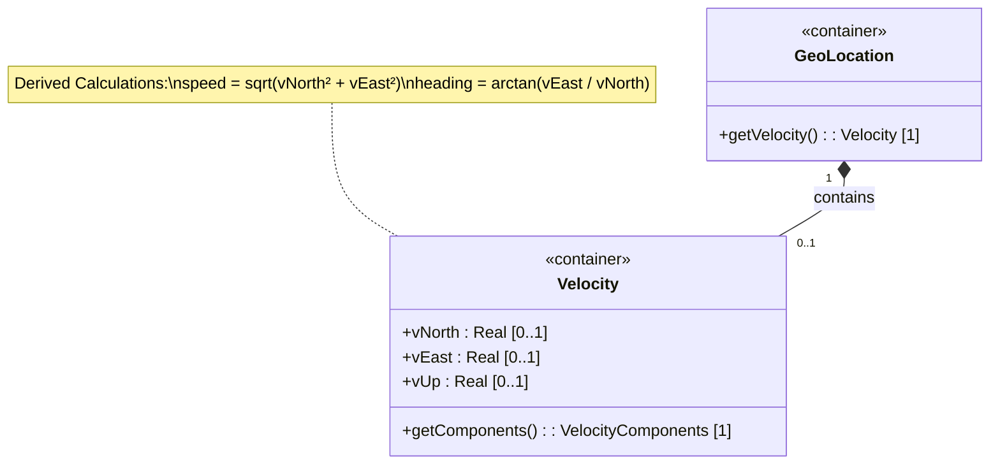

# Feature: Track Velocity Vector

## Parent Epic
- [ ] #1 - [IETF Geo-Location YANG Module](https://github.com/gintatkinson/dep-tst40/blob/main/docs/epics/epic-01-ietf-geo-location.md) (Velocity vector captures object motion relative to the reference frame, supplementing static location data)

## Description
The velocity container captures the three-dimensional motion of an object at the time given by the associated timestamp. It comprises three orthogonal components — v-north (rate of change towards true north), v-east (rate of change perpendicular to the right of true north), and v-up (rate of change away from the center of mass) — all measured in meters per second with 12 fractional digits of precision. These components describe relatively stable motion relative to the reference frame's astronomical body. From the planar components v-north and v-east, the two-dimensional ground speed and heading can be derived: speed is the Euclidean norm sqrt(v_north² + v_east²), and heading is the arctangent arctan(v_east / v_north). Because the vector is intended for objects in relatively stable motion — updated infrequently with high precision — it can track phenomena such as continental drift over long timescales. The velocity container is optional; when absent, the object is assumed stationary. Complex, non-stable motion is out of scope and must be handled by augmenting the data model or increasing query frequency.

## UML Class Diagram


## Interface Requirements

### 1. Payload Schema (JSON Example)
```json
{
  "velocity": {
    "v-north": 0.023456789012,
    "v-east": -0.010987654321,
    "v-up": 0.000000000001
  }
}
```
```json
{
  "velocity": {
    "v-north": 1500.250000000000,
    "v-east": 0.000000000000,
    "v-up": 0.000000000000
  }
}
```
```json
{
  "velocity": {}
}
```

### 2. Validation & Constraints

| Field | Type | Multiplicity | Units | Constraints |
|---|---|---|---|---|
| velocity | container | 0..1 | — | Optional. When absent, the object is considered stationary. |
| v-north | decimal64 | 0..1 | meters per second (m/s) | Fraction-digits: 12. Rate of change towards true north as defined by the geodetic-system. Direction: positive = toward north, negative = toward south. |
| v-east | decimal64 | 0..1 | meters per second (m/s) | Fraction-digits: 12. Rate of change perpendicular to the right of true north as defined by the geodetic-system. Direction: positive = toward east, negative = toward west. |
| v-up | decimal64 | 0..1 | meters per second (m/s) | Fraction-digits: 12. Rate of change away from the center of mass. Perpendicular to the v-north/v-east plane. Direction: positive = away from center of mass (upward). |

### 3. Logical Operations & Interface Messages

| Operation | Request | Response |
|---|---|---|
| Read Velocity Vector | `GET /velocity` | Returns the velocity container with its present v-north, v-east, v-up values (each 12 fractional digits); returns empty container or absent node if no velocity is set |
| Write / Update Velocity Vector | `PUT /velocity` | Creates or replaces the velocity container; returns the persisted velocity with all components |
| Delete Velocity Vector | `DELETE /velocity` | Removes the velocity container; returns confirmation |
| Derive Speed | `GET /velocity/speed` | Returns sqrt(v-north² + v-east²) as a computed value in m/s |
| Derive Heading | `GET /velocity/heading` | Returns arctan(v-east / v-north) as a computed value in radians (or degrees per application convention) |

### 4. Logical Exception States & Validation Failures

| Error Code | Condition | Message |
|---|---|---|
| 422 | v-north has more than 12 fractional digits | "v-north exceeds maximum fractional digits (12)" |
| 422 | v-east has more than 12 fractional digits | "v-east exceeds maximum fractional digits (12)" |
| 422 | v-up has more than 12 fractional digits | "v-up exceeds maximum fractional digits (12)" |
| 422 | v-north is not a valid decimal64 value | "v-north is not a valid decimal64 value" |
| 422 | v-east is not a valid decimal64 value | "v-east is not a valid decimal64 value" |
| 422 | v-up is not a valid decimal64 value | "v-up is not a valid decimal64 value" |
| 422 | v-north and v-east are both zero, heading requested | "Heading is undefined: object is stationary (v-north = 0, v-east = 0)" |
| 422 | v-north is zero, heading requested (v-east non-zero) | "Heading is undefined: division by zero (v-north = 0); heading is ±π/2 (±90°) depending on sign of v-east" |
| 200 | v-north is zero, v-east is positive, heading requested | Returns heading = π/2 (90°) — object moving due east |
| 200 | v-north is zero, v-east is negative, heading requested | Returns heading = −π/2 (−90°) — object moving due west |

## Given-When-Then Acceptance Criteria

### AC-01: Valid Velocity Vector with 12 Decimal Digit Precision
- **Given** a geolocation resource exists
- **When** the velocity vector is written with v-north = 0.023456789012, v-east = -0.010987654321, v-up = 0.000000000001
- **Then** the operation succeeds and the stored values are exactly 0.023456789012, -0.010987654321, and 0.000000000001 respectively

### AC-02: v-north Precision Violation — 13 Fractional Digits Rejected
- **Given** a geolocation resource exists
- **When** the velocity vector is written with v-north = 0.0234567890123 (13 fractional digits)
- **Then** the operation fails with error 422 and message "v-north exceeds maximum fractional digits (12)"

### AC-03: v-east Precision Violation — 13 Fractional Digits Rejected
- **Given** a geolocation resource exists
- **When** the velocity vector is written with v-east = 0.0109876543210 (13 fractional digits)
- **Then** the operation fails with error 422 and message "v-east exceeds maximum fractional digits (12)"

### AC-04: v-up Precision Violation — 13 Fractional Digits Rejected
- **Given** a geolocation resource exists
- **When** the velocity vector is written with v-up = 0.0000000000012 (13 fractional digits)
- **Then** the operation fails with error 422 and message "v-up exceeds maximum fractional digits (12)"

### AC-05: v-north Invalid Decimal — Non-Numeric Value Rejected
- **Given** a geolocation resource exists
- **When** the velocity vector is written with v-north = "abc"
- **Then** the operation fails with error 422 and message "v-north is not a valid decimal64 value"

### AC-06: v-east Invalid Decimal — Non-Numeric Value Rejected
- **Given** a geolocation resource exists
- **When** the velocity vector is written with v-east = true
- **Then** the operation fails with error 422 and message "v-east is not a valid decimal64 value"

### AC-07: v-up Invalid Decimal — Non-Numeric Value Rejected
- **Given** a geolocation resource exists
- **When** the velocity vector is written with v-up = null
- **Then** the operation fails with error 422 and message "v-up is not a valid decimal64 value"

### AC-08: Speed Derivation — Object Moving Northeast
- **Given** a velocity vector is set with v-north = 3.000000000000 and v-east = 4.000000000000
- **When** the derived speed is requested
- **Then** the computed speed is 5.000000000000 m/s (sqrt(3² + 4²) = sqrt(25) = 5)

### AC-09: Speed Derivation — Object Moving Pure North
- **Given** a velocity vector is set with v-north = 10.500000000000 and v-east = 0.000000000000
- **When** the derived speed is requested
- **Then** the computed speed is 10.500000000000 m/s (sqrt(10.5² + 0²) = 10.5)

### AC-10: Speed Derivation — Object Moving Pure East
- **Given** a velocity vector is set with v-north = 0.000000000000 and v-east = 7.250000000000
- **When** the derived speed is requested
- **Then** the computed speed is 7.250000000000 m/s (sqrt(0² + 7.25²) = 7.25)

### AC-11: Speed Derivation — Stationary Object
- **Given** a velocity vector is set with v-north = 0.000000000000 and v-east = 0.000000000000
- **When** the derived speed is requested
- **Then** the computed speed is 0.000000000000 m/s

### AC-12: Heading Derivation — Object Moving Northeast (Quadrant I)
- **Given** a velocity vector is set with v-north = 3.000000000000 and v-east = 4.000000000000
- **When** the derived heading is requested
- **Then** the computed heading is arctan(4/3) ≈ 0.927295218002 radians (≈ 53.13°)

### AC-13: Heading Derivation — Object Moving Northwest (Quadrant II)
- **Given** a velocity vector is set with v-north = -3.000000000000 and v-east = 4.000000000000
- **When** the derived heading is requested
- **Then** the computed heading is arctan(4/-3) ≈ −0.927295218002 radians (≈ −53.13°, or 126.87° corrected for quadrant)

### AC-14: Heading Derivation — Object Moving Pure East (v-north = 0, v-east > 0)
- **Given** a velocity vector is set with v-north = 0.000000000000 and v-east = 5.000000000000
- **When** the derived heading is requested
- **Then** the computed heading is π/2 (90°) — object moving due east

### AC-15: Heading Derivation — Object Moving Negative East / Westward (v-east < 0)
- **Given** a velocity vector is set with v-north = 0.000000000000 and v-east = -5.000000000000
- **When** the derived heading is requested
- **Then** the computed heading is −π/2 (−90°) — object moving due west

### AC-16: Heading Derivation — Stationary Object (v-north = 0, v-east = 0)
- **Given** a velocity vector is set with v-north = 0.000000000000 and v-east = 0.000000000000
- **When** the derived heading is requested
- **Then** the operation fails with error 422 and message "Heading is undefined: object is stationary (v-north = 0, v-east = 0)"

### AC-17: Heading Derivation — Pure North Motion
- **Given** a velocity vector is set with v-north = 10.000000000000 and v-east = 0.000000000000
- **When** the derived heading is requested
- **Then** the computed heading is 0 radians (0°) — object moving due north

### AC-18: Heading Derivation — Pure South Motion (Negative v-north)
- **Given** a velocity vector is set with v-north = -10.000000000000 and v-east = 0.000000000000
- **When** the derived heading is requested
- **Then** the computed heading is π radians (180°) or −π radians (−180°) — object moving due south

### AC-19: Velocity Independent of Location Coordinates
- **Given** a geolocation resource with coordinates set to latitude = -45.0° and longitude = 170.5°
- **When** the velocity vector is written with v-north = 2.500000000000 and v-east = 1.000000000000
- **Then** the velocity values are stored as provided, independent of the coordinate values

### AC-20: Delete Velocity Vector When Set
- **Given** a geolocation resource with a velocity vector set to v-north = 1.000000000000, v-east = 2.000000000000, v-up = 0.000000000000
- **When** the velocity vector is deleted
- **Then** the operation succeeds, the velocity container is removed, and the object is considered stationary

### AC-21: Read Velocity Vector When Not Set
- **Given** a geolocation resource without an explicitly set velocity vector
- **When** the velocity vector is read
- **Then** the response indicates the velocity container is absent or empty (object assumed stationary)

### AC-22: Direction Relative to Geodetic-System True North — Compass Alignment
- **Given** a geolocation resource with a reference frame configured
- **When** the velocity vector is set with v-north = 1.000000000000 and v-east = 0.000000000000
- **Then** the motion is interpreted as directly toward true north as defined by the reference frame's geodetic system (not magnetic north)

### AC-23: v-up Perpendicular to v-north/v-east Plane — Pure Upward Motion
- **Given** a geolocation resource with a velocity vector set to v-north = 0.000000000000, v-east = 0.000000000000, v-up = 0.500000000000
- **When** the velocity components are read
- **Then** v-up = 0.500000000000 represents motion directly away from the center of mass, perpendicular to the horizontal plane defined by v-north and v-east

### AC-24: v-up Positive Direction — Away from Center of Mass
- **Given** a geolocation resource on Earth
- **When** the velocity vector is written with v-up = -0.100000000000
- **Then** the value is stored as -0.100000000000, indicating motion toward the center of mass (negative v-up = downward)

### AC-25: Velocity Vector Optional — Object Without Velocity Considered Stationary
- **Given** a geolocation resource with coordinates but no velocity container
- **When** the geolocation data is read
- **Then** the absence of the velocity container indicates the object is considered stationary

### AC-26: Continental Drift Tracking — Very Slow Movement at High Precision
- **Given** a geolocation resource intended to track continental drift
- **When** the velocity vector is written with v-north = 0.000000025400 and v-east = 0.000000000000 (approximately 0.8 m/year northward drift, expressed in m/s)
- **Then** the values are accepted and stored with full 12-digit fractional precision, suitable for infrequent updates tracking slow tectonic motion

### AC-27: Speed Formula Correctness — Verify Against Known Values
- **Given** a velocity vector is set with v-north = 1.000000000000 and v-east = 1.000000000000
- **When** the derived speed is computed
- **Then** the computed speed is sqrt(2) ≈ 1.414213562373 m/s, matching the formula sqrt(v_north² + v_east²)

### AC-28: Full Velocity Container Replacement
- **Given** a velocity vector is set with v-north = 1.000000000000, v-east = 2.000000000000, v-up = 3.000000000000
- **When** a PUT operation provides only v-north = 5.000000000000
- **Then** the stored velocity has v-north = 5.000000000000 and v-east and v-up are absent (full replacement semantics)

### AC-29: Write v-north at Maximum Precision (12 Fractional Digits) Accepted
- **Given** a geolocation resource exists
- **When** the velocity vector is written with v-north = 999999999999.999999999999 (12 integer digits and 12 fractional digits)
- **Then** the operation succeeds and the value is stored exactly

### AC-30: Read Velocity Vector Returns All Components
- **Given** a velocity vector is set with v-north = 10.123456789012, v-east = -20.210987654321, v-up = 5.000000000000
- **When** the velocity vector is read
- **Then** the response includes all three components with exactly 12 fractional digits of precision each

## Specification Context (Verbatim)
The following paragraphs are quoted from RFC 9179.

**Section 2.3:** "Support is added for objects in relatively stable motion. For objects in relatively stable motion, the grouping provides a three-dimensional vector value. The components of the vector are 'v-north', 'v-east', and 'v-up', which are all given in fractional meters per second. The values 'v-north' and 'v-east' are relative to true north as defined by the reference frame for the astronomical body; 'v-up' is perpendicular to the plane defined by 'v-north' and 'v-east', and is pointed away from the center of mass."

"To derive the two-dimensional heading and speed, one would use the following formulas:
speed = sqrt(v_north^2 + v_east^2)
heading = arctan(v_east / v_north)"

"For some applications that demand high accuracy and where the data is infrequently updated, this velocity vector can track very slow movement such as continental drift."

"Tracking more complex forms of motion is outside the scope of this work. The intent of the grouping being defined here is to identify where something is located, and generally this is expected to be somewhere on, or relative to, Earth (or another astronomical body). At least two options are available to YANG data models that wish to use this grouping with objects that are changing location frequently in non-simple ways. A data model can either add additional motion data to its model directly, or if the application allows, it can require more frequent queries to keep the location data current."

## 4. Source References
Structural Schema: [ietf-geo-location@2022-02-11.yang](https://github.com/YangModels/yang/blob/main/standard/ietf/RFC/ietf-geo-location%402022-02-11.yang)
Normative Specification: [RFC 9179](https://datatracker.ietf.org/doc/rfc9179/)
