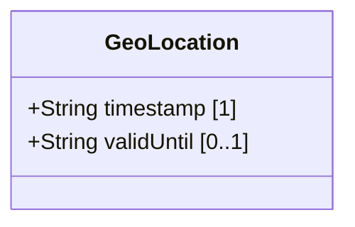

# Feature: Record Temporal Metadata

## Parent Epic
- [ ] #1 - [IETF Geo-Location YANG Module](https://github.com/gintatkinson/dep-tst40/blob/main/docs/epics/epic-01-ietf-geo-location.md) (Temporal metadata provides time-based context for location data, enabling staleness detection and lifecycle management)

## Description
The temporal metadata feature records when a location measurement was taken and, optionally, the time until which the data remains valid. The timestamp captures the moment the geo-location was recorded, expressed as an RFC 3339 date-and-time string with nanosecond precision and optional timezone offset per RFC 6991. The optional valid-until field defines an expiration boundary: when set, the location is considered stale if the current time exceeds valid-until; when absent, the location has no prescribed expiration and remains valid indefinitely. This pairing supports time-bound motion tracking, where the timestamp enables velocity-based interpolation of slow phenomena such as continental drift (per RFC 9179 Section 2.3), and valid-until allows consumers to discard stale data without relying solely on query frequency.

## UML Class Diagram


## Interface Requirements

### 1. Payload Schema (JSON Example)
```json
{
  "timestamp": "2022-02-11T14:30:00Z",
  "valid-until": "2022-02-11T15:30:00+01:00"
}
```
```json
{
  "timestamp": "2022-02-11T14:30:00.123456789-05:00"
}
```
```json
{
  "timestamp": "2022-02-11T14:30:00Z",
  "valid-until": "2022-02-11T14:30:00Z"
}
```

### 2. Validation & Constraints

| Field | Type | Multiplicity | Default | Constraints |
|---|---|---|---|---|
| timestamp | String | 1 | — | Must conform to RFC 3339 date-and-time format as defined by yang:date-and-time per RFC 6991. Mandatory. Fractional seconds (nanosecond precision) and timezone offset are optional but preserved when provided. |
| valid-until | String | 0..1 | absent | When present, must conform to RFC 3339 date-and-time format as defined by yang:date-and-time per RFC 6991. When absent, the location has no expiration time. Logically should be equal to or after timestamp. Timezone offset is optional but preserved. |

### 3. Logical Operations & Interface Messages

| Operation | Request | Response |
|---|---|---|
| Read timestamp | `GET /temporal-metadata/timestamp` | Returns the stored timestamp as an RFC 3339 date-and-time string |
| Write / Update timestamp | `PUT /temporal-metadata/timestamp` | Stores or replaces the timestamp; returns the persisted timestamp |
| Read valid-until | `GET /temporal-metadata/valid-until` | Returns the stored valid-until as an RFC 3339 date-and-time string, or null/absent if not set |
| Write / Update valid-until | `PUT /temporal-metadata/valid-until` | Stores or replaces the valid-until; returns the persisted value |
| Delete valid-until | `DELETE /temporal-metadata/valid-until` | Removes the valid-until field, indicating no expiration; returns confirmation |
| Check if location is expired | `GET /temporal-metadata/expired` | Returns boolean: true if valid-until is set and current time exceeds it; false otherwise |

### 4. Logical Exception States & Validation Failures

| Error Code | Condition | Message |
|---|---|---|
| 422 | timestamp does not conform to RFC 3339 date-and-time format | "timestamp must be a valid RFC 3339 date-and-time" |
| 422 | valid-until does not conform to RFC 3339 date-and-time format | "valid-until must be a valid RFC 3339 date-and-time" |
| 422 | timestamp is missing (required field) | "timestamp is required" |
| 409 | valid-until is before timestamp | "valid-until is before timestamp" — warning: logical inconsistency |
| 410 | Current time exceeds valid-until (location is expired) | "This geo-location has expired" |
| 422 | timestamp is in the far future (beyond system-configured threshold) | "timestamp is in the far future" — accepted but flagged |
| 422 | Timezone offset is missing and system-default timezone is not configured | "timestamp timezone offset is ambiguous" — warning |

## Given-When-Then Acceptance Criteria

### AC-01: Write timestamp in RFC 3339 format with timezone
- **Given** no temporal metadata exists
- **When** timestamp is set to "2022-02-11T14:30:00Z"
- **Then** the value is accepted and stored as "2022-02-11T14:30:00Z"

### AC-02: Write timestamp and valid-until; location is not expired
- **Given** the current time is "2022-02-11T14:00:00Z"
- **When** timestamp is set to "2022-02-11T13:00:00Z" and valid-until is set to "2022-02-11T15:00:00Z"
- **Then** an expiry check returns false (the location has not yet expired)

### AC-03: Valid-until set; location is expired when current time exceeds it
- **Given** the current time is "2022-02-11T16:00:00Z"
- **When** timestamp is set to "2022-02-11T13:00:00Z" and valid-until is set to "2022-02-11T15:00:00Z"
- **Then** an expiry check returns true (current time > valid-until)

### AC-04: Valid-until absent means no expiration
- **Given** temporal metadata is configured with timestamp = "2022-02-11T13:00:00Z" and no valid-until
- **When** the location is queried at any future time
- **Then** the location is never considered expired and valid-until returns null/absent

### AC-05: Timestamp and valid-until equal (instantaneous validity)
- **Given** timestamp is set to "2022-02-11T14:00:00Z"
- **When** valid-until is set to "2022-02-11T14:00:00Z"
- **Then** the values are accepted; the location is expired if current time exceeds 14:00:00Z by any amount

### AC-06: Valid-until before timestamp is accepted but warns
- **Given** timestamp is set to "2022-02-11T14:00:00Z"
- **When** valid-until is set to "2022-02-11T13:00:00Z"
- **Then** the operation succeeds but returns a warning with message "valid-until is before timestamp" indicating logical inconsistency

### AC-07: Timestamp fails RFC 3339 format validation — invalid month
- **Given** no prior temporal metadata
- **When** timestamp is set to "2022-13-11T14:30:00Z" (month 13 is invalid)
- **Then** the operation fails with error 422 and message "timestamp must be a valid RFC 3339 date-and-time"

### AC-08: Timestamp fails RFC 3339 format validation — invalid hour
- **Given** no prior temporal metadata
- **When** timestamp is set to "2022-02-11T25:00:00Z" (hour 25 is invalid)
- **Then** the operation fails with error 422 and message "timestamp must be a valid RFC 3339 date-and-time"

### AC-09: Valid-until fails RFC 3339 format validation — invalid second
- **Given** timestamp is set to "2022-02-11T14:00:00Z"
- **When** valid-until is set to "2022-02-11T14:00:60Z" (second 60 without leap second)
- **Then** the operation fails with error 422 and message "valid-until must be a valid RFC 3339 date-and-time"

### AC-10: GML gml:TimeInstant maps to timestamp
- **Given** a GML observation with gml:TimeInstant value "2022-02-11T14:30:00Z"
- **When** the GML data is ingested
- **Then** the timestamp field is populated with "2022-02-11T14:30:00Z" per RFC 9179 Section 5.1.3

### AC-11: GML gml:TimePeriod start maps to timestamp, end maps to valid-until
- **Given** a GML observation with gml:TimePeriod start "2022-02-11T13:00:00Z" and end "2022-02-11T15:00:00Z"
- **When** the GML data is ingested
- **Then** timestamp is stored as "2022-02-11T13:00:00Z" and valid-until is stored as "2022-02-11T15:00:00Z" per RFC 9179 Section 5.1.3

### AC-12: W3C DOMTimeStamp (milliseconds since epoch) maps to timestamp
- **Given** a W3C DOMTimeStamp value of 1644587400000 (milliseconds since UNIX epoch representing 2022-02-11T13:50:00Z)
- **When** the W3C data is ingested
- **Then** the timestamp field is populated with the equivalent RFC 3339 string per RFC 9179 Section 5.1.2

### AC-13: Timezone offset is preserved on write and read
- **Given** no prior temporal metadata
- **When** timestamp is set to "2022-02-11T14:30:00+05:30"
- **Then** the stored value is "2022-02-11T14:30:00+05:30" with the timezone offset preserved

### AC-14: Fractional seconds (Yang date-and-time nanosecond precision per RFC 6991) preserved
- **Given** no prior temporal metadata
- **When** timestamp is set to "2022-02-11T14:30:00.123456789Z"
- **Then** the value is accepted and the fractional seconds are preserved at full nanosecond precision

### AC-15: Timestamp with fractional seconds truncated to zero preserved
- **Given** no prior temporal metadata
- **When** timestamp is set to "2022-02-11T14:30:00.100000000Z"
- **Then** the trailing zeros after the decimal point are preserved (precision is significant)

### AC-16: Location staleness detected based on timestamp age
- **Given** a location has timestamp = "2022-02-10T00:00:00Z" and no valid-until
- **When** the location is queried at "2022-02-12T00:00:00Z" under a staleness threshold of 24 hours
- **Then** the location is flagged as stale because the timestamp age (48 hours) exceeds the threshold

### AC-17: Timestamp absent (required field) rejected
- **Given** no prior temporal metadata
- **When** an operation attempts to write only valid-until without a timestamp
- **Then** the operation fails with error 422 and message "timestamp is required"

### AC-18: Delete valid-until removes expiration
- **Given** temporal metadata is configured with timestamp = "2022-02-11T13:00:00Z" and valid-until = "2022-02-11T15:00:00Z"
- **When** valid-until is deleted
- **Then** valid-until becomes absent and the location no longer has an expiration

### AC-19: Update timestamp preserves valid-until
- **Given** temporal metadata has timestamp = "2022-02-11T13:00:00Z" and valid-until = "2022-02-11T15:00:00Z"
- **When** timestamp is updated to "2022-02-11T13:30:00Z" without providing valid-until
- **Then** the stored state has timestamp = "2022-02-11T13:30:00Z" and valid-until = "2022-02-11T15:00:00Z"

### AC-20: Read temporal metadata returns full state
- **Given** temporal metadata is configured with timestamp = "2022-02-11T14:30:00Z" and valid-until = "2022-02-11T16:00:00+01:00"
- **When** the temporal metadata is read
- **Then** the response includes timestamp = "2022-02-11T14:30:00Z" and valid-until = "2022-02-11T16:00:00+01:00"

### AC-21: Timestamp in far future is accepted with warning
- **Given** the system-configured future threshold is 1 year
- **When** timestamp is set to a value 10 years into the future
- **Then** the operation succeeds but returns a warning with message "timestamp is in the far future"

### AC-22: Leap second handling (23:59:60)
- **Given** no prior temporal metadata
- **When** timestamp is set to "2016-12-31T23:59:60Z" (a valid leap second per UTC)
- **Then** the value is accepted as valid per RFC 3339 leap second provisions

### AC-23: Valid-RFC 3339 with unknown local offset
- **Given** no prior temporal metadata and the system has no default timezone configured
- **When** timestamp is set to "2022-02-11T14:30:00" (no timezone offset)
- **Then** the operation succeeds but returns a warning with message "timestamp timezone offset is ambiguous"

### AC-24: Valid-until is logically after timestamp
- **Given** timestamp is set to "2022-02-11T14:00:00Z"
- **When** valid-until is set to "2022-02-11T16:00:00Z"
- **Then** the values are accepted with no warning (valid-until is after timestamp)

## Specification Context (Verbatim)
The following paragraphs are quoted from RFC 9179.

**Section 2.3 (Motion):** "For some applications that demand high accuracy and where the data is infrequently updated, this velocity vector can track very slow movement such as continental drift."

**Section 2.3:** "Tracking more complex forms of motion is outside the scope of this work. A data model can either add additional motion data to its model directly, or if the application allows, it can require more frequent queries to keep the location data current."

**Section 5.1.3 (GML):** "GML also defines an observation value in 'gml:Observation', which includes a timestamp value 'gml:validTime' in addition to other components such as 'gml:using', 'gml:target', and 'gml:resultOf'. Only the timestamp is mappable to and from the YANG grouping. Furthermore, 'gml:validTime' can either be an instantaneous measure ('gml:TimeInstant') or a time period ('gml:TimePeriod'). The instantaneous 'gml:TimeInstant' is mappable to and from the YANG grouping 'timestamp' value, and values down to the resolution of seconds for 'gml:TimePeriod' can be mapped using the 'valid-until' node of the YANG grouping."

**Section 5.1.2 (W3C):** "timestamp (DOMTimeStamp): Specifies milliseconds since the UNIX Epoch in a 64-bit unsigned integer. The YANG data model defines the timestamp with arbitrarily large precision by using a string that encompasses all representable values of this timestamp value."

## 4. Source References
Structural Schema: [ietf-geo-location@2022-02-11.yang](https://github.com/YangModels/yang/blob/main/standard/ietf/RFC/ietf-geo-location%402022-02-11.yang)
Normative Specification: [RFC 9179](https://datatracker.ietf.org/doc/rfc9179/)
[RFC 6991: Common YANG Data Types — yang:date-and-time type definition](https://datatracker.ietf.org/doc/rfc6999/)
