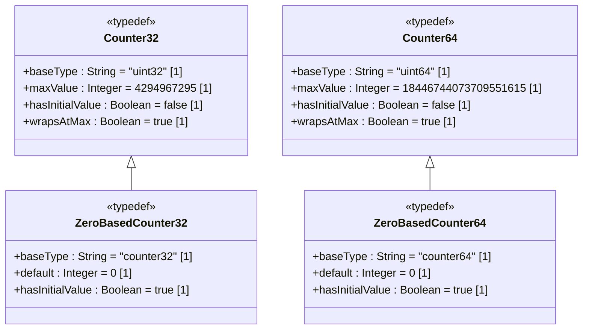

# Feature: Define Counter Types

## Parent Epic
- [ ] #[EpicIssueID] - [ietf-yang-types: Common YANG Data Types](https://github.com/gintatkinson/dep-tst40/blob/main/docs/epics/epic-02-ietf-yang-types.md) (Counter types are foundational monitoring data types for the YANG type library)

## Description
This feature defines four YANG typedefs for monotonically increasing counters that wrap at their maximum value. `counter32` is a uint32-based counter that monotonically increases to 2^32-1 (4294967295) then wraps to 0; it has no defined initial value, MUST NOT be used on configuration schema nodes, and SHOULD NOT carry a default statement. `zero-based-counter32` derives from counter32 with a default of "0", providing a defined initial value of zero. `counter64` is a uint64-based counter that monotonically increases to 2^64-1 (18446744073709551615) then wraps to 0, with the same constraints as counter32 regarding configuration nodes and defaults. `zero-based-counter64` derives from counter64 with a default of "0". Each type is semantically equivalent to its SMIv2 counterpart: Counter32 (SNMPv2-SMI), ZeroBasedCounter32 (RMON2-MIB), Counter64 (SNMPv2-SMI), and ZeroBasedCounter64 (HCNUM-TC) respectively. A single counter value has no information content by itself; delta values are meaningful when read within the minimum wrap time, and discontinuities MUST be documented by a corresponding schema node.

## UML Class Diagram


## Interface Requirements

### 1. Payload Schema
```json
{
  "counter32": 2147483647,
  "zero-based-counter32": 500,
  "counter64": 9223372036854775807,
  "zero-based-counter64": 1000
}
```

### 2. Validation & Constraints

| Type | Base Type | Range | Default | Config Nodes | Initial Value | SMIv2 Equivalent |
|---|---|---|---|---|---|---|
| counter32 | uint32 | 0..4294967295 | SHOULD NOT use default | MUST NOT be used | undefined | Counter32 (SNMPv2-SMI) |
| zero-based-counter32 | counter32 | 0..4294967295 | "0" | allowed | 0 | ZeroBasedCounter32 (RMON2-MIB) |
| counter64 | uint64 | 0..18446744073709551615 | SHOULD NOT use default | MUST NOT be used | undefined | Counter64 (SNMPv2-SMI) |
| zero-based-counter64 | counter64 | 0..18446744073709551615 | "0" | allowed | 0 | ZeroBasedCounter64 (HCNUM-TC) |

- counter32: monotonically increases; wraps to 0 at 4294967295; single value has no information content; discontinuities must be documented by a corresponding schema node; delta values meaningful only if read within minimum wrap time
- zero-based-counter32: same wrapping behavior as counter32; has defined initial value 0; on creation, set to 0 and increases thereafter
- counter64: monotonically increases; wraps to 0 at 18446744073709551615; same discontinuity and delta semantics as counter32
- zero-based-counter64: same wrapping behavior as counter64; has defined initial value 0; on creation, set to 0 and increases thereafter
- All: value MUST NOT decrease between consecutive reads (except wrap); a decrease indicates either a wrap event or a discontinuity

### 3. Logical Operations
| Operation | Description |
|---|---|
| Read counter value | Retrieve the current counter value |
| Calculate delta | Compute difference between two counter readings, accounting for wrap |
| Detect counter wrap | Identify when a counter has wrapped (current < previous) |
| Detect discontinuity | Identify when a counter reset occurred (re-initialization, not wrap) |
| Validate monotonicity | Assert that value has not decreased between consecutive reads (except wrap) |
| Reset zero-based counter | Set zero-based counter to its initial value 0 |
| Determine SMIv2 equivalence | Assert semantic equivalence to the corresponding SMIv2 type |

### 4. Exception States

| Error Code | Condition | Message |
|---|---|---|
| 422 | counter32/counter64 value exceeds max range (2^32-1 / 2^64-1) | "counter value exceeds maximum allowed value" |
| 422 | counter32/counter64 value is negative | "counter value must be non-negative" |
| 422 | counter32/counter64 used on a configuration schema node | "counter32/counter64 MUST NOT be used on configuration schema nodes" |
| 422 | counter32/counter64 has a default statement applied | "default SHOULD NOT be used with counter32/counter64" |
| 422 | monotonicity violation: counter value decreased without wrap | "counter value decreased: discontinuity or wrap event detected" |
| 409 | zero-based counter reset attempted at non-creation point | "zero-based counters can only be reset to initial value on creation" |
| 400 | reading counter without prior reference value | "no prior counter value available; delta cannot be calculated" |
| 422 | discontinuity detected without corresponding discontinuity schema node | "discontinuity must be documented by a corresponding schema node" |

## Given-When-Then Acceptance Criteria

### AC-01: counter32 monotonically increases
- **Given** a counter32 node currently at value 1000
- **When** the counter is updated to 1001
- **Then** the update is accepted and the new value is 1001

### AC-02: counter32 rejects non-monotonic decrease
- **Given** a counter32 node currently at value 1000
- **When** an attempt is made to set the counter to 999
- **Then** the operation fails with error 422 and message "counter value decreased: discontinuity or wrap event detected"

### AC-03: counter32 wraps at 2^32-1
- **Given** a counter32 node currently at value 4294967295
- **When** the counter receives an increment
- **Then** the value wraps to 0 and the wrap event is detectable (current value < previous value)

### AC-04: counter32 wrap is not treated as monotonicity violation
- **Given** a counter32 node previously read at 4294967294
- **When** the counter is read at 1 (having wrapped past 4294967295 and 0)
- **Then** the system identifies this as a wrap event, not a monotonicity violation

### AC-05: counter32 value within uint32 range is accepted
- **Given** no prior counter32 state
- **When** a counter32 node is written with value 2147483647
- **Then** the value is accepted and stored as 2147483647

### AC-06: counter32 rejects value exceeding 2^32-1
- **Given** a counter32 typedef with range 0..4294967295
- **When** an attempt is made to assign the value 4294967296
- **Then** the operation fails with error 422 and message "counter value exceeds maximum allowed value"

### AC-07: counter32 rejects negative value
- **Given** a counter32 typedef derived from uint32
- **When** an attempt is made to assign the value -1
- **Then** the operation fails with error 422 and message "counter value must be non-negative"

### AC-08: counter32 MUST NOT be used on configuration schema nodes
- **Given** a YANG schema node with `config true` using type counter32
- **When** the schema is validated
- **Then** the validation fails with error 422 and message "counter32/counter64 MUST NOT be used on configuration schema nodes"

### AC-09: counter32 SHOULD NOT use a default statement
- **Given** a YANG leaf of type counter32 with a default statement (e.g., `default "0"`)
- **When** the schema is validated
- **Then** a validation warning is raised: "default SHOULD NOT be used with counter32/counter64"

### AC-10: counter32 has no defined initial value
- **Given** a counter32 node is instantiated
- **When** the node value is read before any update
- **Then** the value has no information content; it cannot be assumed to be any specific value (including zero)

### AC-11: counter32 single value has no information content
- **Given** a single read of a counter32 node returning value 5000
- **When** no prior reference value exists
- **Then** the system cannot compute a meaningful delta; attempting to do so returns error 400 and message "no prior counter value available; delta cannot be calculated"

### AC-12: counter32 delta is meaningful with two reads
- **Given** a counter32 node read at time T1 as 1000 and at time T2 as 1500
- **When** the delta is calculated
- **Then** the result is 500 units, representing the change between T1 and T2

### AC-13: counter64 monotonically increases
- **Given** a counter64 node currently at value 5000000000
- **When** the counter is updated to 5000000001
- **Then** the update is accepted and the new value is 5000000001

### AC-14: counter64 rejects non-monotonic decrease
- **Given** a counter64 node currently at value 5000000000
- **When** an attempt is made to set the counter to 4999999999
- **Then** the operation fails with error 422 and message "counter value decreased: discontinuity or wrap event detected"

### AC-15: counter64 wraps at 2^64-1
- **Given** a counter64 node currently at value 18446744073709551615
- **When** the counter receives an increment
- **Then** the value wraps to 0 and the wrap event is detectable

### AC-16: counter64 wrap is not treated as monotonicity violation
- **Given** a counter64 node previously read at 18446744073709551614
- **When** the counter is read at 1 (having wrapped past max and 0)
- **Then** the system identifies this as a wrap event, not a monotonicity violation

### AC-17: counter64 value within uint64 range is accepted
- **Given** no prior counter64 state
- **When** a counter64 node is written with value 9223372036854775807
- **Then** the value is accepted and stored as 9223372036854775807

### AC-18: counter64 rejects value exceeding 2^64-1
- **Given** a counter64 typedef with range 0..18446744073709551615
- **When** an attempt is made to assign the value 18446744073709551616
- **Then** the operation fails with error 422 and message "counter value exceeds maximum allowed value"

### AC-19: counter64 rejects negative value
- **Given** a counter64 typedef derived from uint64
- **When** an attempt is made to assign the value -1
- **Then** the operation fails with error 422 and message "counter value must be non-negative"

### AC-20: counter64 MUST NOT be used on configuration schema nodes
- **Given** a YANG schema node with `config true` using type counter64
- **When** the schema is validated
- **Then** the validation fails with error 422 and message "counter32/counter64 MUST NOT be used on configuration schema nodes"

### AC-21: counter64 SHOULD NOT use a default statement
- **Given** a YANG leaf of type counter64 with a default statement (e.g., `default "0"`)
- **When** the schema is validated
- **Then** a validation warning is raised: "default SHOULD NOT be used with counter32/counter64"

### AC-22: zero-based-counter32 initial value is 0 on creation
- **Given** a zero-based-counter32 node is instantiated
- **When** the node value is read immediately after creation
- **Then** the value is 0 (defined initial value)

### AC-23: zero-based-counter32 has default "0"
- **Given** a YANG leaf of type zero-based-counter32
- **When** the default value is retrieved
- **Then** the default is 0

### AC-24: zero-based-counter32 monotonically increases from 0
- **Given** a zero-based-counter32 node created with initial value 0
- **When** the counter receives incrementing updates
- **Then** the value monotonically increases from 0 toward 2^32-1

### AC-25: zero-based-counter32 wraps at 2^32-1
- **Given** a zero-based-counter32 node currently at value 4294967295
- **When** the counter receives an increment
- **Then** the value wraps to 0 and continues increasing

### AC-26: zero-based-counter32 reject non-monotonic decrease
- **Given** a zero-based-counter32 node currently at value 100
- **When** an attempt is made to set the counter to 50
- **Then** the operation fails with error 422

### AC-27: zero-based-counter32 delta is computable from initial 0
- **Given** a newly created zero-based-counter32 node (value 0) that has incremented to 200
- **When** the delta is calculated between creation (0) and current read (200)
- **Then** the result is exactly 200, because the initial value 0 is a defined reference point

### AC-28: zero-based-counter64 initial value is 0 on creation
- **Given** a zero-based-counter64 node is instantiated
- **When** the node value is read immediately after creation
- **Then** the value is 0 (defined initial value)

### AC-29: zero-based-counter64 has default "0"
- **Given** a YANG leaf of type zero-based-counter64
- **When** the default value is retrieved
- **Then** the default is 0

### AC-30: zero-based-counter64 monotonically increases from 0
- **Given** a zero-based-counter64 node created with initial value 0
- **When** the counter receives incrementing updates
- **Then** the value monotonically increases from 0 toward 2^64-1

### AC-31: zero-based-counter64 wraps at 2^64-1
- **Given** a zero-based-counter64 node currently at value 18446744073709551615
- **When** the counter receives an increment
- **Then** the value wraps to 0 and continues increasing

### AC-32: zero-based-counter64 reject non-monotonic decrease
- **Given** a zero-based-counter64 node currently at value 1000
- **When** an attempt is made to set the counter to 999
- **Then** the operation fails with error 422

### AC-33: zero-based-counter32 is usable on configuration schema nodes
- **Given** a YANG schema node with `config true` using type zero-based-counter32
- **When** the schema is validated
- **Then** the validation passes (zero-based-counter32 is not subject to the config-node prohibition)

### AC-34: zero-based-counter64 is usable on configuration schema nodes
- **Given** a YANG schema node with `config true` using type zero-based-counter64
- **When** the schema is validated
- **Then** the validation passes (zero-based-counter64 is not subject to the config-node prohibition)

### AC-35: counter32 SMIv2 equivalence to Counter32
- **Given** a counter32 typedef defined per RFC 9911 Section 3
- **When** compared to SMIv2 Counter32 (SNMPv2-SMI) in value set and semantics
- **Then** the types are semantically equivalent

### AC-36: zero-based-counter32 SMIv2 equivalence to ZeroBasedCounter32
- **Given** a zero-based-counter32 typedef defined per RFC 9911 Section 3
- **When** compared to SMIv2 ZeroBasedCounter32 (RMON2-MIB) in value set and semantics
- **Then** the types are semantically equivalent

### AC-37: counter64 SMIv2 equivalence to Counter64
- **Given** a counter64 typedef defined per RFC 9911 Section 3
- **When** compared to SMIv2 Counter64 (SNMPv2-SMI) in value set and semantics
- **Then** the types are semantically equivalent

### AC-38: zero-based-counter64 SMIv2 equivalence to ZeroBasedCounter64
- **Given** a zero-based-counter64 typedef defined per RFC 9911 Section 3
- **When** compared to SMIv2 ZeroBasedCounter64 (HCNUM-TC) in value set and semantics
- **Then** the types are semantically equivalent

### AC-39: discontinuity at re-initialization is detectable
- **Given** a counter32 node is re-initialized (e.g., system restart), resetting its value to an undefined state
- **When** the counter is read and its value is lower than the last known value before re-initialization
- **Then** the discontinuity is detected, and the corresponding discontinuity schema node is consulted to record the event

### AC-40: discontinuity without supporting schema node is rejected
- **Given** a counter32 node with no corresponding discontinuity indicator schema node
- **When** a discontinuity event occurs (counter value drops without wrap)
- **Then** the event is logged with error 422 and message "discontinuity must be documented by a corresponding schema node"

### AC-41: delta accounts for single wrap
- **Given** a counter32 node read at T1 as 4294967290 and at T2 as 5 (one wrap)
- **When** the delta is calculated accounting for wrap
- **Then** the result is 11 (delta = max - prev + current + 1)

### AC-42: delta accounts for zero-based-counter32 multiple wraps
- **Given** a zero-based-counter32 wrapping fast enough to wrap n times between reads
- **When** the management station's poll interval exceeds the minimum wrap time
- **Then** the delta is not reliable; data SHOULD be discarded if the actual time between polls exceeds the minimum wrap time

### AC-43: zero-based-counter32 initial value provides usable delta
- **Given** a management station discovers a newly created zero-based-counter32 node at value 50
- **When** the minimum wrap time is known and discovery occurs within it
- **Then** the management station can use the initial value 0 as a reference to compute delta = 50

### AC-44: zero-based-counter64 initial value provides usable delta
- **Given** a management station discovers a newly created zero-based-counter64 node at value 1000
- **When** the minimum wrap time is known and discovery occurs within it
- **Then** the management station can use the initial value 0 as a reference to compute delta = 1000

### AC-45: counter32 at 0 after wrap is distinguishable from fresh counter
- **Given** a counter32 that has wrapped to 0 vs a fresh counter32 at an undefined value that happens to read 0
- **When** the counter value is read as 0 in both cases
- **Then** the wrap scenario can be identified by a prior reading near 2^32-1, whereas the fresh counter has no prior reference; in neither case does 0 alone convey meaningful information

### AC-46: counter64 at 0 after wrap is distinguishable from fresh counter
- **Given** a counter64 that has wrapped to 0 vs a fresh counter64 at an undefined value that happens to read 0
- **When** the counter value is read as 0 in both cases
- **Then** the wrap scenario can be identified by a prior reading near 2^64-1, whereas the fresh counter has no prior reference

### AC-47: zero-based-counter32 reset to initial value at creation only
- **Given** an existing zero-based-counter32 node at value 5000
- **When** an attempt is made to reset it to 0 (outside of creation)
- **Then** the operation fails with error 409 and message "zero-based counters can only be reset to initial value on creation"

### AC-48: zero-based-counter64 reset to initial value at creation only
- **Given** an existing zero-based-counter64 node at value 100000
- **When** an attempt is made to reset it to 0 (outside of creation)
- **Then** the operation fails with error 409 and message "zero-based counters can only be reset to initial value on creation"

## Specification Context (Verbatim)

The following paragraphs are quoted from RFC 9911 Section 3 (counter32 typedef description):

> The counter32 type represents a non-negative integer that monotonically increases until it reaches a maximum value of 2^32-1 (4294967295 decimal), when it wraps around and starts increasing again from zero. Counters have no defined 'initial' value, and thus, a single value of a counter has (in general) no information content. Discontinuities in the monotonically increasing value normally occur at re-initialization of the management system and at other times as specified in the description of a schema node using this type. If discontinuities occur at times other than re-initialization (for example, at the instantiation of a schema node of type counter32), then a corresponding schema node should be defined, with an appropriate type, to indicate the last discontinuity. The counter32 type should not be used for configuration schema nodes. A default statement SHOULD NOT be used in combination with the type counter32. In the value set and its semantics, this type is equivalent to the Counter32 type of the SMIv2.

The following is quoted from RFC 9911 Section 3 (zero-based-counter32 typedef description):

> The zero-based-counter32 type represents a counter32 that has the defined 'initial' value zero. A data tree node using this type will be set to zero (0) on creation and will thereafter increase monotonically until it reaches a maximum value of 2^32-1 (4294967295 decimal), when it wraps around and starts increasing again from zero. Provided that an application discovers a new data tree node using this type within the minimum time to wrap, it can use the 'initial' value as a delta. It is important for a management station to be aware of this minimum time and the actual time between polls, and to discard data if the actual time is too long or there is no defined minimum time. In the value set and its semantics, this type is equivalent to the ZeroBasedCounter32 textual convention of the SMIv2.

## 4. Source References
Structural Schema: [ietf-yang-types@2025-12-22.yang](https://github.com/YangModels/yang/blob/main/standard/ietf/RFC/ietf-yang-types%402025-12-22.yang)
Normative Specification: [RFC 9911](https://datatracker.ietf.org/doc/rfc9911/)
