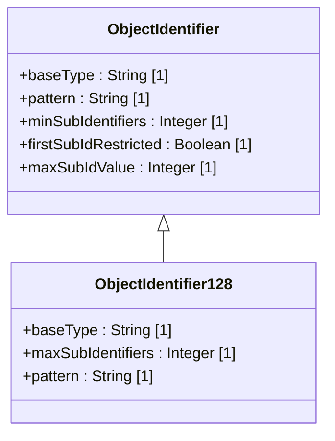

# Feature: Define Object Identifier Types

## Parent Epic
- [ ] #25 - [ietf-yang-types: Common YANG Data Types](https://github.com/gintatkinson/dep-tst40/blob/main/docs/epics/epic-02-ietf-yang-types.md) (Object identifier types enable hierarchical name registration in the YANG type library)

## Description
The object identifier types represent administratively assigned names in a registration-hierarchical-name tree as defined by ASN.1 and ISO 9834-1. The base `object-identifier` type constrains its string representation to a sequence of non-negative integer sub-identifiers separated by single dots, with no whitespace. The first sub-identifier is restricted to 0, 1, or 2. When the first sub-identifier is 0 or 1, the second sub-identifier must not exceed 39. Each sub-identifier must not exceed 2^32-1 (4294967295), and there must be at least two sub-identifiers. The `object-identifier-128` type derives from `object-identifier` and adds a limit of at most 128 sub-identifiers, making it functionally equivalent to the SMIv2 OBJECT IDENTIFIER type. The base `object-identifier` type SHOULD NOT be used to represent SMIv2 OBJECT IDENTIFIER values; `object-identifier-128` SHOULD be used instead.

## UML Class Diagram


## Interface Requirements

### 1. Payload Schema
```json
{ "object-identifier": "1.3.6.1.2.1.1" }
```
```json
{ "object-identifier": "0.0" }
```
```json
{ "object-identifier": "2.999" }
```
```json
{ "object-identifier-128": "1.3.6.1.4.1" }
```
```json
{ "object-identifier-128": "1.3.6.1.2.1.1.1" }
```

### 2. Validation & Constraints

| Constraint | Applicable To | Detail |
|---|---|---|
| Pattern: dot-separated non-negative integers, no whitespace | Both types | String must consist solely of non-negative integers separated by single dots. No leading/trailing dots, no whitespace, no non-digit characters except dots. |
| First sub-identifier restricted to 0, 1, or 2 | object-identifier | Per ASN.1 standard, the first arc of an OID must be 0, 1, or 2. |
| Second sub-identifier max 39 when first is 0 or 1 | object-identifier | Per ASN.1, when the first sub-id is 0 or 1, the second sub-id must be in range 0..39. |
| Minimum 2 sub-identifiers | Both types | At least two integers separated by a dot are required. |
| Each sub-identifier max 2^32-1 (4294967295) | Both types | No individual sub-identifier may exceed 4294967295. |
| No limit on sub-identifier count (practical: 128) | object-identifier | The base type has no explicit upper bound on sub-id count; practical implementations may limit to 128. |
| Maximum 128 sub-identifiers | object-identifier-128 | The derived type restricts the total number of sub-identifiers to 128. |
| SMIv2 equivalence | object-identifier-128 | object-identifier-128 is semantically equivalent to SMIv2 OBJECT IDENTIFIER. |
| SHOULD NOT use base for SMIv2 | object-identifier | object-identifier SHOULD NOT be used to represent SMIv2 OBJECT IDENTIFIER values; use object-identifier-128 instead. |

### 3. Logical Operations & Interface Messages

| Operation | Description |
|---|---|
| Parse OID string | Split the OID string by dots into a sequence of sub-identifier integer values |
| Validate OID structure | Verify all ASN.1 constraints: first sub-id, second sub-id bound, min sub-ids, max sub-id value, sub-id count limit |
| Compare OIDs (prefix matching) | Check if one OID is a prefix of another by comparing sub-identifier sequences |
| Convert between types | Cast from object-identifier to object-identifier-128 if the value has 128 or fewer sub-identifiers; cast from object-identifier-128 to object-identifier by widening |

### 4. Logical Exception States & Validation Failures

| Error Code | Condition | Message |
|---|---|---|
| 422 | First sub-identifier is not 0, 1, or 2 | "First sub-identifier must be 0, 1, or 2" |
| 422 | Second sub-identifier exceeds 39 when first is 0 or 1 | "Second sub-identifier must be 0..39 when first sub-identifier is 0 or 1" |
| 422 | Only one sub-identifier (no dots) | "Object identifier must contain at least two sub-identifiers" |
| 422 | Any sub-identifier exceeds 2^32-1 | "Sub-identifier value exceeds maximum of 4294967295" |
| 422 | object-identifier-128 has more than 128 sub-identifiers | "Object identifier exceeds maximum of 128 sub-identifiers" |
| 422 | Empty string | "Object identifier must not be empty" |
| 422 | Whitespace in value | "Object identifier must not contain whitespace" |
| 422 | Non-integer characters in value | "Object identifier must contain only non-negative integers separated by dots" |
| 422 | Leading dot | "Object identifier must not start with a dot" |
| 422 | Trailing dot | "Object identifier must not end with a dot" |
| 422 | Consecutive dots | "Object identifier must not contain consecutive dots" |
| 422 | Negative sub-identifier | "Sub-identifier must be non-negative" |

## Given-When-Then Acceptance Criteria

### AC-01: Valid OID with first sub-id 0 and second sub-id within bounds
- **Given** a new object-identifier value to validate
- **When** the value is "0.39"
- **Then** the value is accepted as a valid object-identifier

### AC-02: Valid OID with first sub-id 0 and second sub-id at boundary 0
- **Given** a new object-identifier value to validate
- **When** the value is "0.0"
- **Then** the value is accepted as a valid object-identifier

### AC-03: Valid OID with first sub-id 1 and second sub-id within bounds
- **Given** a new object-identifier value to validate
- **When** the value is "1.39"
- **Then** the value is accepted as a valid object-identifier

### AC-04: Valid OID with first sub-id 1 and second sub-id 0
- **Given** a new object-identifier value to validate
- **When** the value is "1.0"
- **Then** the value is accepted as a valid object-identifier

### AC-05: Valid OID with first sub-id 2 and any valid second sub-id
- **Given** a new object-identifier value to validate
- **When** the value is "2.999"
- **Then** the value is accepted as a valid object-identifier

### AC-06: Valid OID with first sub-id 2 and second sub-id 0
- **Given** a new object-identifier value to validate
- **When** the value is "2.0"
- **Then** the value is accepted as a valid object-identifier

### AC-07: Valid OID with multiple sub-identifiers (real-world SNMP example)
- **Given** a new object-identifier value to validate
- **When** the value is "1.3.6.1.2.1.1.1.0"
- **Then** the value is accepted as a valid object-identifier

### AC-08: Valid OID with sub-identifier at 2^32-1 boundary
- **Given** a new object-identifier value to validate
- **When** the value is "2.5.4294967295"
- **Then** the value is accepted as a valid object-identifier

### AC-09: First sub-id 0, second sub-id exceeds 39 — rejected
- **Given** a new object-identifier value to validate
- **When** the value is "0.40"
- **Then** validation fails with error 422 and message "Second sub-identifier must be 0..39 when first sub-identifier is 0 or 1"

### AC-10: First sub-id 1, second sub-id exceeds 39 — rejected
- **Given** a new object-identifier value to validate
- **When** the value is "1.40"
- **Then** validation fails with error 422 and message "Second sub-identifier must be 0..39 when first sub-identifier is 0 or 1"

### AC-11: First sub-id 0, second sub-id at boundary 40 — rejected
- **Given** a new object-identifier value to validate
- **When** the value is "0.40.1"
- **Then** validation fails with error 422 and message "Second sub-identifier must be 0..39 when first sub-identifier is 0 or 1"

### AC-12: First sub-id 1, second sub-id at boundary 40 — rejected
- **Given** a new object-identifier value to validate
- **When** the value is "1.40.1"
- **Then** validation fails with error 422 and message "Second sub-identifier must be 0..39 when first sub-identifier is 0 or 1"

### AC-13: First sub-id out of range (3) — rejected
- **Given** a new object-identifier value to validate
- **When** the value is "3.6"
- **Then** validation fails with error 422 and message "First sub-identifier must be 0, 1, or 2"

### AC-14: First sub-id out of range (4) — rejected
- **Given** a new object-identifier value to validate
- **When** the value is "4.1.2"
- **Then** validation fails with error 422 and message "First sub-identifier must be 0, 1, or 2"

### AC-15: First sub-id negative — rejected
- **Given** a new object-identifier value to validate
- **When** the value is "-1.6"
- **Then** validation fails with error 422 and message "Sub-identifier must be non-negative"

### AC-16: Single sub-identifier (no dots) — rejected
- **Given** a new object-identifier value to validate
- **When** the value is "999"
- **Then** validation fails with error 422 and message "Object identifier must contain at least two sub-identifiers"

### AC-17: Sub-identifier exceeds 2^32-1 — rejected
- **Given** a new object-identifier value to validate
- **When** the value is "1.3.4294967296"
- **Then** validation fails with error 422 and message "Sub-identifier value exceeds maximum of 4294967295"

### AC-18: Sub-identifier exceeds 2^32-1 by one — rejected
- **Given** a new object-identifier value to validate
- **When** the value is "0.0.4294967296"
- **Then** validation fails with error 422 and message "Sub-identifier value exceeds maximum of 4294967295"

### AC-19: Empty string — rejected
- **Given** a new object-identifier value to validate
- **When** the value is ""
- **Then** validation fails with error 422 and message "Object identifier must not be empty"

### AC-20: Whitespace in value — rejected
- **Given** a new object-identifier value to validate
- **When** the value is "1. 3.6"
- **Then** validation fails with error 422 and message "Object identifier must not contain whitespace"

### AC-21: Tab character in value — rejected
- **Given** a new object-identifier value to validate
- **When** the value is "1.\t3.6"
- **Then** validation fails with error 422 and message "Object identifier must not contain whitespace"

### AC-22: Leading dot — rejected
- **Given** a new object-identifier value to validate
- **When** the value is ".1.3.6"
- **Then** validation fails with error 422 and message "Object identifier must not start with a dot"

### AC-23: Trailing dot — rejected
- **Given** a new object-identifier value to validate
- **When** the value is "1.3.6."
- **Then** validation fails with error 422 and message "Object identifier must not end with a dot"

### AC-24: Consecutive dots — rejected
- **Given** a new object-identifier value to validate
- **When** the value is "1..3.6"
- **Then** validation fails with error 422 and message "Object identifier must not contain consecutive dots"

### AC-25: Non-integer characters (letters) — rejected
- **Given** a new object-identifier value to validate
- **When** the value is "1.abc.3"
- **Then** validation fails with error 422 and message "Object identifier must contain only non-negative integers separated by dots"

### AC-26: Non-integer characters (special chars) — rejected
- **Given** a new object-identifier value to validate
- **When** the value is "1.3@.6"
- **Then** validation fails with error 422 and message "Object identifier must contain only non-negative integers separated by dots"

### AC-27: object-identifier-128 within 128 sub-identifiers — accepted
- **Given** a new object-identifier-128 value to validate
- **When** the value has exactly 128 sub-identifiers "0.0.0.0...0" (128 sub-ids)
- **Then** the value is accepted as a valid object-identifier-128

### AC-28: object-identifier-128 with common SNMP OID — accepted
- **Given** a new object-identifier-128 value to validate
- **When** the value is "1.3.6.1.2.1.1.1.0"
- **Then** the value is accepted as a valid object-identifier-128

### AC-29: object-identifier-128 exceeds 128 sub-identifiers — rejected
- **Given** a new object-identifier-128 value to validate
- **When** the value has 129 sub-identifiers
- **Then** validation fails with error 422 and message "Object identifier exceeds maximum of 128 sub-identifiers"

### AC-30: object-identifier-128 at exactly 128 boundary — accepted
- **Given** a new object-identifier-128 value to validate
- **When** the value has exactly 2 sub-identifiers
- **Then** the value is accepted as a valid object-identifier-128

### AC-31: object-identifier-128 with minimum 2 sub-identifiers — accepted
- **Given** a new object-identifier-128 value to validate
- **When** the value is "0.0"
- **Then** the value is accepted as a valid object-identifier-128

### AC-32: SMIv2 OBJECT IDENTIFIER equivalence via object-identifier-128
- **Given** an SMIv2 OBJECT IDENTIFIER value "1.3.6.1.2.1.1"
- **When** the value is parsed and validated as object-identifier-128
- **Then** the value is accepted as valid and is functionally equivalent to the SMIv2 representation

### AC-33: object-identifier SHOULD NOT represent SMIv2 — advisory
- **Given** an SMIv2 OBJECT IDENTIFIER value "1.3.6.1.2.1.1"
- **When** the value is assigned to the base object-identifier type
- **Then** the value is technically valid but a usage advisory is generated recommending object-identifier-128 instead

### AC-34: First sub-id 2, second sub-id large but valid — accepted
- **Given** a new object-identifier value to validate
- **When** the value is "2.4294967295"
- **Then** the value is accepted as a valid object-identifier

### AC-35: ASN.1 standard compliance — first arc 0 maps to itu-t(0)
- **Given** an ASN.1 registration tree
- **When** an object-identifier is set to "0.3.1"
- **Then** the OID corresponds to itu-t(0).identified-organization(3).1 per the ASN.1 registration hierarchy

### AC-36: ASN.1 standard compliance — first arc 1 maps to iso(1)
- **Given** an ASN.1 registration tree
- **When** an object-identifier is set to "1.3.6.1"
- **Then** the OID corresponds to iso(1).identified-organization(3).dod(6).internet(1) per the ASN.1 registration hierarchy

### AC-37: ASN.1 standard compliance — first arc 2 maps to joint-iso-itu-t(2)
- **Given** an ASN.1 registration tree
- **When** an object-identifier is set to "2.16.840"
- **Then** the OID corresponds to joint-iso-itu-t(2).country(16).us(840) per the ASN.1 registration hierarchy

### AC-38: ISO 9834-1 reference conformance — OID as hierarchical name
- **Given** an ISO 9834-1 compliant registration tree
- **When** a new object-identifier is minted as "1.3.6.1.4.1.99999"
- **Then** the OID represents an administratively assigned name in the enterprise subtree per ISO 9834-1 registration procedures

### AC-39: Canonical dot notation preserved on round-trip
- **Given** an object-identifier value "1.2.3.4"
- **When** the value is written and then read back
- **Then** the stored value is exactly "1.2.3.4" with no whitespace, no leading zeros, and no trailing dot

### AC-40: Integer sequence with leading zeros — accepted but normalized
- **Given** a new object-identifier value to validate
- **When** the value is "01.003.006"
- **Then** the value is accepted and normalized to "1.3.6" (leading zeros stripped per integer semantics)

### AC-41: All sub-identifiers zero — accepted
- **Given** a new object-identifier value to validate
- **When** the value is "0.0"
- **Then** the value is accepted as a valid object-identifier

### AC-42: OID with exactly 39 as second sub-id under first=0 — boundary accepted
- **Given** a new object-identifier value to validate
- **When** the value is "0.39.100"
- **Then** the value is accepted as a valid object-identifier

### AC-43: OID with exactly 39 as second sub-id under first=1 — boundary accepted
- **Given** a new object-identifier value to validate
- **When** the value is "1.39.200"
- **Then** the value is accepted as a valid object-identifier

### AC-44: Conversion from object-identifier to object-identifier-128 when within 128 sub-ids
- **Given** a valid object-identifier "2.25.12345" with 3 sub-identifiers
- **When** the value is converted to object-identifier-128
- **Then** the conversion succeeds and the resulting object-identifier-128 is "2.25.12345"

### AC-45: Conversion from object-identifier-128 to object-identifier (widening)
- **Given** a valid object-identifier-128 "1.3.6.1.4.1"
- **When** the value is converted to object-identifier
- **Then** the conversion succeeds and the resulting object-identifier is "1.3.6.1.4.1"

### AC-46: Prefix matching — two OIDs with shared prefix
- **Given** OID A is "1.3.6.1.2" and OID B is "1.3.6.1.2.1.1"
- **When** a prefix match is performed checking if A is a prefix of B
- **Then** the result is true (A is a valid prefix of B)

### AC-47: Prefix matching — OIDs with different branches
- **Given** OID A is "1.3.6.1.2" and OID B is "1.3.6.1.4"
- **When** a prefix match is performed checking if A is a prefix of B
- **Then** the result is false (sub-id at position 5 differs: 2 vs 4)

### AC-48: OID with very long sub-id near 2^32-1 boundary — accepted
- **Given** a new object-identifier value to validate
- **When** the value is "2.25.4294967295"
- **Then** the value is accepted as a valid object-identifier

### AC-49: Control character embedded in value — rejected
- **Given** a new object-identifier value to validate
- **When** the value contains an ASCII control character (e.g., NUL)
- **Then** validation fails with error 422 and message "Object identifier must contain only non-negative integers separated by dots"

### AC-50: Unicode character in value — rejected
- **Given** a new object-identifier value to validate
- **When** the value is "1.\u03B1.3"
- **Then** validation fails with error 422 and message "Object identifier must contain only non-negative integers separated by dots"

## Specification Context (Verbatim)
> The object-identifier type represents administratively assigned names in a registration-hierarchical-name tree. Values are denoted as a sequence of numerical non-negative sub-identifier values. Each sub-identifier MUST NOT exceed 2^32-1. The ASN.1 standard restricts the value space of the first sub-identifier to 0, 1, or 2. The second sub-identifier is restricted to 0..39 if first is 0 or 1. ASN.1 requires at least two sub-identifiers.

## 4. Source References
Structural Schema: [ietf-yang-types@2025-12-22.yang](https://github.com/YangModels/yang/blob/main/standard/ietf/RFC/ietf-yang-types%402025-12-22.yang)
Normative Specification: [RFC 9911](https://datatracker.ietf.org/doc/rfc9911/)
