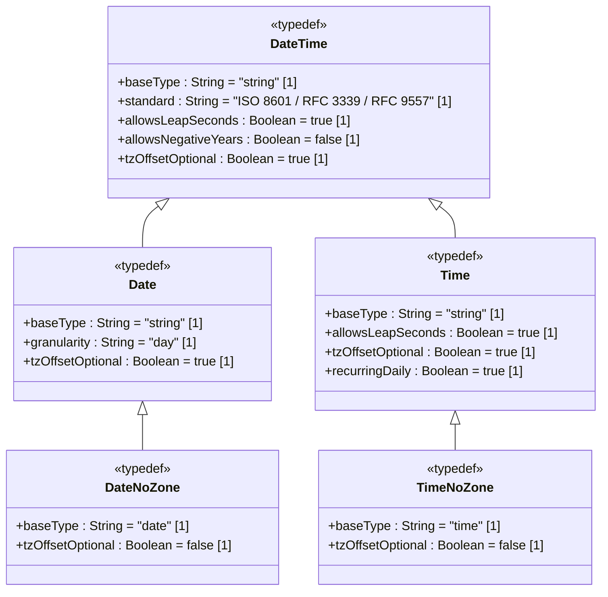

# Feature: Define Date and Time Types

## Parent Epic
- [ ] #8 - [ietf-yang-types: Common YANG Data Types](https://github.com/gintatkinson/dep-tst40/blob/main/docs/epics/epic-02-ietf-yang-types.md) (Date and time types provide ISO 8601 temporal representation for the YANG type library)

## Description
This feature defines five typedefs for temporal values based on the ISO 8601 standard, implemented as a profile conforming to RFC 3339 date-time production with the RFC 9557 update. The `date-and-time` type represents a specific instant in time with optional fractional seconds, leap second support (seconds=60), and timezone offset semantics where `Z` denotes UTC with unknown local timezone reference point while `+00:00` denotes UTC with known local timezone reference point at UTC. Negative years are disallowed, and the type is compatible with XML schema dateTime. The `date` type represents a 24-hour calendar day interval with optional timezone offset, compatible with XML schema date, with the same `Z`/offset distinction. The `date-no-zone` type derives from `date` but prohibits any timezone offset, representing a date without timezone information. The `time` type represents an instance of time of zero duration that recurs every day, with optional fractional seconds, leap second support, and timezone offset semantics identical to `date-and-time`; it is compatible with XML schema time. The `time-no-zone` type derives from `time` but prohibits any timezone offset, representing a time value without timezone information. All five types use the YANG `string` base type with pattern-based lexical constraints.

## UML Class Diagram


## Interface Requirements
### 1. Payload Schema
```json
{
  "date-and-time": "2025-12-22T14:30:00Z",
  "date": "2025-12-22",
  "date-no-zone": "2025-12-22",
  "time": "14:30:00+01:00",
  "time-no-zone": "14:30:00"
}
```
```json
{
  "date-and-time": "2016-12-31T23:59:60Z"
}
```
```json
{
  "date-and-time": "2025-12-22T14:30:00.123456789+05:30",
  "time": "23:59:60.500-04:00"
}
```

### 2. Validation & Constraints

| Field | Type | Multiplicity | Default | Constraints |
|---|---|---|---|---|
| date-and-time | String | 0..1 | absent | Pattern: `^\d{4}-\d{2}-\d{2}T\d{2}:\d{2}:\d{2}(\.\d+)?(Z\|[\+\-]\d{2}:\d{2})$`. RFC 3339 date-time production with RFC 9557 update. Seconds may be 60 (leap second). No negative years. `Z` = UTC with unknown local timezone. `+00:00` = UTC with known local timezone ref UTC. Compatible with XML schema dateTime. |
| date | String | 0..1 | absent | Pattern: `^\d{4}-\d{2}-\d{2}(Z\|[\+\-]\d{2}:\d{2})?$`. 24-hour interval. No negative years. Compatible with XML schema date. Zone semantics same as date-and-time. |
| date-no-zone | String | 0..1 | absent | Pattern: `^\d{4}-\d{2}-\d{2}$`. Derived from date. No timezone offset permitted. |
| time | String | 0..1 | absent | Pattern: `^\d{2}:\d{2}:\d{2}(\.\d+)?(Z\|[\+\-]\d{2}:\d{2})?$`. Instance of time recurring daily. Seconds may be 60. Compatible with XML schema time. Zone semantics same as date-and-time. |
| time-no-zone | String | 0..1 | absent | Pattern: `^\d{2}:\d{2}:\d{2}(\.\d+)?$`. Derived from time. No timezone offset permitted. |

### 3. Logical Operations
| Operation | Request | Response |
|---|---|---|
| Parse date-and-time from string | `POST /typedef/date-and-time/parse` with body `{ "value": "2025-12-22T14:30:00Z" }` | Returns parsed structured representation |
| Format date-and-time to canonical representation | `GET /typedef/date-and-time/canonical?value=2025-12-22T14:30:00+05:30` | Returns `"2025-12-22T09:00:00Z"` (canonical with numeric offset for known tz, Z for unknown) |
| Compare date-and-time values with timezone awareness | `POST /typedef/date-and-time/compare` with body `{ "a": "2025-12-22T14:30:00Z", "b": "2025-12-22T15:30:00+01:00" }` | Returns `-1` (a < b since both resolve to same instant but a is 30 min earlier) |
| Extract date component from date-and-time | `POST /typedef/date-and-time/to-date` with body `{ "value": "2025-12-22T14:30:00Z" }` | Returns `"2025-12-22"` |
| Extract time component from date-and-time | `POST /typedef/date-and-time/to-time` with body `{ "value": "2025-12-22T14:30:00Z" }` | Returns `"14:30:00Z"` |
| Validate leap second value | `POST /typedef/date-and-time/validate` with body `{ "value": "2016-12-31T23:59:60Z" }` | Returns `true` (valid leap second) |
| Resolve timezone offset to UTC | `POST /typedef/date-and-time/resolve-utc` with body `{ "value": "2025-12-22T14:30:00+05:30" }` | Returns `"2025-12-22T09:00:00Z"` |
| Parse date | `POST /typedef/date/parse` with body `{ "value": "2025-12-22" }` | Returns parsed structured representation |
| Parse date-no-zone | `POST /typedef/date-no-zone/parse` with body `{ "value": "2025-12-22" }` | Returns parsed structured representation |
| Parse time | `POST /typedef/time/parse` with body `{ "value": "14:30:00+01:00" }` | Returns parsed structured representation |
| Parse time-no-zone | `POST /typedef/time-no-zone/parse` with body `{ "value": "14:30:00" }` | Returns parsed structured representation |

### 4. Exception States
| Error Code | Condition | Message |
|---|---|---|
| 422 | date-and-time has invalid month (13+) | "date-and-time: month must be 01–12" |
| 422 | date-and-time has invalid day for month (e.g., Feb 30) | "date-and-time: day is invalid for the given month" |
| 422 | date-and-time has invalid hour (24+) | "date-and-time: hour must be 00–23" |
| 422 | date-and-time has invalid minute (60+) | "date-and-time: minute must be 00–59" |
| 422 | date-and-time has invalid second (61+ when not leap second) | "date-and-time: second must be 00–59, or 60 for a valid leap second" |
| 422 | date-and-time has negative year | "date-and-time: negative years are not permitted" |
| 422 | date-and-time is missing required timezone offset | "date-and-time: timezone offset is required" |
| 422 | date-no-zone contains timezone offset | "date-no-zone: timezone offset is not permitted" |
| 422 | time-no-zone contains timezone offset | "time-no-zone: timezone offset is not permitted" |
| 422 | date has invalid month (13+) | "date: month must be 01–12" |
| 422 | date has invalid day for month (e.g., Feb 30) | "date: day is invalid for the given month" |
| 422 | date has negative year | "date: negative years are not permitted" |
| 422 | time has invalid hour (24+) | "time: hour must be 00–23" |
| 422 | time has invalid minute (60+) | "time: minute must be 00–59" |
| 422 | time has invalid second (61+ when not leap second) | "time: second must be 00–59, or 60 for a valid leap second" |
| 422 | timezone offset exceeds maximum range (+14:00 max) | "date-and-time: timezone offset must be within −12:00 to +14:00" |
| 422 | date-and-time does not match RFC 3339 date-time production | "date-and-time: value must conform to RFC 3339 date-time format per RFC 9557" |

## Given-When-Then Acceptance Criteria

### AC-01: Valid date-and-time in RFC 3339 format with Z offset
- **Given** no prior temporal value
- **When** date-and-time is set to "2025-12-22T14:30:00Z"
- **Then** the value is accepted and stored as "2025-12-22T14:30:00Z"

### AC-02: Valid date-and-time with leap second (23:59:60)
- **Given** the date 2016-12-31 is a known leap second day
- **When** date-and-time is set to "2016-12-31T23:59:60Z"
- **Then** the value is accepted as valid per RFC 3339 leap second provisions

### AC-03: Z timezone offset semantics — UTC with unknown local timezone
- **Given** the date-and-time value "2025-12-22T14:30:00Z"
- **When** the timezone offset is resolved and the local reference point is queried
- **Then** the value resolves to UTC with the local timezone reference point marked as unknown

### AC-04: +00:00 timezone offset semantics — UTC with known local timezone ref UTC
- **Given** the date-and-time value "2025-12-22T14:30:00+00:00"
- **When** the timezone offset is resolved and the local reference point is queried
- **Then** the value resolves to UTC with the local timezone reference point confirmed as UTC

### AC-05: Valid date in YYYY-MM-DD format
- **Given** no prior temporal value
- **When** date is set to "2025-12-22"
- **Then** the value is accepted as a valid ISO 8601 / XML schema date

### AC-06: Valid date with timezone offset
- **Given** no prior temporal value
- **When** date is set to "2025-12-22+05:30"
- **Then** the value is accepted with the timezone offset preserved

### AC-07: Valid date-no-zone without timezone offset
- **Given** no prior temporal value
- **When** date-no-zone is set to "2025-12-22"
- **Then** the value is accepted

### AC-08: Valid time with timezone offset
- **Given** no prior temporal value
- **When** time is set to "14:30:00+01:00"
- **Then** the value is accepted with the timezone offset preserved

### AC-09: Valid time-no-zone without timezone offset
- **Given** no prior temporal value
- **When** time-no-zone is set to "14:30:00"
- **Then** the value is accepted

### AC-10: date-no-zone rejects timezone offset (Z)
- **Given** no prior temporal value
- **When** date-no-zone is set to "2025-12-22Z"
- **Then** the operation fails with error 422 and message "date-no-zone: timezone offset is not permitted"

### AC-11: date-no-zone rejects timezone offset (+01:00)
- **Given** no prior temporal value
- **When** date-no-zone is set to "2025-12-22+01:00"
- **Then** the operation fails with error 422 and message "date-no-zone: timezone offset is not permitted"

### AC-12: time-no-zone rejects timezone offset (Z)
- **Given** no prior temporal value
- **When** time-no-zone is set to "14:30:00Z"
- **Then** the operation fails with error 422 and message "time-no-zone: timezone offset is not permitted"

### AC-13: time-no-zone rejects timezone offset (+01:00)
- **Given** no prior temporal value
- **When** time-no-zone is set to "14:30:00+01:00"
- **Then** the operation fails with error 422 and message "time-no-zone: timezone offset is not permitted"

### AC-14: ISO 8601 conformance — date-and-time with fractional seconds
- **Given** no prior temporal value
- **When** date-and-time is set to "2025-12-22T14:30:00.123456789Z"
- **Then** the value is accepted with fractional seconds preserved at full precision

### AC-15: XML schema dateTime compatibility — date-and-time without fractional seconds
- **Given** no prior temporal value
- **When** date-and-time is set to "2025-12-22T14:30:00+05:30"
- **Then** the value is accepted as compatible with XML schema dateTime lexical representation

### AC-16: Canonical format uses Z for unknown local timezone
- **Given** a date-and-time value of "2025-12-22T14:30:00.000Z" (unknown local timezone)
- **When** the canonical representation is requested
- **Then** the output uses "Z" as the timezone offset, not "-00:00"

### AC-17: Canonical format uses numeric offset for known local timezone
- **Given** a date-and-time value of "2025-12-22T14:30:00+05:30" (known local timezone)
- **When** the canonical representation is requested
- **Then** the output preserves the numeric offset "+05:30"

### AC-18: Feb 29 in leap year is valid
- **Given** no prior temporal value
- **When** date is set to "2024-02-29" (2024 is a leap year)
- **Then** the value is accepted as valid

### AC-19: Feb 29 in non-leap year is invalid
- **Given** no prior temporal value
- **When** date is set to "2025-02-29" (2025 is not a leap year)
- **Then** the operation fails with error 422 and message "date: day is invalid for the given month"

### AC-20: Month 13 is invalid
- **Given** no prior temporal value
- **When** date is set to "2025-13-01"
- **Then** the operation fails with error 422 and message "date: month must be 01–12"

### AC-21: Day 32 is invalid
- **Given** no prior temporal value
- **When** date is set to "2025-01-32"
- **Then** the operation fails with error 422 and message "date: day is invalid for the given month"

### AC-22: Hour 25 is invalid
- **Given** no prior temporal value
- **When** time is set to "25:00:00"
- **Then** the operation fails with error 422 and message "time: hour must be 00–23"

### AC-23: Negative year is rejected in date-and-time
- **Given** no prior temporal value
- **When** date-and-time is set to "-0001-01-01T00:00:00Z"
- **Then** the operation fails with error 422 and message "date-and-time: negative years are not permitted"

### AC-24: Fractional seconds with trailing zeros preserved
- **Given** no prior temporal value
- **When** date-and-time is set to "2025-12-22T14:30:00.100000000Z"
- **Then** the trailing zeros after the decimal point are preserved (precision is significant)

### AC-25: Timezone offset at maximum positive range (+14:00) is valid
- **Given** no prior temporal value
- **When** date-and-time is set to "2025-12-22T14:30:00+14:00"
- **Then** the value is accepted as valid

### AC-26: Timezone offset exceeding maximum range (+14:01) is invalid
- **Given** no prior temporal value
- **When** date-and-time is set to "2025-12-22T14:30:00+14:01"
- **Then** the operation fails with error 422 and message "date-and-time: timezone offset must be within −12:00 to +14:00"

### AC-27: Timezone offset at minimum range (−12:00) is valid
- **Given** no prior temporal value
- **When** date-and-time is set to "2025-12-22T14:30:00-12:00"
- **Then** the value is accepted as valid

### AC-28: DST-aware canonical conversion preserves wall-clock semantics
- **Given** a date-and-time value of "2025-03-09T02:30:00-05:00" (US Eastern pre-DST)
- **When** the value is converted to UTC via canonical conversion
- **Then** the result is "2025-03-09T07:30:00Z" (offset correctly applied regardless of DST transitions)

### AC-29: Date boundary at month end — Jan 31 valid
- **Given** no prior temporal value
- **When** date is set to "2025-01-31"
- **Then** the value is accepted as valid (January has 31 days)

### AC-30: Date boundary at month end — Apr 31 invalid
- **Given** no prior temporal value
- **When** date is set to "2025-04-31"
- **Then** the operation fails with error 422 and message "date: day is invalid for the given month" (April has 30 days)

### AC-31: Year 0000 is rejected
- **Given** no prior temporal value
- **When** date is set to "0000-01-01"
- **Then** the operation fails with error 422 and message "date: negative years are not permitted" (year 0000 is non-positive, treated as zero/negative)

### AC-32: date-and-time with second 61 when not a leap second is rejected
- **Given** the date is not a known leap second date
- **When** date-and-time is set to "2025-06-15T12:00:61Z"
- **Then** the operation fails with error 422 and message "date-and-time: second must be 00–59, or 60 for a valid leap second"

### AC-33: time second 60 is valid (leap second)
- **Given** no prior temporal value
- **When** time is set to "23:59:60Z"
- **Then** the value is accepted as valid (leap second provision for time type)

### AC-34: date-and-time without T separator is invalid
- **Given** no prior temporal value
- **When** date-and-time is set to "2025-12-22 14:30:00Z" (space instead of T)
- **Then** the operation fails with error 422 and message "date-and-time: value must conform to RFC 3339 date-time format per RFC 9557"

### AC-35: time minute 60 is invalid
- **Given** no prior temporal value
- **When** time is set to "14:60:00"
- **Then** the operation fails with error 422 and message "time: minute must be 00–59"

### AC-36: Extract date component preserves value
- **Given** a date-and-time value of "2025-12-22T14:30:00+05:30"
- **When** the date component is extracted
- **Then** the result is "2025-12-22+05:30" (date with preserved offset)

### AC-37: Extract time component preserves value
- **Given** a date-and-time value of "2025-12-22T14:30:00+05:30"
- **When** the time component is extracted
- **Then** the result is "14:30:00+05:30" (time with preserved offset)

## Specification Context (Verbatim)
> The date-and-time type is a profile of the ISO 8601 standard defined by the date-time production in RFC 3339 and the update in RFC 9557. The value of 60 for seconds is allowed only in the case of leap seconds. The time-offset Z indicates UTC with unknown local time zone reference point. The time-offset +00:00 indicates UTC with local time zone reference point UTC. The date type represents a time-interval of the length of a day. The time type represents an instance of time of zero duration that recurs every day.

## 4. Source References
Structural Schema: [ietf-yang-types@2025-12-22.yang](https://github.com/YangModels/yang/blob/main/standard/ietf/RFC/ietf-yang-types%402025-12-22.yang)
Normative Specification: [RFC 9911](https://datatracker.ietf.org/doc/rfc9911/)
