# Feature: Define Time Duration Types

## Parent Epic
- [ ] #[EpicIssueID] - [ietf-yang-types: Common YANG Data Types](https://github.com/gintatkinson/dep-tst40/blob/main/docs/epics/epic-02-ietf-yang-types.md) (Duration types express time intervals across multiple granularities for the YANG type library)

## Description
This feature defines nine platform-independent time duration typedefs, each measuring a time interval at a specific granularity derived from the `yang:timeticks` base type defined in RFC 9911. The typedefs span seven orders of magnitude — from hours (coarsest) to nanoseconds (finest) — and are offered in two integer widths: `int32` for compact storage and `int64` for extended range. All typedefs natively support signed values, enabling temporal arithmetic across zero; for use cases requiring only non-negative durations, every type can be range-restricted to `0..max`.

The type hierarchy consists of: `hours32` (approx -89,478,485 to +89,478,485 days), `minutes32` (approx -1,491,308 to +1,491,308 days), `seconds32` (approx -24,855 to +24,855 days), `centiseconds32` (approx -248 to +248 days, semantically equivalent to SMIv2 `TimeInterval`), `milliseconds32` (approx -24 to +24 days), `microseconds32` (approx -35 min to +35 min), `microseconds64` (approx -106,751,991 to +106,751,991 days), `nanoseconds32` (approx -2 sec to +2 sec), and `nanoseconds64` (approx -106,753 to +106,752 days). The `centiseconds32` type is explicitly aligned with SMIv2 `TimeInterval` for SNMP interoperability, while the 64-bit variants provide sufficient range for century-scale and cosmological durations.

## UML Class Diagram

```mermaid
classDiagram
    class Duration32 {
        <<typedef>>
        +baseType : String = "int32" [1]
        +unit : String [1]
        +positiveOnlyRecommended : Boolean = true [1]
    }
    class Hours32 {
        <<typedef>>
        +unit : String = "hours" [1]
        +maxRangeDays : Integer = 89478485 [1]
    }
    class Minutes32 {
        <<typedef>>
        +unit : String = "minutes" [1]
        +maxRangeDays : Integer = 1491308 [1]
    }
    class Seconds32 {
        <<typedef>>
        +unit : String = "seconds" [1]
        +maxRangeDays : Integer = 24855 [1]
    }
    class Centiseconds32 {
        <<typedef>>
        +unit : String = "centiseconds" [1]
        +smiEquivalent : String = "TimeInterval" [1]
        +maxRangeDays : Integer = 248 [1]
    }
    class Milliseconds32 {
        <<typedef>>
        +unit : String = "milliseconds" [1]
        +maxRangeDays : Integer = 24 [1]
    }
    class Microseconds32 {
        <<typedef>>
        +unit : String = "microseconds" [1]
        +maxRangeMinutes : Integer = 35 [1]
    }
    class Microseconds64 {
        <<typedef>>
        +baseType : String = "int64" [1]
        +unit : String = "microseconds" [1]
        +maxRangeDays : Integer = 106751991 [1]
    }
    class Nanoseconds32 {
        <<typedef>>
        +unit : String = "nanoseconds" [1]
        +maxRangeSeconds : Integer = 2 [1]
    }
    class Nanoseconds64 {
        <<typedef>>
        +baseType : String = "int64" [1]
        +unit : String = "nanoseconds" [1]
        +maxRangeDays : Integer = 106753 [1]
    }
    Duration32 <|-- Hours32
    Duration32 <|-- Minutes32
    Duration32 <|-- Seconds32
    Duration32 <|-- Centiseconds32
    Duration32 <|-- Milliseconds32
    Duration32 <|-- Microseconds32
    Duration32 <|-- Nanoseconds32
    Duration32 <|-- Microseconds64
    Duration32 <|-- Nanoseconds64
```


## Interface Requirements

### 1. Payload Schema
```json
{
  "hours32": 24,
  "minutes32": 90,
  "seconds32": 3600,
  "centiseconds32": 500,
  "milliseconds32": 5000,
  "microseconds32": 1000000,
  "microseconds64": 3600000000,
  "nanoseconds32": 1000000000,
  "nanoseconds64": 86400000000000
}
```
```json
{
  "hours32": 0,
  "minutes32": 0,
  "seconds32": 0,
  "centiseconds32": 0,
  "milliseconds32": 0,
  "microseconds32": 0,
  "microseconds64": 0,
  "nanoseconds32": 0,
  "nanoseconds64": 0
}
```
```json
{
  "hours32": -1,
  "minutes32": -1440,
  "seconds32": -86400,
  "centiseconds32": -8640000,
  "milliseconds32": -86400000,
  "microseconds32": -2100000000,
  "microseconds64": -9223372036854775808,
  "nanoseconds32": -2147483648,
  "nanoseconds64": -9223372036854775808
}
```

### 2. Validation & Constraints

| Field | Type | Multiplicity | Units | Default | Constraints |
|---|---|---|---|---|---|
| hours32 | int32 | 1 | hours | — | Must be within int32 range [-2,147,483,648 .. 2,147,483,647]. Recommended range: `0..max` for non-negative use. Approx range: -89,478,485 to +89,478,485 days. |
| minutes32 | int32 | 1 | minutes | — | Must be within int32 range. Recommended range: `0..max` for non-negative use. Approx range: -1,491,308 to +1,491,308 days. |
| seconds32 | int32 | 1 | seconds | — | Must be within int32 range. Recommended range: `0..max` for non-negative use. Approx range: -24,855 to +24,855 days. |
| centiseconds32 | int32 | 1 | centiseconds (10^-2 s) | — | Must be within int32 range. Semantically equivalent to SMIv2 `TimeInterval`. Recommended range: `0..max` for non-negative use. Approx range: -248 to +248 days. |
| milliseconds32 | int32 | 1 | milliseconds (10^-3 s) | — | Must be within int32 range. Recommended range: `0..max` for non-negative use. Approx range: -24 to +24 days. |
| microseconds32 | int32 | 1 | microseconds (10^-6 s) | — | Must be within int32 range. Approx range: -35 min to +35 min. Recommended range: `0..max` for non-negative use. |
| microseconds64 | int64 | 1 | microseconds (10^-6 s) | — | Must be within int64 range [-9,223,372,036,854,775,808 .. 9,223,372,036,854,775,807]. Extended range relative to microseconds32. Approx range: -106,751,991 to +106,751,991 days. |
| nanoseconds32 | int32 | 1 | nanoseconds (10^-9 s) | — | Must be within int32 range. Approx range: -2 sec to +2 sec. Narrow range; overflow risk for durations exceeding ~2.15 seconds. Recommended range: `0..max` for non-negative use. |
| nanoseconds64 | int64 | 1 | nanoseconds (10^-9 s) | — | Must be within int64 range. Extended range relative to nanoseconds32. Approx range: -106,753 to +106,752 days. |

### 3. Logical Operations & Interface Messages

| Operation | Request | Response |
|---|---|---|
| Store duration in hours | `PUT /duration/hours32` `{"value": 24}` | Stores 24 hours; returns persisted value `{"hours32": 24}` |
| Store duration in minutes | `PUT /duration/minutes32` `{"value": 90}` | Stores 90 minutes; returns persisted value `{"minutes32": 90}` |
| Store duration in seconds | `PUT /duration/seconds32` `{"value": 3600}` | Stores 3600 seconds; returns persisted value `{"seconds32": 3600}` |
| Store duration in centiseconds | `PUT /duration/centiseconds32` `{"value": 500}` | Stores 500 centiseconds (5 seconds); returns persisted value `{"centiseconds32": 500}` |
| Store duration in milliseconds | `PUT /duration/milliseconds32` `{"value": 5000}` | Stores 5000 milliseconds; returns persisted value `{"milliseconds32": 5000}` |
| Store duration in microseconds (int32) | `PUT /duration/microseconds32` `{"value": 1000000}` | Stores 1,000,000 microseconds (1 second); returns persisted value `{"microseconds32": 1000000}` |
| Store duration in microseconds (int64) | `PUT /duration/microseconds64` `{"value": 3600000000}` | Stores 3,600,000,000 microseconds (1 hour); returns persisted value `{"microseconds64": 3600000000}` |
| Store duration in nanoseconds (int32) | `PUT /duration/nanoseconds32` `{"value": 1000000000}` | Stores 1,000,000,000 nanoseconds (1 second); returns persisted value `{"nanoseconds32": 1000000000}` |
| Store duration in nanoseconds (int64) | `PUT /duration/nanoseconds64` `{"value": 86400000000000}` | Stores 86,400,000,000,000 nanoseconds (1 day); returns persisted value `{"nanoseconds64": 86400000000000}` |
| Read duration | `GET /duration/{type}` | Returns stored duration value (signed integer) with unit metadata |
| Convert hours to minutes | `POST /duration/convert` `{"from": "hours32", "to": "minutes32", "value": 2}` | Returns `{"minutes32": 120}` (2 hours × 60 min/hour) |
| Convert seconds to milliseconds | `POST /duration/convert` `{"from": "seconds32", "to": "milliseconds32", "value": 5}` | Returns `{"milliseconds32": 5000}` (5 s × 1000 ms/s) |
| Convert centiseconds32 to SMIv2 TimeInterval | `POST /duration/convert` `{"from": "centiseconds32", "to": "smi-timeticks", "value": 500}` | Returns `{"timeticks": 5}` (500 cs ÷ 100 = 5 seconds as SMIv2 TimeTicks) |
| Compare two durations of same unit | `POST /duration/compare` `{"a": {"type": "hours32", "value": 24}, "b": {"type": "hours32", "value": 48}}` | Returns `{"result": "less_than"}` |
| Compare two durations across units | `POST /duration/compare` `{"a": {"type": "hours32", "value": 1}, "b": {"type": "minutes32", "value": 60}}` | Returns `{"result": "equal"}` (1 hour = 60 minutes) |
| Validate non-negative range restriction | `PUT /duration/hours32` `{"value": 24, "range": "0..max"}` | Returns persisted `{"hours32": 24}` (24 ≥ 0) |
| Create type definition with unit annotation | `POST /duration/typedef` `{"name": "my-hours", "base": "hours32", "unit": "hours"}` | Returns typedef descriptor with unit metadata |
| Enforce range restriction at typedef level | `POST /duration/typedef` `{"name": "positive-hours", "base": "hours32", "range": "0..max"}` | Returns typedef descriptor with range restriction applied |
| List all available duration types | `GET /duration/types` | Returns array of all 9 type names with their base type, unit string, and approximate range bounds |
| Query type metadata | `GET /duration/types/hours32` | Returns `{"name": "hours32", "baseType": "int32", "unit": "hours", "maxRangeDays": 89478485}` |

### 4. Logical Exception States & Validation Failures

| Error Code | Condition | Message |
|---|---|---|
| 422 | Value exceeds int32 maximum (2,147,483,647) | "hours32 exceeds maximum int32 value" |
| 422 | Value exceeds int32 maximum | "minutes32 exceeds maximum int32 value" |
| 422 | Value exceeds int32 maximum | "seconds32 exceeds maximum int32 value" |
| 422 | Value exceeds int32 maximum | "centiseconds32 exceeds maximum int32 value" |
| 422 | Value exceeds int32 maximum | "milliseconds32 exceeds maximum int32 value" |
| 422 | Value exceeds int32 maximum | "microseconds32 exceeds maximum int32 value" |
| 422 | Value exceeds int64 maximum (9,223,372,036,854,775,807) | "microseconds64 exceeds maximum int64 value" |
| 422 | Value exceeds int32 maximum | "nanoseconds32 exceeds maximum int32 value" |
| 422 | Value exceeds int64 maximum | "nanoseconds64 exceeds maximum int64 value" |
| 422 | Value is below int32 minimum (-2,147,483,648) | "hours32 below minimum int32 value" |
| 422 | Value is below int64 minimum (-9,223,372,036,854,775,808) | "microseconds64 below minimum int64 value" |
| 422 | Negative value provided but range is restricted to `0..max` | "hours32 requires non-negative value (range '0..max')" |
| 422 | Negative value with `0..max` restriction | "minutes32 requires non-negative value (range '0..max')" |
| 422 | Negative value with `0..max` restriction | "seconds32 requires non-negative value (range '0..max')" |
| 422 | Negative value with `0..max` restriction | "centiseconds32 requires non-negative value (range '0..max')" |
| 422 | Negative value with `0..max` restriction | "milliseconds32 requires non-negative value (range '0..max')" |
| 422 | Negative value with `0..max` restriction | "microseconds32 requires non-negative value (range '0..max')" |
| 422 | Negative value with `0..max` restriction | "microseconds64 requires non-negative value (range '0..max')" |
| 422 | Negative value with `0..max` restriction | "nanoseconds32 requires non-negative value (range '0..max')" |
| 422 | Negative value with `0..max` restriction | "nanoseconds64 requires non-negative value (range '0..max')" |
| 400 | Unit mismatch in comparison request (e.g., comparing hours32 to milliseconds32) | "Cannot compare hours32 and milliseconds32: units differ; specify conversion target or compare equal-unit durations" |
| 422 | Conversion exceeds target type range (e.g., int32 underflow/overflow) | "Conversion from minutes32 to seconds32 exceeds target type range" |
| 422 | nanoseconds32 value exceeds ~2.15 second duration bound | "nanoseconds32 overflow: maximum representable duration is approximately 2.15 seconds (2,147,483,647 ns)" |
| 422 | centiseconds32 SMIv2 TimeInterval equivalence violated (non-integer timeticks after division by 100) | "centiseconds32 value must be a multiple of 100 when mapping to SMIv2 TimeInterval whole seconds (centiseconds % 100 != 0)" |
| 422 | Invalid unit string provided | "\"{unit}\" is not a valid duration unit (valid: hours, minutes, seconds, centiseconds, milliseconds, microseconds, nanoseconds)" |
| 422 | Type name not found | "\"{type}\" is not a recognised duration type" |
| 409 | Duplicate typedef name attempted | "typedef \"{name}\" already exists" |

## Given-When-Then Acceptance Criteria

### hours32

#### AC-01: Store valid non-negative hours32 value
- **Given** no duration is stored for hours32
- **When** the value `24` is written to hours32
- **Then** the value `24` is persisted and the unit `"hours"` is recorded

#### AC-02: hours32 with `0..max` range rejects negative value
- **Given** hours32 is range-restricted to `0..max`
- **When** the value `-1` is written to hours32
- **Then** the operation fails with error 422 and message "hours32 requires non-negative value (range '0..max')"

#### AC-03: hours32 accepts negative value without range restriction
- **Given** hours32 has no range restriction applied (default `int32` full range)
- **When** the value `-24` is written to hours32
- **Then** the value `-24` is persisted successfully

#### AC-04: hours32 rejects value exceeding int32 maximum
- **Given** hours32 is configured
- **When** the value `2147483648` is written (exceeds int32 max of 2,147,483,647)
- **Then** the operation fails with error 422 and message "hours32 exceeds maximum int32 value"

### minutes32

#### AC-05: Store valid non-negative minutes32 value
- **Given** no duration is stored for minutes32
- **When** the value `90` is written to minutes32
- **Then** the value `90` is persisted and the unit `"minutes"` is recorded

#### AC-06: minutes32 with `0..max` range rejects negative value
- **Given** minutes32 is range-restricted to `0..max`
- **When** the value `-60` is written to minutes32
- **Then** the operation fails with error 422 and message "minutes32 requires non-negative value (range '0..max')"

#### AC-07: minutes32 accepts negative value without range restriction
- **Given** minutes32 has no range restriction
- **When** the value `-1440` is written to minutes32
- **Then** the value `-1440` is persisted successfully

#### AC-08: minutes32 rejects value exceeding int32 maximum
- **Given** minutes32 is configured
- **When** the value `2147483648` is written
- **Then** the operation fails with error 422 and message "minutes32 exceeds maximum int32 value"

### seconds32

#### AC-09: Store valid non-negative seconds32 value
- **Given** no duration is stored for seconds32
- **When** the value `3600` is written to seconds32
- **Then** the value `3600` is persisted and the unit `"seconds"` is recorded

#### AC-10: seconds32 with `0..max` range rejects negative value
- **Given** seconds32 is range-restricted to `0..max`
- **When** the value `-3600` is written to seconds32
- **Then** the operation fails with error 422 and message "seconds32 requires non-negative value (range '0..max')"

#### AC-11: seconds32 accepts negative value without range restriction
- **Given** seconds32 has no range restriction
- **When** the value `-86400` is written to seconds32
- **Then** the value `-86400` is persisted successfully

#### AC-12: seconds32 rejects value exceeding int32 maximum
- **Given** seconds32 is configured
- **When** the value `2147483648` is written
- **Then** the operation fails with error 422

### centiseconds32

#### AC-13: Store valid centiseconds32 value
- **Given** no duration is stored for centiseconds32
- **When** the value `500` is written to centiseconds32
- **Then** the value `500` (5 seconds) is persisted and the unit `"centiseconds"` is recorded

#### AC-14: centiseconds32 SMIv2 TimeInterval equivalence — valid mapping
- **Given** a centiseconds32 value of `700` (7 seconds)
- **When** the value is exported as SMIv2 `TimeInterval` (TimeTicks)
- **Then** the SMIv2 value is `7` (700 ÷ 100 = 7), preserving one-hundredth-second to whole-second mapping

#### AC-15: centiseconds32 SMIv2 TimeInterval equivalence — non-multiple-of-100
- **Given** a centiseconds32 value of `150` (1.5 seconds)
- **When** the value is exported as SMIv2 `TimeInterval`
- **Then** a warning is raised or the value is truncated to `1` (floor division), depending on implementation policy; a strict mode rejects with error 422 and message "centiseconds32 value must be a multiple of 100 when mapping to SMIv2 TimeInterval whole seconds (centiseconds % 100 != 0)"

#### AC-16: centiseconds32 with `0..max` range rejects negative value
- **Given** centiseconds32 is range-restricted to `0..max`
- **When** the value `-100` is written to centiseconds32
- **Then** the operation fails with error 422 and message "centiseconds32 requires non-negative value (range '0..max')"

#### AC-17: centiseconds32 rejects value exceeding int32 maximum
- **Given** centiseconds32 is configured
- **When** the value `2147483648` is written
- **Then** the operation fails with error 422

### milliseconds32

#### AC-18: Store valid non-negative milliseconds32 value
- **Given** no duration is stored for milliseconds32
- **When** the value `5000` is written to milliseconds32
- **Then** the value `5000` is persisted and the unit `"milliseconds"` is recorded

#### AC-19: milliseconds32 with `0..max` range rejects negative value
- **Given** milliseconds32 is range-restricted to `0..max`
- **When** the value `-1000` is written to milliseconds32
- **Then** the operation fails with error 422 and message "milliseconds32 requires non-negative value (range '0..max')"

#### AC-20: milliseconds32 accepts negative value without range restriction
- **Given** milliseconds32 has no range restriction
- **When** the value `-86400000` is written to milliseconds32
- **Then** the value `-86400000` is persisted successfully

#### AC-21: milliseconds32 rejects value exceeding int32 maximum
- **Given** milliseconds32 is configured
- **When** the value `2147483648` is written
- **Then** the operation fails with error 422

### microseconds32

#### AC-22: Store valid microseconds32 value within int32 range
- **Given** no duration is stored for microseconds32
- **When** the value `1000000` (1 second) is written to microseconds32
- **Then** the value `1000000` is persisted and the unit `"microseconds"` is recorded

#### AC-23: microseconds32 range boundary — maximum 35-minute duration
- **Given** microseconds32 is configured
- **When** the value `2100000000` (approximately 35 minutes in microseconds) is written
- **Then** the value is persisted successfully (the maximum representable duration for microseconds32)

#### AC-24: microseconds32 range boundary — just above ~35 min
- **Given** microseconds32 is configured
- **When** the value `2147483648` is written (exceeds int32 max)
- **Then** the operation fails with error 422 and message "microseconds32 exceeds maximum int32 value"

#### AC-25: microseconds32 negative duration
- **Given** microseconds32 has no range restriction
- **When** the value `-1000000` is written to microseconds32
- **Then** the value `-1000000` (negative 1 second) is persisted

#### AC-26: microseconds32 with `0..max` range rejects negative value
- **Given** microseconds32 is range-restricted to `0..max`
- **When** the value `-1` is written to microseconds32
- **Then** the operation fails with error 422 and message "microseconds32 requires non-negative value (range '0..max')"

### microseconds64

#### AC-27: Store valid microseconds64 value
- **Given** no duration is stored for microseconds64
- **When** the value `3600000000` (1 hour in microseconds) is written to microseconds64
- **Then** the value `3600000000` is persisted and the unit `"microseconds"` is recorded

#### AC-28: microseconds64 stores value exceeding microseconds32 range
- **Given** no duration is stored for microseconds64
- **When** the value `100000000000` is written (far exceeds microseconds32 maximum of 2,147,483,647)
- **Then** the value `100000000000` is persisted successfully (int64 accommodates)

#### AC-29: microseconds64 rejects value exceeding int64 maximum
- **Given** microseconds64 is configured
- **When** the value `9223372036854775808` is written (exceeds int64 max of 9,223,372,036,854,775,807)
- **Then** the operation fails with error 422 and message "microseconds64 exceeds maximum int64 value"

#### AC-30: microseconds64 with `0..max` range rejects negative value
- **Given** microseconds64 is range-restricted to `0..max`
- **When** the value `-9223372036854775808` is written
- **Then** the operation fails with error 422 and message "microseconds64 requires non-negative value (range '0..max')"

#### AC-31: microseconds64 accepts negative value without range restriction
- **Given** microseconds64 has no range restriction
- **When** the value `-3600000000` is written to microseconds64
- **Then** the value `-3600000000` is persisted successfully

### nanoseconds32

#### AC-32: Store valid nanoseconds32 value within ~2-second bound
- **Given** no duration is stored for nanoseconds32
- **When** the value `1000000000` (1 second) is written to nanoseconds32
- **Then** the value `1000000000` is persisted and the unit `"nanoseconds"` is recorded

#### AC-33: nanoseconds32 maximum bound — approximately 2.15 seconds
- **Given** nanoseconds32 is configured
- **When** the value `2147483647` (maximum int32, approximately 2.15 seconds) is written
- **Then** the value is persisted successfully

#### AC-34: nanoseconds32 overflow — exceeding int32 max
- **Given** nanoseconds32 is configured
- **When** the value `2147483648` is written (exceeds int32 maximum)
- **Then** the operation fails with error 422 and message "nanoseconds32 exceeds maximum int32 value"

#### AC-35: nanoseconds32 with `0..max` range rejects negative value
- **Given** nanoseconds32 is range-restricted to `0..max`
- **When** the value `-1000000000` is written to nanoseconds32
- **Then** the operation fails with error 422 and message "nanoseconds32 requires non-negative value (range '0..max')"

#### AC-36: nanoseconds32 accepts negative value without range restriction
- **Given** nanoseconds32 has no range restriction
- **When** the value `-1000000000` is written to nanoseconds32
- **Then** the value `-1000000000` is persisted successfully

### nanoseconds64

#### AC-37: Store valid nanoseconds64 value
- **Given** no duration is stored for nanoseconds64
- **When** the value `86400000000000` (1 day in nanoseconds) is written to nanoseconds64
- **Then** the value `86400000000000` is persisted and the unit `"nanoseconds"` is recorded

#### AC-38: nanoseconds64 stores value far exceeding nanoseconds32 range
- **Given** no duration is stored for nanoseconds64
- **When** the value `10000000000000` is written (far exceeds nanoseconds32 maximum of ~2.15 billion)
- **Then** the value `10000000000000` is persisted successfully

#### AC-39: nanoseconds64 rejects value exceeding int64 maximum
- **Given** nanoseconds64 is configured
- **When** the value `9223372036854775808` is written (exceeds int64 max)
- **Then** the operation fails with error 422 and message "nanoseconds64 exceeds maximum int64 value"

#### AC-40: nanoseconds64 with `0..max` range rejects negative value
- **Given** nanoseconds64 is range-restricted to `0..max`
- **When** the value `-86400000000000` is written to nanoseconds64
- **Then** the operation fails with error 422 and message "nanoseconds64 requires non-negative value (range '0..max')"

#### AC-41: nanoseconds64 accepts negative value without range restriction
- **Given** nanoseconds64 has no range restriction
- **When** the value `-86400000000000` is written to nanoseconds64
- **Then** the value `-86400000000000` is persisted successfully

### Unit Conversion

#### AC-42: Convert hours32 to minutes32
- **Given** a duration of `2` stored in hours32
- **When** a conversion to minutes32 is requested
- **Then** the result is `120` minutes (2 × 60)

#### AC-43: Convert seconds32 to milliseconds32
- **Given** a duration of `5` stored in seconds32
- **When** a conversion to milliseconds32 is requested
- **Then** the result is `5000` milliseconds (5 × 1000)

#### AC-44: Convert minutes32 to seconds32
- **Given** a duration of `3` stored in minutes32
- **When** a conversion to seconds32 is requested
- **Then** the result is `180` seconds (3 × 60)

#### AC-45: Conversion overflow detection — minutes32 to microseconds32
- **Given** a duration of `60` stored in minutes32
- **When** a conversion to microseconds32 is requested (60 × 60 × 1,000,000 = 3,600,000,000 > int32 max)
- **Then** the operation fails with error 422 and message "Conversion from minutes32 to microseconds32 exceeds target type range"

#### AC-46: Conversion overflow detection — hours32 to milliseconds32
- **Given** a duration of `600` stored in hours32
- **When** a conversion to milliseconds32 is requested (600 × 60 × 60 × 1000 = 2,160,000,000 > int32 max)
- **Then** the operation fails with error 422

#### AC-47: Conversion from centiseconds32 to SMIv2 TimeTicks (exact)
- **Given** a duration of `1000` stored in centiseconds32 (10 seconds)
- **When** a conversion to SMIv2 TimeInterval (TimeTicks) is requested
- **Then** the result is `10` timeticks (1000 ÷ 100)

#### AC-48: Conversion from centiseconds32 to SMIv2 TimeTicks (non-exact, floor)
- **Given** a duration of `150` stored in centiseconds32 (1.50 seconds)
- **When** a conversion to SMIv2 TimeInterval is requested in lenient mode
- **Then** the result is `1` timetick (floor division: 150 ÷ 100 = 1)

### Comparisons

#### AC-49: Compare equal durations in same unit
- **Given** a duration of `24` in hours32 and a duration of `24` in hours32
- **When** a comparison is requested
- **Then** the result is `"equal"`

#### AC-50: Compare unequal durations in same unit
- **Given** a duration of `24` in hours32 and a duration of `48` in hours32
- **When** a comparison is requested
- **Then** the result is `"less_than"`

#### AC-51: Compare equal durations across units
- **Given** a duration of `1` in hours32 and a duration of `60` in minutes32
- **When** a cross-unit comparison is requested
- **Then** the result is `"equal"` (both represent 1 hour)

#### AC-52: Compare unequal durations across units
- **Given** a duration of `2` in hours32 and a duration of `100` in minutes32
- **When** a cross-unit comparison is requested
- **Then** the result is `"greater_than"` (2 hours = 120 minutes > 100 minutes)

### Unit Validation & Metadata

#### AC-53: Invalid unit string rejected
- **Given** a typedef creation request
- **When** the unit string `"fortnight"` is provided
- **Then** the operation fails with error 422 and message "\"fortnight\" is not a valid duration unit (valid: hours, minutes, seconds, centiseconds, milliseconds, microseconds, nanoseconds)"

#### AC-54: List all duration types
- **Given** the duration type library is initialised
- **When** all available types are queried
- **Then** the response includes exactly `hours32`, `minutes32`, `seconds32`, `centiseconds32`, `milliseconds32`, `microseconds32`, `microseconds64`, `nanoseconds32`, `nanoseconds64` with their respective base types, units, and range metadata

#### AC-55: Query type metadata for hours32
- **Given** the duration type library is initialised
- **When** metadata for `hours32` is queried
- **Then** the response includes `{"name": "hours32", "baseType": "int32", "unit": "hours", "maxRangeDays": 89478485}`

### Negative Scenarios

#### AC-56: Write negative hours32 without range-restriction (signed allowed)
- **Given** hours32 has no range restriction
- **When** the value `-89478485` is written to hours32 (negative max range)
- **Then** the value `-89478485` is persisted successfully

#### AC-57: Write negative nanoseconds32 without range-restriction (signed allowed)
- **Given** nanoseconds32 has no range restriction
- **When** the value `-1000000000` is written to nanoseconds32
- **Then** the value `-1000000000` is persisted successfully

#### AC-58: Write zero to all range-restricted types
- **Given** all nine types are range-restricted to `0..max`
- **When** the value `0` is written to all nine types simultaneously
- **Then** all nine values are persisted successfully (0 is valid non-negative)

#### AC-59: Range restriction respects int32 lower bound
- **Given** hours32 is range-restricted to `0..max`
- **When** the value `-2147483648` (int32 minimum) is written
- **Then** the operation fails with error 422 and message "hours32 requires non-negative value (range '0..max')"

#### AC-60: Range restriction respects int64 lower bound
- **Given** microseconds64 is range-restricted to `0..max`
- **When** the value `-9223372036854775808` (int64 minimum) is written
- **Then** the operation fails with error 422 and message "microseconds64 requires non-negative value (range '0..max')"

## Specification Context (Verbatim)
> A period of time measured in units of hours/minutes/seconds/centiseconds/milliseconds/microseconds/nanoseconds. This type should be range-restricted in situations where only non-negative time periods are desirable (i.e., range '0..max'). The centiseconds32 type is equivalent to the SMIv2 TimeInterval type.

## 4. Source References
Structural Schema: [ietf-yang-types@2025-12-22.yang](https://github.com/YangModels/yang/blob/main/standard/ietf/RFC/ietf-yang-types%402025-12-22.yang)
Normative Specification: [RFC 9911](https://datatracker.ietf.org/doc/rfc9911/)
