# Feature: Define General String Types

## Parent Epic
- [ ] #25 - [ietf-yang-types: Common YANG Data Types](https://github.com/gintatkinson/dep-tst40/blob/main/docs/epics/epic-02-ietf-yang-types.md) (General string types provide common string validation patterns for the YANG type library)

## Description
This feature defines six YANG typedefs for general-purpose string types providing common validation and formatting patterns. `xpath1.0` represents an XPATH 1.0 expression; schema nodes using this type MUST declare the XPath evaluation context in their description. `hex-string` represents hexadecimal octets separated by colons, with an optional pattern allowing the empty string; canonical form is lowercase. `uuid` represents a Universally Unique Identifier per RFC 9562 in the canonical 8-4-4-4-12 hexadecimal string format with dashes at fixed positions; canonical form is lowercase. `dotted-quad` represents an unsigned 32-bit number in dotted-quad notation with four octets (0..255 each) separated by dots, with no leading zeros on octets (except zero itself). `language-tag` represents a language tag per RFC 5646 (BCP 47), stored in canonical lowercase, and is semantically equivalent to the SMIv2 LangTag textual convention for tags within SMIv2 length constraints. `yang-identifier` represents a YANG identifier string as defined by the 'identifier' rule in RFC 7950 Section 14: starts with an alphabetic character or underscore, followed by zero or more alphabetic, numeric, underscore, hyphen, or dot characters, with a minimum length of 1.

## UML Class Diagram

```mermaid
classDiagram
    class StringGroup { }
    class XPath10 {
        &lt;&lt;typedef&gt;&gt;
        +baseType : String [1]
        +requiresXPathContext : Boolean [1]
        +version : String [1]
    }
    class HexString {
        &lt;&lt;typedef&gt;&gt;
        +baseType : String [1]
        +format : String [1]
        +canonicalCase : String [1]
        +emptyAllowed : Boolean [1]
    }
    class UUID {
        &lt;&lt;typedef&gt;&gt;
        +baseType : String [1]
        +format : String [1]
        +canonicalCase : String [1]
        +standard : String [1]
        +fixedLength : Integer [1]
    }
    class DottedQuad {
        &lt;&lt;typedef&gt;&gt;
        +baseType : String [1]
        +octetCount : Integer [1]
        +octetMaxValue : Integer [1]
        +octetMinValue : Integer [1]
        +separator : String [1]
        +noLeadingZeros : Boolean [1]
    }
    class LanguageTag {
        &lt;&lt;typedef&gt;&gt;
        +baseType : String [1]
        +standard : String [1]
        +canonicalCase : String [1]
        +smiEquivalent : String [1]
    }
    class YangIdentifier {
        &lt;&lt;typedef&gt;&gt;
        +baseType : String [1]
        +minLength : Integer [1]
        +pattern : String [1]
        +startsWithAlphaOrUnderscore : Boolean [1]
    }
```


## Interface Requirements

### 1. Payload Schema
```json
{
  "xpath1.0": "/interfaces/interface[name='eth0']",
  "hex-string": "f8:1d:4f:ae:7d:ec",
  "uuid": "f81d4fae-7dec-11d0-a765-00a0c91e6bf6",
  "dotted-quad": "192.168.1.1",
  "language-tag": "en-us",
  "yang-identifier": "my-interface_1"
}
```

### 2. Validation & Constraints

| Type | Base Type | Pattern / Constraint | Canonical Form | Standards Reference |
|---|---|---|---|---|
| xpath1.0 | string | Any string (no pattern restriction) | N/A | XML Path Language 1.0 (W3C Recommendation) |
| hex-string | string | `([0-9a-fA-F]{2}(:[0-9a-fA-F]{2})*)?` | lowercase | N/A |
| uuid | string | `[0-9a-fA-F]{8}-[0-9a-fA-F]{4}-[0-9a-fA-F]{4}-[0-9a-fA-F]{4}-[0-9a-fA-F]{12}` | lowercase | RFC 9562 |
| dotted-quad | string | 4 octets (0..255), dot-separated, no leading zeros | N/A | N/A (32-bit dotted-quad notation) |
| language-tag | string | Well-formed per BCP 47 (RFC 5646) | lowercase | RFC 5646 / BCP 47 |
| yang-identifier | string | `[a-zA-Z_][a-zA-Z0-9\-_.]*`, length >= 1 | N/A | RFC 7950 Section 14 |

**Additional constraints by type:**

- **xpath1.0**: Any string value representing an XPATH 1.0 expression. A schema node definition using this type MUST specify the XPath context in its description statement, identifying the XML document context against which the expression is evaluated.

- **hex-string**: Hexadecimal string with octets represented as two hex digits separated by colons. The empty string is valid (zero octets). Each non-empty octet is exactly two hex characters [0-9a-fA-F]. Canonical representation uses lowercase hex digits. No embedded whitespace is permitted.

- **uuid**: Universally Unique Identifier in the 8-4-4-4-12 hexadecimal string format defined in RFC 9562: 8 hex digits, hyphen, 4 hex digits, hyphen, 4 hex digits, hyphen, 4 hex digits, hyphen, 12 hex digits. Total fixed length of 36 characters. Dashes are at fixed positions (indices 9, 14, 19, 24). Canonical representation uses lowercase hex digits.

- **dotted-quad**: Unsigned 32-bit number expressed in dotted-quad notation: four decimal octets separated by dots. Each octet is in the range 0..255 inclusive. No leading zeros on any octet, except that the octet value zero is represented as a single "0". The boundary values are "0.0.0.0" (minimum) and "255.255.255.255" (maximum).

- **language-tag**: Language tag conforming to RFC 5646 (BCP 47). Must be well-formed according to BCP 47 syntax rules. Canonical representation uses lowercase. May be further restricted by a validating processor (e.g., checking against the IANA Language Subtag Registry). Equivalent to the SMIv2 LangTag textual convention for language tags whose total length fits within the SMIv2 constraints.

- **yang-identifier**: YANG identifier string as defined by the 'identifier' rule in RFC 7950 Section 14. Must start with an uppercase or lowercase ASCII letter (A-Z, a-z) or underscore (_), followed by zero or more characters from the set [a-zA-Z0-9\-_.]. Minimum length is 1. There is no defined maximum length. In YANG version 1 context, identifiers starting with the characters 'xml' (in any case combination) are excluded from use, though this restriction does not apply in YANG 1.1.

### 3. Logical Operations

| Operation | Description |
|---|---|
| Validate XPATH 1.0 expression syntax | Parse and validate that the string conforms to XPATH 1.0 grammar |
| Retrieve required XPath context | Determine the XPath evaluation context declared by the schema node using this type |
| Parse hex-string into byte array | Split on colons and convert each hex octet pair into a byte value |
| Canonicalize hex-string to lowercase | Convert all hex digits A-F to a-f |
| Generate UUID in RFC 9562 format | Create a valid UUID string in 8-4-4-4-12 lowercase hex format |
| Validate UUID format and structure | Check fixed dash positions, hex character validity, and exact 36-character length |
| Parse dotted-quad to uint32 | Convert each octet to integer, validate range 0..255, and compute the 32-bit unsigned value |
| Convert uint32 to dotted-quad string | Split a 32-bit unsigned integer into four octets and format with dot separators |
| Validate language tag per BCP 47 | Check well-formedness of the language tag according to RFC 5646 syntax |
| Canonicalize language tag to lowercase | Normalize the language tag to lowercase form |
| Validate YANG identifier syntax | Check starts with alpha/underscore, contains only allowed characters, and has length >= 1 |
| Check YANG 1 xml-prefix exclusion | Detect identifiers starting with 'xml' (any case) in YANG 1 context |

### 4. Exception States

| Error Code | Condition | Message |
|---|---|---|
| 422 | hex-string contains invalid hex character (not 0-9, a-f, A-F) | "hex-string contains invalid hex character" |
| 422 | hex-string octet is not exactly 2 hex digits (e.g., a single digit or triple) | "each hex-string octet must be exactly 2 hex digits" |
| 422 | hex-string contains embedded whitespace within the string | "hex-string must not contain whitespace" |
| 422 | uuid has incorrect dash positions (dashes not at indices 9, 14, 19, 24) | "uuid dash at wrong position; expected format 8-4-4-4-12" |
| 422 | uuid contains invalid hex digit (not 0-9, a-f, A-F) | "uuid contains invalid hex digit" |
| 422 | uuid length is not exactly 36 characters | "uuid must be exactly 36 characters in 8-4-4-4-12 format" |
| 422 | uuid is missing required dashes | "uuid is missing dashes at required positions" |
| 422 | dotted-quad octet value exceeds 255 | "dotted-quad octet value exceeds maximum 255" |
| 422 | dotted-quad octet value is negative | "dotted-quad octet must be non-negative" |
| 422 | dotted-quad has leading zero on non-zero octet (e.g., "01.2.3.4") | "dotted-quad octets must not have leading zeros" |
| 422 | dotted-quad does not have exactly 4 octets | "dotted-quad must have exactly 4 octets separated by dots" |
| 422 | dotted-quad contains non-numeric characters in an octet | "dotted-quad octet contains non-numeric characters" |
| 422 | language-tag is not well-formed per BCP 47 | "language-tag is not well-formed per BCP 47 (RFC 5646)" |
| 422 | language-tag contains uppercase characters (not canonical) | "language-tag must be in canonical lowercase form" |
| 422 | yang-identifier starts with a digit | "yang-identifier must start with an alphabetic character or underscore" |
| 422 | yang-identifier contains characters outside [a-zA-Z0-9\-_.] | "yang-identifier contains invalid character" |
| 422 | yang-identifier is an empty string (length 0) | "yang-identifier must have a minimum length of 1" |
| 422 | xpath1.0 used on schema node without XPath context declared | "schema node using xpath1.0 type MUST specify XPath context in its description" |
| 422 | yang-identifier starts with 'xml' in YANG 1 context | "yang-identifier starting with 'xml' is reserved in YANG version 1" |

## Given-When-Then Acceptance Criteria

### AC-01: Valid xpath1.0 expression is accepted
- **Given** a schema node of type xpath1.0 with XPath context declared
- **When** the value "/interfaces/interface[name='eth0']/mtu" is assigned
- **Then** the value is accepted and stored as-is

### AC-02: Schema node using xpath1.0 without XPath context is rejected
- **Given** a schema node using type xpath1.0 without declaring XPath context in its description
- **When** the schema is validated
- **Then** validation fails with error 422 and message "schema node using xpath1.0 type MUST specify XPath context in its description"

### AC-03: Valid hex-string with lowercase canonical form is accepted
- **Given** a hex-string type with canonical lowercase
- **When** the value "f8:1d:4f:ae:7d:ec" is assigned
- **Then** the value is accepted and stored as "f8:1d:4f:ae:7d:ec"

### AC-04: hex-string with uppercase characters is canonized to lowercase
- **Given** a hex-string type with canonical lowercase
- **When** the value "F8:1D:4F:AE:7D:EC" is assigned
- **Then** the value is accepted and canonized to lowercase "f8:1d:4f:ae:7d:ec"

### AC-05: hex-string with mixed case is canonized to lowercase
- **Given** a hex-string type with canonical lowercase
- **When** the value "F8:1d:4F:aE:7D:ec" is assigned
- **Then** the value is accepted and canonized to lowercase "f8:1d:4f:ae:7d:ec"

### AC-06: hex-string empty string is valid
- **Given** a hex-string type allowing empty string
- **When** the value "" (empty string) is assigned
- **Then** the value is accepted, representing zero octets

### AC-07: hex-string colon separator between octets is required for non-empty string
- **Given** a hex-string value "f81d4fae7dec" without colon separators
- **When** the value is validated against the hex-string pattern
- **Then** validation fails with error 422 because colons are required between octets

### AC-08: hex-string rejects invalid hex character
- **Given** a hex-string type with hex-only character constraint
- **When** the value "f8:1g:4f:ae:7d:ec" (contains 'g') is assigned
- **Then** validation fails with error 422 and message "hex-string contains invalid hex character"

### AC-09: hex-string rejects single-digit octet
- **Given** a hex-string type requiring exactly 2 hex digits per octet
- **When** the value "f:1d:4f:ae:7d:ec" (single digit 'f') is assigned
- **Then** validation fails with error 422 and message "each hex-string octet must be exactly 2 hex digits"

### AC-10: hex-string rejects triple-digit octet
- **Given** a hex-string type requiring exactly 2 hex digits per octet
- **When** the value "f8a:1d:4f:ae:7d:ec" (three digits 'f8a') is assigned
- **Then** validation fails with error 422 and message "each hex-string octet must be exactly 2 hex digits"

### AC-11: hex-string rejects embedded whitespace
- **Given** a hex-string type with no whitespace allowed
- **When** the value "f8: 1d:4f:ae:7d:ec" (space after first colon) is assigned
- **Then** validation fails with error 422 and message "hex-string must not contain whitespace"

### AC-12: hex-string single octet is accepted
- **Given** a hex-string type
- **When** the value "f8" (single octet) is assigned
- **Then** the value is accepted and stored in canonical lowercase

### AC-13: Valid uuid in RFC 9562 format is accepted
- **Given** a uuid type with 8-4-4-4-12 format per RFC 9562
- **When** the value "f81d4fae-7dec-11d0-a765-00a0c91e6bf6" is assigned
- **Then** the value is accepted and stored as-is in lowercase

### AC-14: uuid with uppercase hex digits is canonized to lowercase
- **Given** a uuid type with canonical lowercase
- **When** the value "F81D4FAE-7DEC-11D0-A765-00A0C91E6BF6" is assigned
- **Then** the value is accepted and canonized to lowercase "f81d4fae-7dec-11d0-a765-00a0c91e6bf6"

### AC-15: uuid with mixed case is canonized to lowercase
- **Given** a uuid type with canonical lowercase
- **When** the value "F81d4fae-7deC-11d0-A765-00a0c91E6bf6" is assigned
- **Then** the value is accepted and canonized to lowercase "f81d4fae-7dec-11d0-a765-00a0c91e6bf6"

### AC-16: uuid dash positions are fixed at indices 9, 14, 19, 24
- **Given** a uuid type requiring dashes at fixed positions
- **When** the value "f81d4fae7-dec-11d0-a765-00a0c91e6bf6" (dash at wrong position) is assigned
- **Then** validation fails with error 422 and message "uuid dash at wrong position; expected format 8-4-4-4-12"

### AC-17: uuid rejects invalid hex digit
- **Given** a uuid type
- **When** the value "f81d4fae-7dec-11d0-a765-00a0c91g6bf6" (contains 'g') is assigned
- **Then** validation fails with error 422 and message "uuid contains invalid hex digit"

### AC-18: uuid rejects wrong length (too short)
- **Given** a uuid type requiring exactly 36 characters
- **When** the value "f81d4fae-7dec-11d0-a765-00a0c91e6bf" (35 chars) is assigned
- **Then** validation fails with error 422 and message "uuid must be exactly 36 characters in 8-4-4-4-12 format"

### AC-19: uuid rejects wrong length (too long)
- **Given** a uuid type requiring exactly 36 characters
- **When** the value "f81d4fae-7dec-11d0-a765-00a0c91e6bf6a" (37 chars) is assigned
- **Then** validation fails with error 422 and message "uuid must be exactly 36 characters in 8-4-4-4-12 format"

### AC-20: uuid rejects missing dashes
- **Given** a uuid type requiring dashes at fixed positions
- **When** the value "f81d4fae7dec11d0a76500a0c91e6bf6" (no dashes, 32 chars) is assigned
- **Then** validation fails with error 422 and message "uuid is missing dashes at required positions"

### AC-21: Valid dotted-quad "0.0.0.0" is accepted
- **Given** a dotted-quad type with range 0..255 per octet
- **When** the value "0.0.0.0" is assigned
- **Then** the value is accepted and represents the unsigned 32-bit integer 0

### AC-22: Valid dotted-quad "255.255.255.255" is accepted
- **Given** a dotted-quad type with range 0..255 per octet
- **When** the value "255.255.255.255" is assigned
- **Then** the value is accepted and represents the unsigned 32-bit integer 4294967295

### AC-23: Valid dotted-quad "192.168.1.1" is accepted
- **Given** a dotted-quad type
- **When** the value "192.168.1.1" is assigned
- **Then** the value is accepted

### AC-24: Valid dotted-quad "10.0.0.1" is accepted
- **Given** a dotted-quad type
- **When** the value "10.0.0.1" is assigned
- **Then** the value is accepted

### AC-25: dotted-quad rejects octet exceeding 255
- **Given** a dotted-quad type with maximum octet value 255
- **When** the value "256.0.0.0" is assigned
- **Then** validation fails with error 422 and message "dotted-quad octet value exceeds maximum 255"

### AC-26: dotted-quad rejects negative octet
- **Given** a dotted-quad type with non-negative octet constraint
- **When** the value "-1.0.0.0" is assigned
- **Then** validation fails with error 422 and message "dotted-quad octet must be non-negative"

### AC-27: dotted-quad rejects octet with leading zero on non-zero value
- **Given** a dotted-quad type with no-leading-zeros constraint
- **When** the value "01.02.03.04" is assigned
- **Then** validation fails with error 422 and message "dotted-quad octets must not have leading zeros"

### AC-28: dotted-quad "0" as single octet without leading zero is accepted
- **Given** a dotted-quad type where zero octet is allowed without leading zeros
- **When** the value "0.0.0.0" is assigned
- **Then** the value is accepted (zero octets use single "0")

### AC-29: dotted-quad rejects fewer than 4 octets
- **Given** a dotted-quad type requiring exactly 4 octets
- **When** the value "192.168.1" (3 octets) is assigned
- **Then** validation fails with error 422 and message "dotted-quad must have exactly 4 octets separated by dots"

### AC-30: dotted-quad rejects more than 4 octets
- **Given** a dotted-quad type requiring exactly 4 octets
- **When** the value "192.168.1.1.1" (5 octets) is assigned
- **Then** validation fails with error 422 and message "dotted-quad must have exactly 4 octets separated by dots"

### AC-31: dotted-quad rejects non-numeric octet characters
- **Given** a dotted-quad type
- **When** the value "abc.def.ghi.jkl" is assigned
- **Then** validation fails with error 422 and message "dotted-quad octet contains non-numeric characters"

### AC-32: dotted-quad pattern boundary 0 per octet is valid
- **Given** a dotted-quad type with minimum octet value 0
- **When** the value "0.255.0.255" is assigned
- **Then** the value is accepted

### AC-33: dotted-quad pattern boundary 255 per octet is valid
- **Given** a dotted-quad type with maximum octet value 255
- **When** the value "255.0.255.0" is assigned
- **Then** the value is accepted

### AC-34: Valid language-tag "en-us" is accepted
- **Given** a language-tag type per BCP 47
- **When** the value "en-us" is assigned
- **Then** the value is accepted and stored in canonical lowercase

### AC-35: Valid language-tag "zh-hans-cn" is accepted
- **Given** a language-tag type per BCP 47
- **When** the value "zh-hans-cn" is assigned
- **Then** the value is accepted

### AC-36: language-tag is canonized to lowercase
- **Given** a language-tag type with canonical lowercase
- **When** the value "EN-US" is assigned
- **Then** the value is accepted and canonized to lowercase "en-us"

### AC-37: language-tag well-formedness per BCP 47 is enforced
- **Given** a language-tag type requiring well-formed BCP 47 syntax
- **When** the value "not a valid language tag!" (spaces and special chars) is assigned
- **Then** validation fails with error 422 and message "language-tag is not well-formed per BCP 47 (RFC 5646)"

### AC-38: language-tag rejects empty string
- **Given** a language-tag type requiring a valid BCP 47 tag
- **When** the value "" (empty string) is assigned
- **Then** validation fails with error 422 and message "language-tag is not well-formed per BCP 47 (RFC 5646)"

### AC-39: language-tag SMIv2 LangTag equivalence for valid tags
- **Given** a language-tag typedef defined per RFC 9911
- **When** compared to the SMIv2 LangTag textual convention for a tag fitting within SMIv2 length constraints
- **Then** the types are semantically equivalent

### AC-40: language-tag with single primary language subtag is accepted
- **Given** a language-tag type per BCP 47
- **When** the value "en" is assigned
- **Then** the value is accepted

### AC-41: Valid yang-identifier starting with alpha is accepted
- **Given** a yang-identifier type with pattern `[a-zA-Z_][a-zA-Z0-9\-_.]*`
- **When** the value "myInterface" is assigned
- **Then** the value is accepted

### AC-42: Valid yang-identifier starting with underscore is accepted
- **Given** a yang-identifier type
- **When** the value "_privateField" is assigned
- **Then** the value is accepted

### AC-43: Valid yang-identifier with hyphens and dots is accepted
- **Given** a yang-identifier type
- **When** the value "my-interface.v2" is assigned
- **Then** the value is accepted

### AC-44: Valid yang-identifier "my-interface_1" is accepted
- **Given** a yang-identifier type
- **When** the value "my-interface_1" is assigned
- **Then** the value is accepted

### AC-45: yang-identifier rejects value starting with digit
- **Given** a yang-identifier type requiring alpha or underscore first character
- **When** the value "1st-interface" is assigned
- **Then** validation fails with error 422 and message "yang-identifier must start with an alphabetic character or underscore"

### AC-46: yang-identifier rejects special characters
- **Given** a yang-identifier type with allowed character set [a-zA-Z0-9\-_.]
- **When** the value "my@interface" (contains '@') is assigned
- **Then** validation fails with error 422 and message "yang-identifier contains invalid character"

### AC-47: yang-identifier rejects empty string
- **Given** a yang-identifier type with minimum length 1
- **When** the value "" (empty string) is assigned
- **Then** validation fails with error 422 and message "yang-identifier must have a minimum length of 1"

### AC-48: yang-identifier rejects value starting with 'xml' prefix in YANG 1 context
- **Given** a yang-identifier type in YANG version 1 context
- **When** the value "xmlInterface" is assigned
- **Then** validation fails with error 422 and message "yang-identifier starting with 'xml' is reserved in YANG version 1"

### AC-49: yang-identifier rejects value starting with 'XML' prefix in YANG 1 context
- **Given** a yang-identifier type in YANG version 1 context
- **When** the value "XMLInterface" is assigned
- **Then** validation fails with error 422 and message "yang-identifier starting with 'xml' is reserved in YANG version 1"

### AC-50: yang-identifier rejects value starting with 'xMl' prefix in YANG 1 context
- **Given** a yang-identifier type in YANG version 1 context with case-insensitive xml prefix exclusion
- **When** the value "xMlData" is assigned
- **Then** validation fails with error 422 and message "yang-identifier starting with 'xml' is reserved in YANG version 1"

### AC-51: yang-identifier starting with 'xml' is accepted in YANG 1.1 context
- **Given** a yang-identifier type in YANG version 1.1 context (no xml-prefix restriction)
- **When** the value "xmlInterface" is assigned
- **Then** the value is accepted

### AC-52: yang-identifier single character alpha is accepted
- **Given** a yang-identifier type with minimum length 1
- **When** the value "a" is assigned
- **Then** the value is accepted

### AC-53: yang-identifier single character underscore is accepted
- **Given** a yang-identifier type
- **When** the value "_" is assigned
- **Then** the value is accepted

### AC-54: hex-string to byte array conversion is correct
- **Given** a hex-string value "f8:1d:4f:ae:7d:ec"
- **When** the value is parsed into a byte array
- **Then** the byte array is [0xf8, 0x1d, 0x4f, 0xae, 0x7d, 0xec] (6 bytes)

### AC-55: hex-string empty string converts to empty byte array
- **Given** a hex-string value "" (empty string)
- **When** the value is parsed into a byte array
- **Then** the byte array is [] (zero bytes)

### AC-56: dotted-quad to uint32 conversion is correct
- **Given** a dotted-quad value "192.168.1.1"
- **When** the value is parsed to uint32
- **Then** the result is 3232235777 (0xC0A80101)

### AC-57: uint32 to dotted-quad conversion is correct
- **Given** a uint32 value 3232235777
- **When** the value is formatted as dotted-quad
- **Then** the result is "192.168.1.1"

### AC-58: uuid generated in RFC 9562 format has correct structure
- **Given** a uuid generation operation
- **When** a new UUID is generated
- **Then** the result is a 36-character string matching the 8-4-4-4-12 pattern with dashes at positions 9, 14, 19, 24 and all hex digits in lowercase

### AC-59: XPATH 1.0 expression with complex predicate is accepted
- **Given** a schema node of type xpath1.0 with XPath context declared
- **When** the value "/routing/routes/route[type='static' and metric<10]/next-hop" is assigned
- **Then** the value is accepted

### AC-60: XPATH 1.0 expression with relative path is accepted
- **Given** a schema node of type xpath1.0 with XPath context declared
- **When** the value "../sibling-node/child" is assigned
- **Then** the value is accepted

## Specification Context (Verbatim)

> The xpath1.0 type represents an XPATH 1.0 expression. The hex-string type is a hexadecimal string with octets represented as hex digits separated by colons. The uuid type is a Universally Unique IDentifier in string representation defined in RFC 9562. The dotted-quad type is an unsigned 32-bit number expressed in dotted-quad notation. The language-tag type is a language tag according to RFC 5646 (BCP 47). The yang-identifier type is a YANG identifier string as defined by the 'identifier' rule in Section 14 of RFC 7950.

## 4. Source References
Structural Schema: [ietf-yang-types@2025-12-22.yang](https://github.com/YangModels/yang/blob/main/standard/ietf/RFC/ietf-yang-types%402025-12-22.yang)
Normative Specification: [RFC 9911](https://datatracker.ietf.org/doc/rfc9911/)
