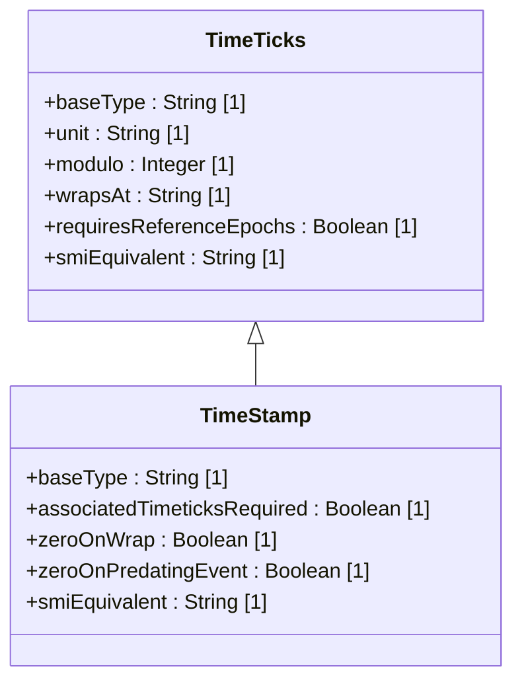

# Feature: Define SNMP Temporal Types

## Parent Epic
- [ ] #25 - [ietf-yang-types: Common YANG Data Types](https://github.com/gintatkinson/dep-tst40/blob/main/docs/epics/epic-02-ietf-yang-types.md) (SNMP temporal types provide time-tick-based event tracking for the YANG type library)

## Description
This feature defines two YANG typedefs for representing time intervals and event timestamps in hundredths of a second modulo 2^32, equivalent to their SMIv2 counterparts. The `timeticks` type is a uint32-based type representing a non-negative integer that measures the time, modulo 2^32 (4294967296), in hundredths of a second between two reference epochs. When a schema node uses `timeticks`, its description MUST identify both reference epochs. At the maximum value of 4294967295, the next increment wraps the value to 0 after approximately 497 days. The `timestamp` type derives from `timeticks` and represents the value of an associated `timeticks` schema node instance at the moment a specific occurrence happened. The specific occurrence MUST be defined in the schema node description of any `timestamp` node. If the occurrence predates the last time the associated `timeticks` was zero, the `timestamp` value is zero. When the associated `timeticks` wraps at 497+ days, all `timestamp` values reset to zero. The types are semantically equivalent to SMIv2 TimeTicks and TimeStamp, respectively.

## UML Class Diagram


## Interface Requirements

### 1. Payload Schema
```json
{ "timeticks": 8640000 }
```
```json
{ "timeticks": 0 }
```
```json
{ "timeticks": 4294967295 }
```
```json
{ "timestamp": 4320000 }
```
```json
{ "timestamp": 0 }
```

### 2. Validation & Constraints

| Type | Base Type | Range | Unit | Modulo | Wrap Period | SMIv2 Equivalent |
|---|---|---|---|---|---|---|
| timeticks | uint32 | 0..4294967295 | hundredths of a second (centiseconds) | 2^32 (4294967296) | ~497 days, 2 hours, 27 minutes, 52.96 seconds | TimeTicks (SNMPv2-SMI) |
| timestamp | timeticks | 0..4294967295 | hundredths of a second (centiseconds) | 2^32 (4294967296) | inherited from associated timeticks | TimeStamp (SNMPv2-TC) |

- timeticks: non-negative uint32 value modulo 2^32; represents time in hundredths of a second between two reference epochs; schema node description MUST identify both reference epochs; wraps at 4294967295 to 0 after ~497 days; equivalent to SMIv2 TimeTicks
- timestamp: derived from timeticks; represents the value of an associated timeticks schema node instance at a specific occurrence; specific occurrence MUST be defined in the schema node description; value is zero if the occurrence predates the last time associated timeticks was zero; all timestamp values reset to zero when the associated timeticks wraps; associated timeticks schema node MUST be referenced; equivalent to SMIv2 TimeStamp

### 3. Logical Operations

| Operation | Description |
|---|---|
| Read current timeticks value | Retrieve the current value of a timeticks node in centiseconds since epoch |
| Calculate time delta | Compute the difference between two timeticks readings, accounting for modulo 2^32 wrap |
| Detect timeticks wrap | Identify when timeticks has wrapped (current value < prior value without error) |
| Record timestamp at event | Capture the value of associated timeticks at the moment a specific occurrence happens |
| Reset timestamps on wrap | Set all timestamp values to zero when the associated timeticks wraps past 2^32 |
| Validate zero timestamp | Distinguish between a timestamp of zero due to predating event vs. zero due to wrap |
| Determine SMIv2 equivalence | Assert semantic equivalence to SMIv2 TimeTicks and TimeStamp |

### 4. Exception States

| Error Code | Condition | Message |
|---|---|---|
| 422 | timeticks value exceeds uint32 max (4294967295) | "timeticks: value exceeds maximum allowed value of 4294967295" |
| 422 | timeticks value is negative | "timeticks: value must be non-negative" |
| 422 | timeticks schema node description missing reference epochs | "timeticks: schema node description MUST identify both reference epochs" |
| 422 | timestamp schema node description missing specific occurrence | "timestamp: schema node description MUST define the specific occurrence" |
| 422 | timestamp schema node description missing associated timeticks reference | "timestamp: associated timeticks schema node MUST be referenced in the description" |
| 422 | timestamp exceeds uint32 range (0..4294967295) | "timestamp: value exceeds maximum allowed value of 4294967295" |
| 422 | timestamp is negative | "timestamp: value must be non-negative" |
| 422 | timeticks wrap detected | "timeticks: value has wrapped; all derived timestamps reset to zero" |
| 422 | timestamp read after timeticks wrap without reset | "timestamp: value is zero because associated timeticks has wrapped" |
| 422 | event predates last timeticks zeroing | "timestamp: value is zero; specific occurrence predates the last time associated timeticks was zero" |
| 422 | associated timeticks node not instantiated | "timestamp: associated timeticks schema node is not instantiated" |
| 422 | non-integer value assigned to timeticks | "timeticks: value must be a non-negative integer" |

## Given-When-Then Acceptance Criteria

### AC-01: Valid timeticks within uint32 range is accepted
- **Given** no prior timeticks state
- **When** a timeticks node is written with value 8640000
- **Then** the value is accepted and stored as 8640000 (representing 86,400.00 seconds)

### AC-02: Timeticks zero value is accepted
- **Given** a timeticks node
- **When** the node is written with value 0
- **Then** the value is accepted and stored as 0 (epoch boundary)

### AC-03: Timeticks maximum uint32 value is accepted
- **Given** a timeticks node
- **When** the node is written with value 4294967295
- **Then** the value is accepted and stored as 4294967295 (one centisecond before wrap)

### AC-04: Timeticks rejects value exceeding 2^32-1
- **Given** a timeticks typedef with range 0..4294967295
- **When** an attempt is made to assign the value 4294967296
- **Then** the operation fails with error 422 and message "timeticks: value exceeds maximum allowed value of 4294967295"

### AC-05: Timeticks rejects negative value
- **Given** a timeticks typedef derived from uint32
- **When** an attempt is made to assign the value -1
- **Then** the operation fails with error 422 and message "timeticks: value must be non-negative"

### AC-06: Timeticks rejects non-integer value
- **Given** a timeticks typedef derived from uint32
- **When** an attempt is made to assign the value 100.5
- **Then** the operation fails with error 422 and message "timeticks: value must be a non-negative integer"

### AC-07: Timeticks schema node description MUST identify both reference epochs
- **Given** a YANG leaf of type timeticks whose description does not identify both reference epochs
- **When** the schema is validated
- **Then** the validation fails with error 422 and message "timeticks: schema node description MUST identify both reference epochs"

### AC-08: Timeticks with proper epoch documentation is accepted
- **Given** a YANG leaf of type timeticks whose description states "The time in hundredths of a second since the system was last powered on and the time since the management subsystem was restarted"
- **When** the schema is validated
- **Then** the validation passes (both reference epochs are documented)

### AC-09: Timeticks hundredths-of-second granularity is preserved
- **Given** a timeticks node written with value 1
- **When** the value is read back
- **Then** the value is 1, representing exactly 0.01 seconds (one centisecond)

### AC-10: Timeticks wraps at 2^32
- **Given** a timeticks node currently at value 4294967295
- **When** the timeticks receives an increment (system time advances by 1 centisecond)
- **Then** the value wraps to 0 and a wrap event is signaled

### AC-11: Timeticks wrap is detectable via value comparison
- **Given** a timeticks node read at time T1 as 4294967290 and at time T2 as 5
- **When** the values are compared
- **Then** the system identifies this as a wrap event (current 5 < prior 4294967290), not an error

### AC-12: Timeticks wrap period is approximately 497 days
- **Given** a timeticks node initialized at 0
- **When** the value increments monotonically at real-time rate (100 centiseconds per second)
- **Then** after exactly 4294967296 centiseconds (~497 days, 2 hours, 27 minutes, 52.96 seconds), the value wraps to 0

### AC-13: Timeticks time delta calculation accounts for wrap
- **Given** a timeticks node read at T1 as 4294967290 and at T2 as 5 (one wrap occurred)
- **When** the time delta is calculated
- **Then** the result is 11 centiseconds (delta = modulo - prev + current)

### AC-14: Timeticks time delta without wrap is straightforward
- **Given** a timeticks node read at T1 as 1000 and at T2 as 2500
- **When** the time delta is calculated
- **Then** the result is 1500 centiseconds

### AC-15: Timeticks SMIv2 TimeTicks equivalence
- **Given** a timeticks typedef defined per RFC 9911
- **When** compared to SMIv2 TimeTicks (SNMPv2-SMI) in value set and semantics
- **Then** the types are semantically equivalent

### AC-16: Timeticks unit is centiseconds (10^-2 seconds)
- **Given** a timeticks value of 100
- **When** the value is converted to seconds
- **Then** the result is 1.00 seconds (100 / 100)

### AC-17: Valid timestamp equals associated timeticks at event occurrence
- **Given** an associated timeticks node currently reading 4320000 and a specific occurrence is defined as "linkDown"
- **When** the linkDown event occurs
- **Then** a timestamp node records the value 4320000 (the associated timeticks value at that instant)

### AC-18: Timestamp zero when event predates last timeticks zeroing
- **Given** an associated timeticks was last zeroed at system restart 100000 centiseconds ago, and a timestamped event occurred 200000 centiseconds ago (before the restart)
- **When** the timestamp is read for that event
- **Then** the value is 0, indicating the event predates the last timeticks zeroing

### AC-19: All timestamps reset to zero on associated timeticks wrap
- **Given** a set of timestamp nodes with recorded values (e.g., 4000000000, 4100000000, 4200000000) all associated with the same timeticks
- **When** the associated timeticks wraps from 4294967295 to 0
- **Then** all timestamp values reset to 0 simultaneously

### AC-20: Timestamp zero after wrap is distinguishable from predating zero
- **Given** a timestamp value of 0
- **When** the system determines whether zero is due to a wrap event or a predating occurrence
- **Then** the wrap scenario is identifiable by a prior reading near 2^32-1 on the associated timeticks, whereas the predating scenario has no such prior near-max reading

### AC-21: Timestamp schema node description MUST define the specific occurrence
- **Given** a YANG leaf of type timestamp whose description does not define a specific occurrence
- **When** the schema is validated
- **Then** the validation fails with error 422 and message "timestamp: schema node description MUST define the specific occurrence"

### AC-22: Timestamp schema node description MUST reference associated timeticks
- **Given** a YANG leaf of type timestamp whose description does not reference an associated timeticks schema node
- **When** the schema is validated
- **Then** the validation fails with error 422 and message "timestamp: associated timeticks schema node MUST be referenced in the description"

### AC-23: Timestamp with proper occurrence and timeticks reference is accepted
- **Given** a YANG leaf of type timestamp with description "The value of sysUpTime at the time of the last linkDown event. Associated timeticks: sysUpTime."
- **When** the schema is validated
- **Then** the validation passes (both specific occurrence and associated timeticks are documented)

### AC-24: Timestamp SMIv2 TimeStamp equivalence
- **Given** a timestamp typedef defined per RFC 9911
- **When** compared to SMIv2 TimeStamp (SNMPv2-TC) in value set and semantics
- **Then** the types are semantically equivalent

### AC-25: Timestamp rejects value exceeding 2^32-1
- **Given** a timestamp typedef with range 0..4294967295
- **When** an attempt is made to assign the value 4294967296
- **Then** the operation fails with error 422 and message "timestamp: value exceeds maximum allowed value of 4294967295"

### AC-26: Timestamp rejects negative value
- **Given** a timestamp typedef derived from timeticks
- **When** an attempt is made to assign the value -1
- **Then** the operation fails with error 422 and message "timestamp: value must be non-negative"

### AC-27: Timestamp at zero is a valid value
- **Given** a timestamp node after associated timeticks has wrapped or event predates last zeroing
- **When** the timestamp is read
- **Then** a value of 0 is a valid, semantically meaningful value (not an error)

### AC-28: Timeticks at max uint32 value is a valid pre-wrap state
- **Given** a timeticks node reading 4294967295
- **When** the system continues operating for one more centisecond
- **Then** the timeticks wraps to 0 without error and continues incrementing

### AC-29: Multiple timeticks wrap cycles are tracked correctly
- **Given** a timeticks node that has wrapped twice since a timestamp was recorded
- **When** the timestamp is read
- **Then** the value is 0 (timestamp only reflects the current epoch; it cannot represent events from two wraps ago)

### AC-30: Timeticks non-monotonic decrease without wrap is an error
- **Given** a timeticks node currently at value 50000
- **When** an attempt is made to set the value to 10000 (not a wrap scenario since prior value is far from 2^32-1)
- **Then** the operation fails with an appropriate validation error

### AC-31: Timestamp equals associated timeticks at exactly the recorded moment
- **Given** an associated timeticks currently at value 500 and an event occurs at that exact moment
- **When** the timestamp is read immediately after the event
- **Then** the timestamp value is exactly 500

### AC-32: Associated timeticks not instantiated is rejected
- **Given** a timestamp node whose associated timeticks schema node is not currently instantiated in the data tree
- **When** the timestamp is read
- **Then** the operation fails with error 422 and message "timestamp: associated timeticks schema node is not instantiated"

### AC-33: Timeticks value represents time correctly at 1 day
- **Given** a timeticks node running for exactly 1 day (86,400 seconds)
- **When** the value is read
- **Then** the value is 8640000 (86,400 × 100 centiseconds)

### AC-34: Centisecond arithmetic: timeticks delta at sub-second precision
- **Given** a timeticks reading at T1 as 100 and T2 as 199
- **When** the delta is calculated
- **Then** the result is 99 centiseconds (0.99 seconds)

### AC-35: Reference epoch identification is discoverable via schema introspection
- **Given** a timeticks schema node with properly documented reference epochs
- **When** a management station introspects the YANG schema
- **Then** both reference epochs are visible in the schema node description, enabling correct delta interpretation

### AC-36: Associated timeticks reference is discoverable via schema introspection
- **Given** a timestamp schema node with properly referenced associated timeticks
- **When** a management station introspects the YANG schema
- **Then** the associated timeticks schema node path is identifiable from the description, enabling correct timestamp interpretation

### AC-37: Timeticks accepts value 2147483647 (mid-range uint32)
- **Given** a timeticks node
- **When** the node is written with value 2147483647
- **Then** the value is accepted and stored as 2147483647

### AC-38: Timestamp value is clamped to associated timeticks value at event time
- **Given** an associated timeticks reading 1000 and a timestamp node
- **When** a specific occurrence is recorded
- **Then** the timestamp value is exactly 1000, not a derived or transformed value

### AC-39: Timeticks wrap at exactly 2^32 (modulo 2^32)
- **Given** a timeticks node at value 4294967295
- **When** one centisecond elapses
- **Then** value becomes 0 (4294967296 mod 4294967296 = 0)

### AC-40: Timestamp zero on wrap resets all timestamps sharing the same associated timeticks
- **Given** two timestamp nodes TSA and TSB both associated with the same timeticks node, with recorded values 100000 and 200000 respectively
- **When** the associated timeticks wraps from 4294967295 to 0
- **Then** both TSA and TSB reset to 0 simultaneously

## Specification Context (Verbatim)
> The timeticks type represents a non-negative integer that represents the time, modulo 2^32 (4294967296 decimal), in hundredths of a second between two epochs. When a schema node is defined that uses this type, the description of the schema node identifies both of the reference epochs. The timestamp type represents the value of an associated timeticks schema node instance at which a specific occurrence happened. When the specific occurrence occurred prior to the last time the associated timeticks was zero, the timestamp value is zero. All timestamp values reset to zero when the associated timeticks reaches 497+ days and wraps.

## 4. Source References
Structural Schema: [ietf-yang-types@2025-12-22.yang](https://github.com/YangModels/yang/blob/main/standard/ietf/RFC/ietf-yang-types%402025-12-22.yang)
Normative Specification: [RFC 9911](https://datatracker.ietf.org/doc/rfc9911/)
