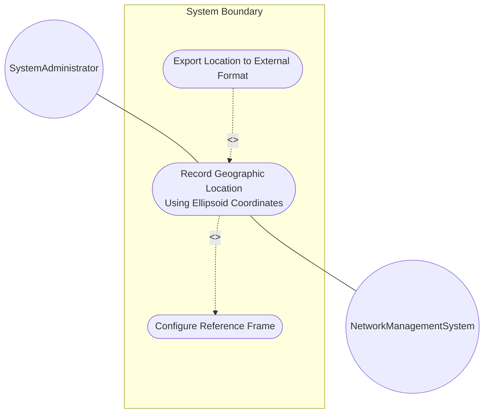
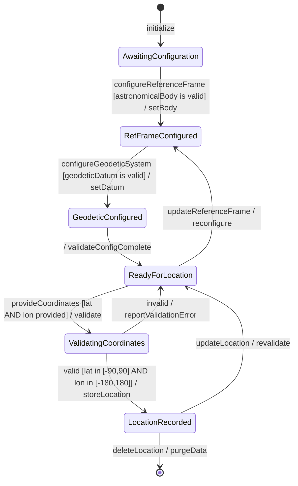

# Use Case: Record Geographic Location Using Ellipsoid Coordinates

## Parent Epic
- [ ] #7 - [ietf-geo-location: Geographic Location](https://github.com/gintatkinson/dep-tst40/blob/main/docs/epics/epic-01-ietf-geo-location.md) (Recording ellipsoid locations is the primary deployment scenario for Earth-based geographic positioning using the geolocation grouping)

## 1. Actors
- **Primary Actor:** SystemAdministrator — configures and records geographic location data for network elements
- **Secondary Actors:** NetworkManagementSystem — consumes recorded location data for topology visualization

## 2. Preconditions
- The device or module supports the ietf-geo-location YANG grouping
- The reference-frame container is configured with a valid astronomical-body
- The geodetic-system container is configured with a valid geodetic-datum

## 3. Trigger
A system administrator needs to record the geographic location of a network element (data center, router, fiber endpoint) using standard latitude/longitude/height coordinates.

## 4. Main Success Scenario (Basic Flow)
1. SystemAdministrator initiates a location recording session for the target network element
2. System retrieves the current reference-frame configuration (astronomical-body, geodetic-datum, alternate-system)
3. SystemAdministrator provides latitude, longitude, and optionally height values
4. System validates the latitude value is within -90 to +90 decimal degrees with up to 16 fractional digits of precision
5. System validates the longitude value is within -180 to +180 decimal degrees with up to 16 fractional digits of precision
6. System validates the optional height value with up to 6 fractional digits in meters
7. System validates that latitude/longitude coordinates conform to ISO 6709:2008 horizontal position representation
8. System records the timestamp marking when the location was captured
9. System optionally records a valid-until timestamp defining the data validity window
10. System stores the complete geo-location object with ellipsoid coordinates, reference frame, geodetic system, and temporal metadata
11. System confirms successful location recording to the SystemAdministrator

## 5. Alternate and Exception Flows

- **5a. Missing Reference Frame (Branches from Basic Flow step 2):**
  1. System detects that reference-frame is not configured on the target element
  2. System applies default values: astronomical-body = "earth", geodetic-datum = "wgs-84"
  3. System returns to step 4 of the Main Success Scenario.

- **5b. Latitude Out of Range (Branches from Basic Flow step 4):**
  1. System detects latitude value exceeds ±90 decimal degrees
  2. System rejects the location recording request
  3. System notifies SystemAdministrator with error "LATITUDE_OUT_OF_RANGE: Value must be between -90.0 and +90.0 decimal degrees"

- **5c. Longitude Out of Range (Branches from Basic Flow step 5):**
  1. System detects longitude value exceeds ±180 decimal degrees
  2. System rejects the location recording request
  3. System notifies SystemAdministrator with error "LONGITUDE_OUT_OF_RANGE: Value must be between -180.0 and +180.0 decimal degrees"

- **5d. Precision Limit Exceeded (Branches from Basic Flow steps 4, 5, or 6):**
  1. System detects coordinate value exceeds allowed fractional digit precision (16 for lat/lon, 6 for height)
  2. System rejects the location recording request
  3. System notifies SystemAdministrator with error "PRECISION_EXCEEDED: Value has more fractional digits than allowed"

- **5e. Invalid Timestamp Format (Branches from Basic Flow step 8):**
  1. System detects timestamp does not conform to RFC 3339 date-and-time format
  2. System rejects the location recording request
  3. System notifies SystemAdministrator with error "INVALID_TIMESTAMP: Timestamp must conform to RFC 3339 format"

## 6. Postconditions (Guarantees)
- **Success Guarantee:** A complete geo-location object is stored with validated ellipsoid coordinates, reference frame, geodetic system parameters, and temporal metadata (timestamp + optional valid-until). The location data is available for query, export, and further configuration operations.
- **Failure Guarantee:** No partial data is stored. The system state remains unchanged. An error message is returned to the SystemAdministrator describing the specific validation failure.

## UML Diagrams
### Use Case Diagram

### State Machine Diagram

## 7. Operational Context
> In many applications, we would like to specify the location of something geographically. Some examples of locations in networking might be the location of data centers, a rack in an Internet exchange point, a router, a firewall, a port on some device, or it could be the endpoints of a fiber, or perhaps the failure point along a fiber.

> For test A.1.2.4, latitude/longitude values conform. For test A.1.2.5, height value conforms.

## 8. Realization Matrix
### Required User Stories
- [ ] #8 - [Derive Speed and Heading from Velocity Vector](https://github.com/gintatkinson/dep-tst40/blob/main/docs/user-stories/us-01-derive-speed-heading.md) (Velocity derivation is an optional extension to the location recording flow for moving objects)
- [ ] #9 - [Manage Location Data Temporal Lifecycle](https://github.com/gintatkinson/dep-tst40/blob/main/docs/user-stories/us-02-temporal-lifecycle.md) (Temporal metadata recorded during location recording enables staleness detection and lifecycle management)
- [ ] #10 - [Inherit Reference Frame in Nested Locations](https://github.com/gintatkinson/dep-tst40/blob/main/docs/user-stories/us-03-nested-reference-frame.md) (Nested location inheritance enables hierarchical location models where child elements inherit parent reference frame)

### Required Features
- [ ] #1 - [Configure Reference Frame](https://github.com/gintatkinson/dep-tst40/blob/main/docs/features/feat-01-reference-frame.md) (The reference-frame container must be configured before location coordinates can be meaningfully recorded)
- [ ] #2 - [Configure Geodetic System](https://github.com/gintatkinson/dep-tst40/blob/main/docs/features/feat-02-geodetic-system.md) (The geodetic system defines coordinate meaning and accuracy parameters)
- [ ] #3 - [Specify Ellipsoid Location Coordinates](https://github.com/gintatkinson/dep-tst40/blob/main/docs/features/feat-03-ellipsoid-location.md) (The latitude, longitude, and height values are the core data recorded in this use case)
- [ ] #6 - [Record Temporal Metadata](https://github.com/gintatkinson/dep-tst40/blob/main/docs/features/feat-06-temporal-metadata.md) (Timestamp and valid-until are recorded alongside location data for lifecycle tracking)

## Source References
Structural Schema: [ietf-geo-location@2022-02-11.yang](https://github.com/YangModels/yang/blob/main/standard/ietf/RFC/ietf-geo-location%402022-02-11.yang)
Normative Specification: [RFC 9179](https://datatracker.ietf.org/doc/rfc9179/)
