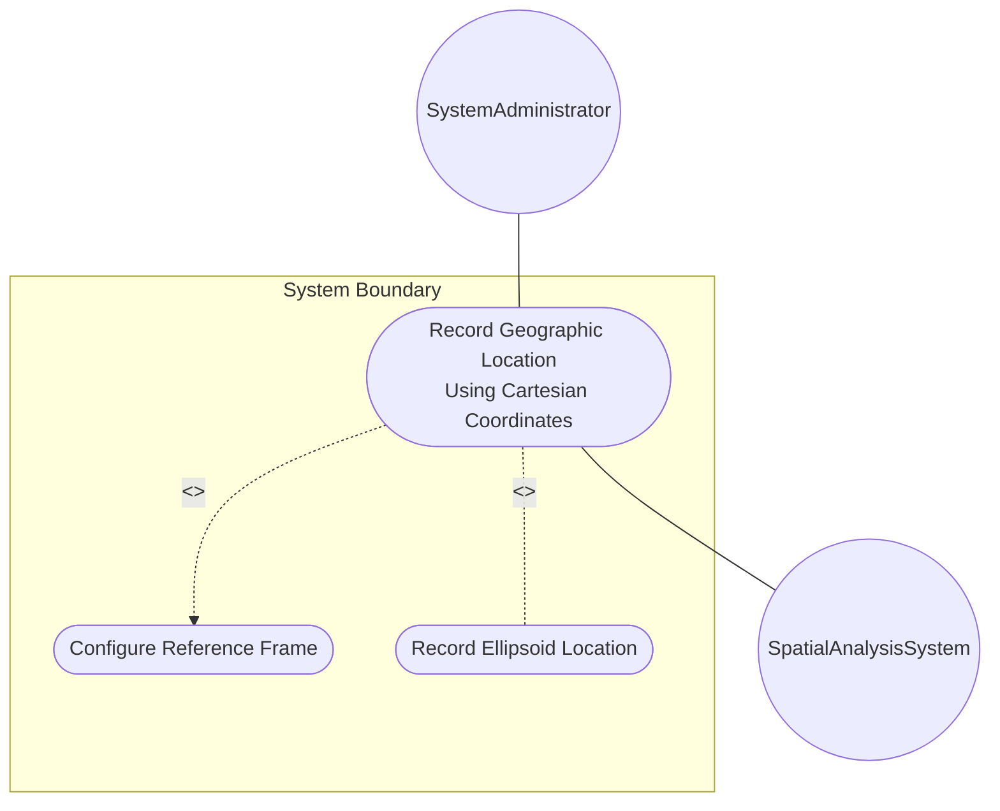
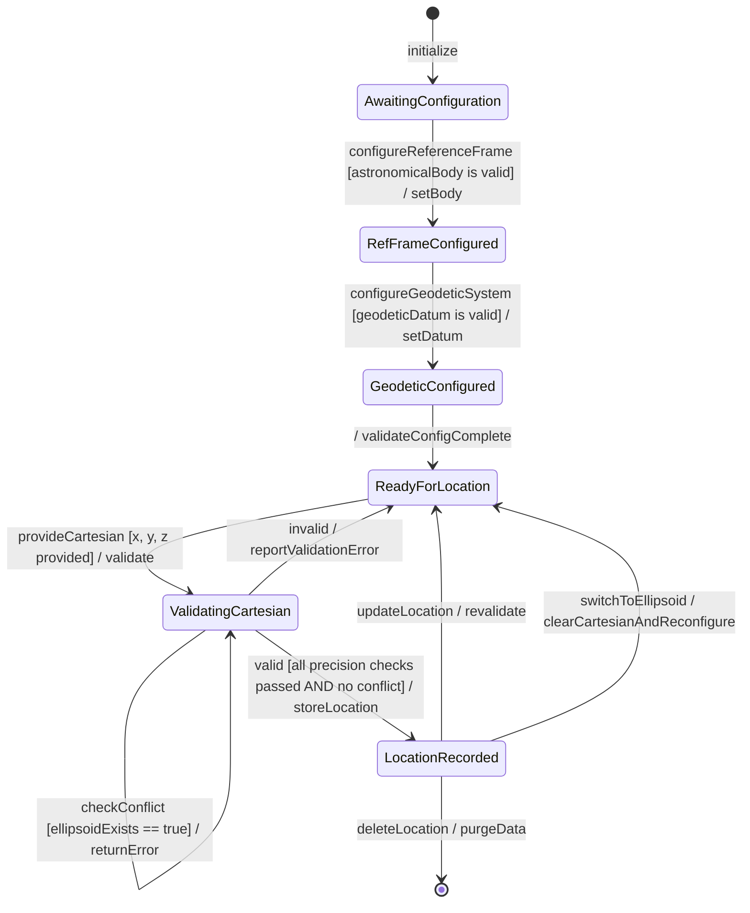

# Use Case: Record Geographic Location Using Cartesian Coordinates

## Parent Epic
- [ ] #7 - [ietf-geo-location: Geographic Location](https://github.com/gintatkinson/dep-tst40/blob/main/docs/epics/epic-01-ietf-geo-location.md) (Recording Cartesian locations enables non-Earth and specialized coordinate system deployment scenarios)

## 1. Actors
- **Primary Actor:** SystemAdministrator — configures and records geographic location data for network elements using Cartesian coordinates
- **Secondary Actors:** SpatialAnalysisSystem — consumes Cartesian coordinate data for 3D spatial modeling

## 2. Preconditions
- The device or module supports the ietf-geo-location YANG grouping
- The reference-frame container is configured with a valid astronomical-body (e.g., "moon", "mars")
- The geodetic-system container is configured with a valid geodetic-datum (e.g., "me" for Mean Earth/Polar Axis Moon)
- No ellipsoid coordinates are currently set (Cartesian and ellipsoid are mutually exclusive)

## 3. Trigger
A system administrator needs to record the geographic location of a device on a non-Earth astronomical body (Moon, Mars) or within a simulation/virtual reality using Cartesian X/Y/Z coordinates in meters.

## 4. Main Success Scenario (Basic Flow)
1. SystemAdministrator initiates a location recording session for the target network element on a non-Earth body
2. System retrieves the current reference-frame configuration (astronomical-body = "mars", geodetic-datum = "mola")
3. SystemAdministrator provides x, y, and z Cartesian coordinate values in meters
4. System validates the x coordinate value with up to 6 fractional digits of precision
5. System validates the y coordinate value with up to 6 fractional digits of precision
6. System validates the z coordinate value with up to 6 fractional digits of precision
7. System verifies that no ellipsoid coordinates are currently set (mutual exclusivity check)
8. System records the timestamp marking when the Cartesian location was captured
9. System optionally records a valid-until timestamp defining the data validity window
10. System stores the complete geo-location object with Cartesian coordinates, reference frame, geodetic system, and temporal metadata
11. System confirms successful location recording to the SystemAdministrator

## 5. Alternate and Exception Flows

- **5a. Missing Reference Frame (Branches from Basic Flow step 2):**
  1. System detects that reference-frame is not configured on the target element
  2. System applies default values: astronomical-body = "earth", geodetic-datum = "wgs-84"
  3. System returns to step 4 of the Main Success Scenario.

- **5b. X Coordinate Precision Exceeded (Branches from Basic Flow step 4):**
  1. System detects x coordinate value exceeds 6 fractional digits of precision
  2. System rejects the location recording request
  3. System notifies SystemAdministrator with error "PRECISION_EXCEEDED: X coordinate has more than 6 fractional digits"

- **5c. Y Coordinate Precision Exceeded (Branches from Basic Flow step 5):**
  1. System detects y coordinate value exceeds 6 fractional digits of precision
  2. System rejects the location recording request
  3. System notifies SystemAdministrator with error "PRECISION_EXCEEDED: Y coordinate has more than 6 fractional digits"

- **5d. Z Coordinate Precision Exceeded (Branches from Basic Flow step 6):**
  1. System detects z coordinate value exceeds 6 fractional digits of precision
  2. System rejects the location recording request
  3. System notifies SystemAdministrator with error "PRECISION_EXCEEDED: Z coordinate has more than 6 fractional digits"

- **5e. Coordinate System Conflict (Branches from Basic Flow step 7):**
  1. System detects that ellipsoid coordinates (latitude/longitude/height) are already set on the target location
  2. System rejects the Cartesian location recording request
  3. System notifies SystemAdministrator with error "COORDINATE_SYSTEM_CONFLICT: Cannot set Cartesian coordinates when ellipsoid coordinates are present. Clear ellipsoid coordinates first."

- **5f. Height-Accuracy Not Applicable (Branches from Basic Flow step 7):**
  1. System detects that height-accuracy is configured in the geodetic-system
  2. System issues a warning "HEIGHT_ACCURACY_NOT_APPLICABLE: Height-accuracy is not applicable to Cartesian coordinates and will be ignored"
  3. System returns to step 8 of the Main Success Scenario.

## 6. Postconditions (Guarantees)
- **Success Guarantee:** A complete geo-location object is stored with validated Cartesian coordinates (x, y, z in meters), reference frame, geodetic system parameters, and temporal metadata. The coordinate system type is explicitly Cartesian. No ellipsoid coordinates are set.
- **Failure Guarantee:** No partial data is stored. The system state remains unchanged. An error message is returned to the SystemAdministrator describing the specific validation failure.

## UML Diagrams
### Use Case Diagram

### State Machine Diagram

## 7. Operational Context
> Additionally, while this location is typically relative to Earth, it does not need to be. Indeed, it is easy to imagine a network or device located on the Moon, on Mars, on Enceladus, or even on a comet. The Cartesian choice uses 'x', 'y', and 'z' in fractions of meters. GML defines an Abstract CRS type which can have either ellipsoidal or Cartesian coordinates.

## 8. Realization Matrix
### Required User Stories
- [ ] #12 - [Export Geolocation to W3C, GML, and KML Portability Formats](https://github.com/gintatkinson/dep-tst40/blob/main/docs/user-stories/us-05-portability-formats.md) (Cartesian coordinates are mappable to GML Cartesian CRS types for geographic information systems)

### Required Features
- [ ] #1 - [Configure Reference Frame](https://github.com/gintatkinson/dep-tst40/blob/main/docs/features/feat-01-reference-frame.md) (The reference-frame must be configured with the appropriate astronomical body before Cartesian coordinates can be meaningfully recorded)
- [ ] #2 - [Configure Geodetic System](https://github.com/gintatkinson/dep-tst40/blob/main/docs/features/feat-02-geodetic-system.md) (The geodetic system defines coordinate meaning; coord-accuracy applies to Cartesian coordinates while height-accuracy does not)
- [ ] #4 - [Specify Cartesian Location Coordinates](https://github.com/gintatkinson/dep-tst40/blob/main/docs/features/feat-04-cartesian-location.md) (The x, y, and z coordinate values are the core data recorded in this use case)
- [ ] #6 - [Record Temporal Metadata](https://github.com/gintatkinson/dep-tst40/blob/main/docs/features/feat-06-temporal-metadata.md) (Timestamp and valid-until are recorded alongside Cartesian location data for lifecycle tracking)

## Source References
Structural Schema: [ietf-geo-location@2022-02-11.yang](https://github.com/YangModels/yang/blob/main/standard/ietf/RFC/ietf-geo-location%402022-02-11.yang)
Normative Specification: [RFC 9179](https://datatracker.ietf.org/doc/rfc9179/)
