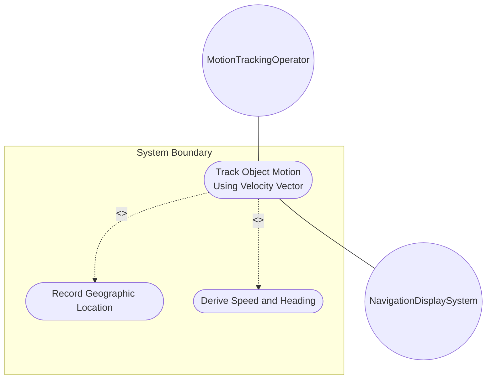
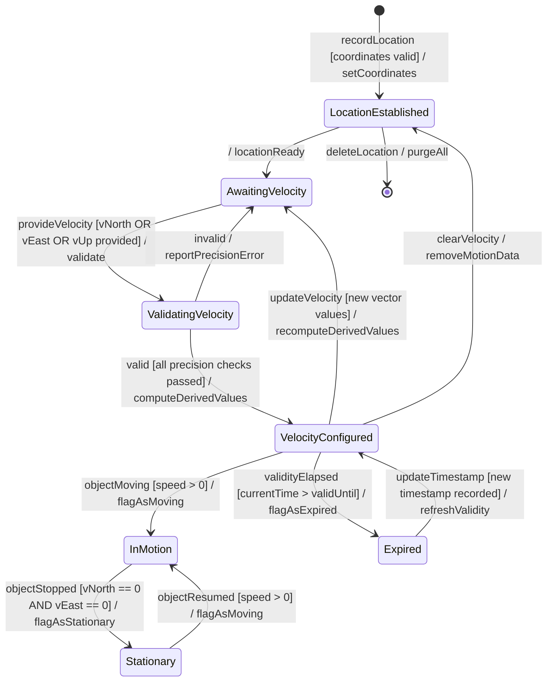

# Use Case: Track Object Motion Using Velocity Vector

## Parent Epic
- [ ] #7 - [ietf-geo-location: Geographic Location](https://github.com/gintatkinson/dep-tst40/blob/main/docs/epics/epic-01-ietf-geo-location.md) (Velocity vector tracking enables motion-aware deployment scenarios for objects undergoing relatively stable movement)

## 1. Actors
- **Primary Actor:** MotionTrackingOperator — configures and monitors velocity data for moving network elements or tracked objects
- **Secondary Actors:** NavigationDisplaySystem — consumes derived speed and heading for visual navigation displays

## 2. Preconditions
- A geo-location object is already recorded with valid coordinates (ellipsoid or Cartesian) and a reference frame
- The object is undergoing relatively stable motion (e.g., satellite, vehicle, tectonic plate)
- The timestamp of the location recording is current

## 3. Trigger
A motion tracking operator needs to attach velocity vector data to a geolocation record to track the object's movement, enabling speed and heading computation for navigation or drift analysis.

## 4. Main Success Scenario (Basic Flow)
1. MotionTrackingOperator selects a geo-location object that represents a moving entity
2. System retrieves the current location and confirms the location has a valid timestamp
3. MotionTrackingOperator provides v-north, v-east, and optionally v-up velocity component values in meters per second
4. System validates v-north value with up to 12 fractional digits of precision
5. System validates v-east value with up to 12 fractional digits of precision
6. System validates v-up value with up to 12 fractional digits of precision
7. System computes derived 2D speed using speed = sqrt(v-north^2 + v-east^2)
8. System computes derived heading using heading = arctan(v-east / v-north) relative to true north
9. System stores the velocity vector and derived navigational parameters with the geo-location object
10. System updates the timestamp to reflect when velocity data was recorded
11. System confirms successful velocity vector configuration to the MotionTrackingOperator and provides derived speed/heading values

## 5. Alternate and Exception Flows

- **5a. No Existing Location (Branches from Basic Flow step 2):**
  1. System detects that no location coordinates are recorded for the target object
  2. System rejects the velocity vector recording request
  3. System notifies MotionTrackingOperator with error "MISSING_LOCATION: Velocity tracking requires an existing location with valid coordinates"

- **5b. Stationary Object (Branches from Basic Flow step 7):**
  1. System detects that both v-north and v-east are 0.0 (stationary)
  2. System computes speed = 0.0 m/s
  3. System sets heading to 0.0 or "undefined" depending on configuration
  4. System returns to step 9 of the Main Success Scenario with stationary status

- **5c. Division by Zero in Heading (Branches from Basic Flow step 8):**
  1. System detects that v-north equals 0.0 (division by zero in heading formula)
  2. System evaluates v-east sign: if v-east > 0, heading = 90°; if v-east < 0, heading = 270°
  3. System returns to step 9 of the Main Success Scenario with computed heading

- **5d. Precision Limit Exceeded (Branches from Basic Flow steps 4, 5, or 6):**
  1. System detects velocity component value exceeds 12 fractional digits of precision
  2. System rejects the velocity vector recording request
  3. System notifies MotionTrackingOperator with error "PRECISION_EXCEEDED: Velocity component has more than 12 fractional digits"

- **5e. Stale Location Timestamp (Branches from Basic Flow step 2):**
  1. System detects the location timestamp is older than the valid-until value (expired)
  2. System issues a warning "LOCATION_EXPIRED: The location data is stale. Velocity tracking on expired data may produce inaccurate results."
  3. System returns to step 3 of the Main Success Scenario, allowing override.

- **5f. Continental Drift Tracking (Branches from Basic Flow step 10):**
  1. System detects velocity values are extremely small (e.g., < 0.000001 m/s) indicating tectonic movement
  2. System applies high-precision storage with all 12 fractional digits preserved
  3. System flags the velocity record as "continental-drift" for specialized analysis
  4. System returns to step 11 of the Main Success Scenario.

## 6. Postconditions (Guarantees)
- **Success Guarantee:** A velocity vector is stored with v-north, v-east, and v-up components at 12-digit precision. Derived speed and heading values are computed and available. The timestamp is updated to reflect when velocity was recorded. The location remains accessible with both positional and motion data.
- **Failure Guarantee:** No velocity data is stored. The location data remains unchanged. An error message describes the specific validation failure (missing location, precision exceeded, or invalid components).

## UML Diagrams
### Use Case Diagram

### State Machine Diagram

## 7. Operational Context
> Support is added for objects in relatively stable motion. For some applications that demand high accuracy and where the data is infrequently updated, this velocity vector can track very slow movement such as continental drift. Tracking more complex forms of motion is outside the scope of this work.

## 8. Realization Matrix
### Required User Stories
- [ ] #8 - [Derive Speed and Heading from Velocity Vector](https://github.com/gintatkinson/dep-tst40/blob/main/docs/user-stories/us-01-derive-speed-heading.md) (Speed and heading are derived behavioral outputs from velocity vector components recorded in this use case)
- [ ] #9 - [Manage Location Data Temporal Lifecycle](https://github.com/gintatkinson/dep-tst40/blob/main/docs/user-stories/us-02-temporal-lifecycle.md) (Timestamp updates and valid-until tracking are essential for velocity-contextualized location data)

### Required Features
- [ ] #1 - [Configure Reference Frame](https://github.com/gintatkinson/dep-tst40/blob/main/docs/features/feat-01-reference-frame.md) (The reference frame defines true north direction for v-north/v-east orientation)
- [ ] #2 - [Configure Geodetic System](https://github.com/gintatkinson/dep-tst40/blob/main/docs/features/feat-02-geodetic-system.md) (The geodetic system defines the coordinate system against which v-north/v-east velocity components are measured)
- [ ] #5 - [Track Velocity Vector](https://github.com/gintatkinson/dep-tst40/blob/main/docs/features/feat-05-velocity-vector.md) (The velocity vector container with v-north, v-east, v-up is the core structural feature for this use case)
- [ ] #6 - [Record Temporal Metadata](https://github.com/gintatkinson/dep-tst40/blob/main/docs/features/feat-06-temporal-metadata.md) (Timestamp marks when velocity was recorded; valid-until governs motion data freshness)

## Source References
Structural Schema: [ietf-geo-location@2022-02-11.yang](https://github.com/YangModels/yang/blob/main/standard/ietf/RFC/ietf-geo-location%402022-02-11.yang)
Normative Specification: [RFC 9179](https://datatracker.ietf.org/doc/rfc9179/)
