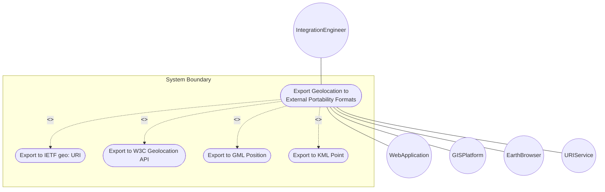
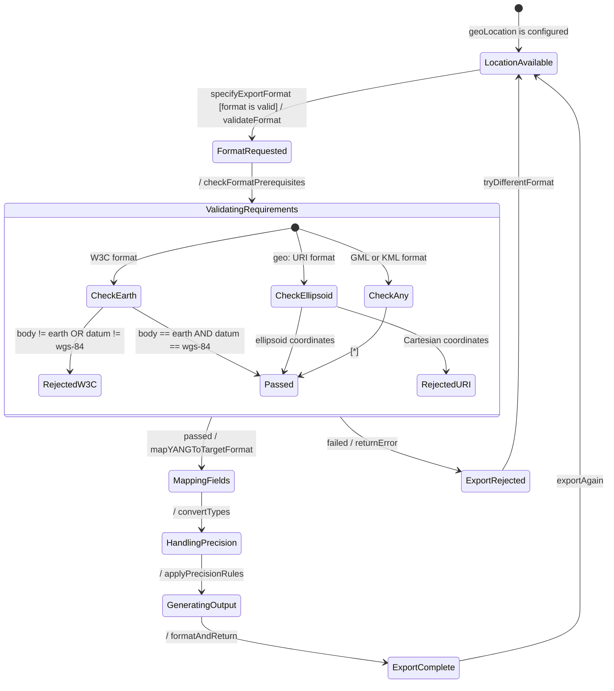

# Use Case: Export Geolocation to External Portability Formats

## Parent Epic
- [ ] #7 - [ietf-geo-location: Geographic Location](https://github.com/gintatkinson/dep-tst40/blob/main/docs/epics/epic-01-ietf-geo-location.md) (External format export enables the geolocation grouping to interoperate with standard IETF, W3C, OGC, and Google location APIs and formats)

## 1. Actors
- **Primary Actor:** IntegrationEngineer — needs to export geolocation data to standard external formats for system integration
- **Secondary Actors:** WebApplication (W3C consumer), GISPlatform (GML consumer), EarthBrowser (KML consumer), URIService (geo: URI consumer)

## 2. Preconditions
- A geo-location object is fully configured with valid coordinates and a reference frame
- The export target format is specified (geo: URI, W3C, GML, or KML)
- For W3C export, the astronomical body must be "earth" and geodetic-datum must be "wgs-84"
- For geo: URI export, ellipsoid coordinates must be present

## 3. Trigger
An integration engineer needs to export a geolocation record to an external standard format for consumption by a web application, GIS platform, earth visualization tool, or URI-based location service.

## 4. Main Success Scenario (Basic Flow)
1. IntegrationEngineer selects the target geo-location object to export
2. IntegrationEngineer specifies the desired export format (geo: URI, W3C, GML, or KML)
3. System retrieves the complete geo-location data including coordinates, reference frame, geodetic system, velocity, and temporal metadata
4. System validates that required fields for the chosen format are present
5. System maps the YANG data fields to the target format's field structure
6. System handles format-specific precision conversions (decimal64 → double/string) with documented precision loss warnings
7. System generates the formatted output (URI string, JSON object, XML element)
8. System includes a precision-caveat note indicating any loss of fidelity due to type conversions
9. System returns the formatted export to the IntegrationEngineer

## 5. Alternate and Exception Flows

- **5a. W3C Export with Non-Earth Body (Branches from Basic Flow step 4):**
  1. System detects astronomical-body is not "earth" or geodetic-datum is not "wgs-84"
  2. System rejects the W3C export request
  3. System notifies IntegrationEngineer with error "W3C_EXPORT_UNSUPPORTED: W3C Geolocation API only supports Earth with WGS-84 datum. Use GML or KML formats instead."

- **5b. geo: URI Export with Cartesian Coordinates (Branches from Basic Flow step 4):**
  1. System detects that the location uses Cartesian coordinates instead of ellipsoid coordinates
  2. System rejects the geo: URI export request
  3. System notifies IntegrationEngineer with error "GEO_URI_UNSUPPORTED: The geo: URI format (RFC 5870) requires ellipsoid coordinates. Cartesian coordinates cannot be directly exported to geo: URI format."

- **5c. KML Relative Height Mode (Branches from Basic Flow step 5):**
  1. System detects that the target KML configuration requires relativeToGround or relativeToSeaFloor altitude mode
  2. System issues a warning "KML_RELATIVE_HEIGHT_REQUIRED: Relative height modes require application-level transformation. Absolute height value is provided."
  3. System returns the KML output with height in absolute mode

- **5d. Precision Loss Warning (Branches from Basic Flow step 6):**
  1. System detects that the YANG decimal64 precision exceeds the target format's numeric precision
  2. System applies truncation or rounding to match target format limits
  3. System appends a precision-caveat note to the export: "PRECISION_CAVEAT: Value truncated from decimal64(N) to target format precision. Original value retained in source data."
  4. System returns to step 8 of the Main Success Scenario.

- **5e. Missing Velocity Data (Branches from Basic Flow step 5):**
  1. System detects that the target format (W3C) expects speed/heading but no velocity vector is configured
  2. System omits the speed and heading fields from the W3C export
  3. System includes a note "VELOCITY_NOT_CONFIGURED: Speed and heading fields omitted due to missing velocity data."
  4. System returns to step 7 of the Main Success Scenario.

- **5f. Invalid GML CRS Mapping (Branches from Basic Flow step 5):**
  1. System detects that the geodetic-datum value does not have a known GML CRS identifier mapping
  2. System falls back to using the datum value as a custom srsName
  3. System appends a caveat: "CUSTOM_CRS: Geodetic-datum mapped to custom GML srsName. Verify CRS compatibility with GML consumer."
   4. System returns to step 7 of the Main Success Scenario.

- **5g. W3C Export with Missing Coordinates (Branches from Basic Flow step 4):**
   1. System detects that latitude or longitude values are null or absent in the geo-location record
   2. System rejects the W3C export request
   3. System notifies IntegrationEngineer with error "W3C_EXPORT_INCOMPLETE: W3C Geolocation API requires both latitude and longitude values"

- **5h. geo: URI Export with Missing Coordinates (Branches from Basic Flow step 4):**
   1. System detects that latitude or longitude values are missing in the geo-location record
   2. System rejects the geo: URI export request
   3. System notifies IntegrationEngineer with error "GEO_URI_INCOMPLETE: geo: URI export requires both latitude and longitude coordinates"

- **5i. Latitude/Longitude Precision Exceeded for Target Format (Branches from Basic Flow step 6):**
   1. System detects that the latitude or longitude decimal64(16) precision exceeds the target format's supported precision (e.g., double for W3C)
   2. System applies rounding to fit target format precision and appends precision-caveat note
   3. System returns to step 8 of the Main Success Scenario.

- **5j. Cartesian Coordinates Not Mappable to W3C (Branches from Basic Flow step 5):**
   1. System detects that the W3C format was requested but the location uses Cartesian coordinates instead of ellipsoid
   2. System rejects the W3C export request
   3. System notifies IntegrationEngineer with error "W3C_EXPORT_UNSUPPORTED: W3C Geolocation API does not support Cartesian coordinates. Use ellipsoid coordinates or export to GML."

- **5k. Cartesian Coordinates Not Mappable to KML (Branches from Basic Flow step 5):**
   1. System detects that the KML format was requested but the location uses Cartesian coordinates without an Earth-based CRS
   2. System issues a warning "KML_CARTESIAN_CAVEAT: KML is designed for Earth-based visualization. Cartesian coordinates may not render correctly."
   3. System returns to step 7 of the Main Success Scenario.

- **5l. Missing Velocity Data for W3C Complete Export (Branches from Basic Flow step 5):**
   1. System detects that no velocity vector is configured but W3C export was requested with full motion data
   2. System omits speed and heading fields from the W3C GeolocationPosition
   3. System includes a note "VELOCITY_NOT_CONFIGURED: Speed and heading omitted" and returns to step 7.

- **5m. Missing Timestamp for GML Observation Export (Branches from Basic Flow step 5):**
   1. System detects that the timestamp is absent when GML Observation format is requested
   2. System issues a warning "GML_OBSERVATION_INCOMPLETE: GML Observation requires a timestamp. Exporting as gml:pos without observation metadata."
   3. System returns to step 7 of the Main Success Scenario.

- **5n. Timestamp Format Compatibility (Branches from Basic Flow step 6):**
   1. System detects that the timestamp string precision (e.g., nanosecond fractional seconds) exceeds the target format's timestamp precision
   2. System truncates the timestamp to target format's maximum resolution
   3. System appends a precision-caveat note: "TIMESTAMP_TRUNCATED: Timestamp precision reduced to match target format"

## 6. Postconditions (Guarantees)
- **Success Guarantee:** A correctly formatted export is produced in the requested format. The export contains all available mappable fields. A precision-caveat note documents any precision loss from YANG decimal64 to target format types. Source data remains unchanged.
- **Failure Guarantee:** No export is produced. The source data is unchanged. An error message describes why the export failed (unsupported format for the given data constraints).

## UML Diagrams
### Use Case Diagram

### State Machine Diagram

## 7. Operational Context
> The geo-location object has been designed to be usable in a very broad set of applications. W3C API values can be mapped to the YANG grouping with the caveat that some loss of precision may occur. GML gml:pos values can be mapped directly. The YANG grouping and KML values can be directly mapped in both directions when using a supported altitude mode.

## 8. Realization Matrix
### Required User Stories
- [ ] #11 - [Export Geolocation to IETF geo: URI Format](https://github.com/gintatkinson/dep-tst40/blob/main/docs/user-stories/us-04-geo-uri-mapping.md) (The geo: URI is the IETF standard format for location data, providing URI-based portability)
- [ ] #12 - [Export Geolocation to W3C, GML, and KML Portability Formats](https://github.com/gintatkinson/dep-tst40/blob/main/docs/user-stories/us-05-portability-formats.md) (W3C, GML, and KML are the primary web and GIS portability formats for geolocation data)
- [ ] #8 - [Derive Speed and Heading from Velocity Vector](https://github.com/gintatkinson/dep-tst40/blob/main/docs/user-stories/us-01-derive-speed-heading.md) (Speed and heading derivatives are required for complete W3C GeolocationPosition export)

### Required Features
- [ ] #3 - [Specify Ellipsoid Location Coordinates](https://github.com/gintatkinson/dep-tst40/blob/main/docs/features/feat-03-ellipsoid-location.md) (Ellipsoid coordinates are required for geo: URI and W3C exports)
- [ ] #4 - [Specify Cartesian Location Coordinates](https://github.com/gintatkinson/dep-tst40/blob/main/docs/features/feat-04-cartesian-location.md) (Cartesian coordinates are mappable to GML Cartesian CRS types)
- [ ] #5 - [Track Velocity Vector](https://github.com/gintatkinson/dep-tst40/blob/main/docs/features/feat-05-velocity-vector.md) (Velocity vector provides speed/heading for W3C and KML exports)
- [ ] #6 - [Record Temporal Metadata](https://github.com/gintatkinson/dep-tst40/blob/main/docs/features/feat-06-temporal-metadata.md) (Timestamp maps to W3C DOMTimeStamp, GML gml:validTime, and KML TimeStamp)

## Source References
Structural Schema: [ietf-geo-location@2022-02-11.yang](https://github.com/YangModels/yang/blob/main/standard/ietf/RFC/ietf-geo-location%402022-02-11.yang)
Normative Specification: [RFC 9179](https://datatracker.ietf.org/doc/rfc9179/)
