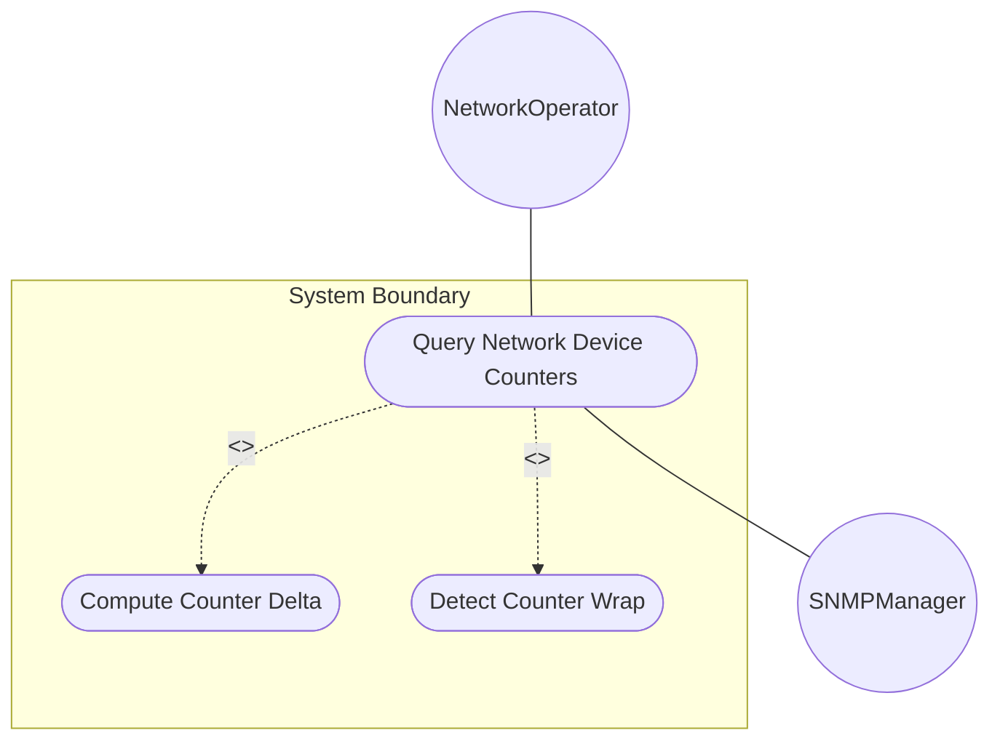
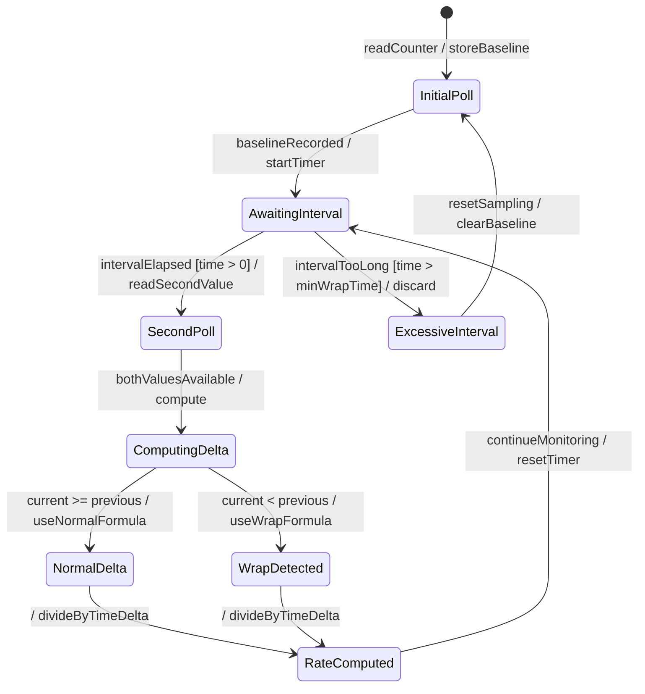

# Use Case: Query Network Device Counters for Performance Monitoring

## Parent Epic
- [ ] #25 - [ietf-yang-types: Common YANG Data Types](https://github.com/gintatkinson/dep-tst40/blob/main/docs/epics/epic-02-ietf-yang-types.md) (Counter and gauge types are used by network monitoring applications to track performance metrics)

## 1. Actors
- **Primary Actor:** NetworkOperator — queries device counters to monitor interface utilization and error rates
- **Secondary Actors:** SNMPManager — older management system consuming SMIv2-equivalent counter values

## 2. Preconditions
- The target device supports YANG data models using ietf-yang-types counter32/counter64 types
- The monitoring system has established a NETCONF or RESTCONF session to the device
- The device has been operational long enough for counters to have accumulated non-trivial values

## 3. Trigger
A network operator needs to compute packet-per-second rates on a network interface to detect traffic anomalies.

## 4. Main Success Scenario (Basic Flow)
1. NetworkOperator initiates a poll of the target device's interface counter using a NETCONF get request
2. System reads the current counter64 value for the interface's in-octets leaf (using counter64 typedef)
3. System stores the counter value and the current timeticks reading as the baseline
4. After a configured polling interval (e.g., 30 seconds), NetworkOperator polls again
5. System reads the new counter64 value and new timeticks value
6. System computes the time delta in seconds from the two timeticks readings
7. System detects whether the counter has wrapped (current value < previous value)
8. If no wrap, delta = current - previous; if wrap detected, delta = (max - previous) + current + 1
9. System computes rate = delta / timeDelta seconds
10. System discards the result if the time delta exceeds the minimum wrap time for counter64
11. System reports the computed rate to the NetworkOperator

## 5. Alternate and Exception Flows
- **5a. Counter Re-Initialization (Branches from step 2):**
  1. System detects that the counter value is at its initial zero-based-counter64 value
  2. System cannot compute a delta since single counter value has no information content
  3. System stores the value as baseline and will compute delta on next poll

- **5b. Counter Wrap Detection (Branches from step 7):**
  1. System computes delta using wrap-aware formula: delta = (2^64 - previous) + current
  2. System logs the wrap event for discontinuity tracking
  3. System returns to step 9 of the Main Success Scenario

- **5c. Excessive Polling Interval (Branches from step 10):**
  1. System detects the time delta exceeds the minimum wrap time for counter64
  2. System discards the calculation as unreliable
  3. System notifies NetworkOperator: "RATE_UNRELIABLE: Polling interval too long, counter may have wrapped multiple times"

## 6. Postconditions
- **Success Guarantee:** A validated packets-per-second rate is computed from two counter64 readings with correct wrap handling and reported to the operator.
- **Failure Guarantee:** No rate is reported. The operator is notified of the limitation (too few samples, excessive interval, counter re-initialization).

## UML Diagrams
### Use Case Diagram

### State Machine Diagram

## 7. Operational Context
> Monotonically increasing counters provide the data for computing interface utilization rates. The counter32 type represents a non-negative integer that monotonically increases until it reaches a maximum value of 2^32-1, when it wraps around. The counter64 variant provides a longer wrap period. Zero-based variants start at zero on creation, providing a known initial value for delta calculations.

## 8. Realization Matrix
### Required User Stories
- [ ] #26 - [Detect Counter Wrap and Compute Deltas](https://github.com/gintatkinson/dep-tst40/blob/main/docs/user-stories/us-06-counter-wrap-detection.md) (Wrap-aware delta computation is the core behavioral operation)
- [ ] #29 - [Map YANG Data Types to SMIv2 Equivalents](https://github.com/gintatkinson/dep-tst40/blob/main/docs/user-stories/us-09-smiv2-mapping.md) (Counter values may be consumed by SNMP managers using SMIv2 Counter32/Counter64)

### Required Features
- [ ] #17 - [Define Counter Types](https://github.com/gintatkinson/dep-tst40/blob/main/docs/features/feat-17-counter-types.md) (The counter32/64 typedefs define the value space and semantics)
- [ ] #24 - [Define SNMP Temporal Types](https://github.com/gintatkinson/dep-tst40/blob/main/docs/features/feat-24-snmp-temporal-types.md) (Timeticks provide the time reference for rate calculations)

## Source References
Structural Schema: [ietf-yang-types@2025-12-22.yang](https://github.com/YangModels/yang/blob/main/standard/ietf/RFC/ietf-yang-types%402025-12-22.yang)
Normative Specification: [RFC 9911](https://datatracker.ietf.org/doc/rfc9911/)
