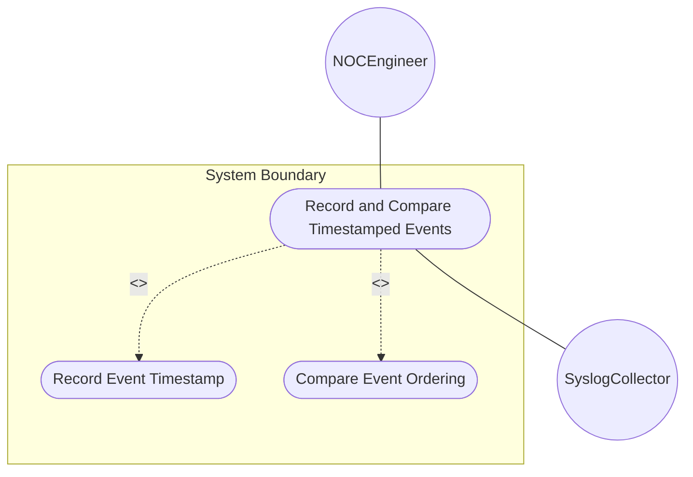
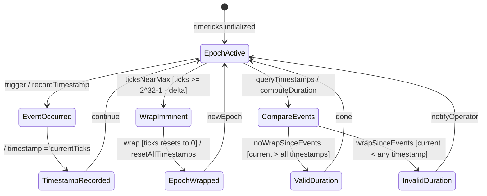

# Use Case: Record and Compare Timestamped Events on Managed Devices

## Parent Epic
- [ ] #25 - [ietf-yang-types: Common YANG Data Types](https://github.com/gintatkinson/dep-tst40/blob/main/docs/epics/epic-02-ietf-yang-types.md) (Timeticks, timestamp, and date-and-time types enable event recording and ordering)

## 1. Actors
- **Primary Actor:** NOCEngineer — records and compares timestamped events for root cause analysis
- **Secondary Actors:** SyslogCollector — aggregates timestamped events from multiple devices

## 2. Preconditions
- The device supports YANG schema nodes using timeticks and timestamp types
- The associated timeticks schema node is defined and active on the device
- The device clock is synchronized (NTP) for date-and-time accuracy

## 3. Trigger
A NOC engineer needs to determine the temporal ordering of two events (link down, link up) to calculate outage duration.

## 4. Main Success Scenario (Basic Flow)
1. NOCEngineer queries the device for the timestamp values of the link-down and link-up events
2. System returns timestamp values recorded from the associated timeticks at each event occurrence
3. NOCEngineer retrieves the current timeticks value to verify the timeticks has not wrapped since the events
4. System confirms that current timeticks > both timestamp values (no wrap since events)
5. System computes the outage duration: duration = (linkUpTimestamp - linkDownTimestamp) * 100ms
6. System also retrieves the date-and-time values associated with each event for human-readable timestamps
7. NOCEngineer receives the outage duration and human-readable event times

## 5. Alternate and Exception Flows

- **5a. Timeticks Wrapped Since Event (Branches from step 3):**
  1. System detects current timeticks < the event timestamp value (wrap occurred)
  2. System sets all timestamp values to 0 (wrap behavior)
  3. System notifies NOCEngineer: "TIMESTAMPS_RESET: Timeticks wrap occurred. Event timestamps from previous epoch are unavailable."

- **5b. Event Predates Last Reset (Branches from step 2):**
  1. System returns timestamp value of 0 for one or both events
  2. System notifies NOCEngineer: "EVENT_PREDATES_EPOCH: One or both events occurred before the last timeticks zeroing. Ordering and duration cannot be determined."

- **5c. Missing Associated Timeticks (Branches from step 1):**
  1. System detects that the schema node using timestamp type does not specify its associated timeticks
  2. System rejects the query
  3. System notifies NOCEngineer: "CONFIGURATION_ERROR: Timestamp schema node missing required associated timeticks reference."

- **5d. Leap Second Event Recording (Branches from step 6):**
  1. System detects that the date-and-time value records a leap second (seconds=60)
  2. System validates that the date is a valid leap second date
  3. System includes a "LEAP_SECOND" annotation on the human-readable timestamp

## 6. Postconditions
- **Success Guarantee:** Outage duration is computed from timeticks-based timestamps with 10ms precision. Human-readable date-and-time values provide context for root cause analysis.
- **Failure Guarantee:** An error message explains why temporal comparison is impossible (wrap, missing associated timeticks, pre-epoch events).

## UML Diagrams
### Use Case Diagram

### State Machine Diagram

## 7. Operational Context
> The timeticks type represents time modulo 2^32 in hundredths of a second between two epochs. The timestamp type records the value of an associated timeticks at a specific occurrence. When the specific occurrence occurred prior to the last time the associated timeticks was zero, the timestamp value is zero. The date-and-time type provides human-readable ISO 8601 timestamps for event context.

## 8. Realization Matrix
### Required User Stories
- [ ] #26 - [Detect Counter Wrap and Compute Deltas](https://github.com/gintatkinson/dep-tst40/blob/main/docs/user-stories/us-06-counter-wrap-detection.md) (Counter/timeticks wrap detection logic applies to timestamp comparison)
- [ ] #27 - [Validate Date-Time Values per ISO 8601 and RFC 9557](https://github.com/gintatkinson/dep-tst40/blob/main/docs/user-stories/us-07-datetime-validation.md) (Date-and-time values provide human-readable event context)
- [ ] #28 - [Manage Timestamp Lifecycle Across Timeticks Wrap Cycles](https://github.com/gintatkinson/dep-tst40/blob/main/docs/user-stories/us-08-timestamp-lifecycle.md) (Timestamp reset behavior governs event comparison across wrap boundaries)

### Required Features
- [ ] #20 - [Define Date and Time Types](https://github.com/gintatkinson/dep-tst40/blob/main/docs/features/feat-20-date-time-types.md) (Date-and-time provides human-readable ISO 8601 timestamps)
- [ ] #24 - [Define SNMP Temporal Types](https://github.com/gintatkinson/dep-tst40/blob/main/docs/features/feat-24-snmp-temporal-types.md) (Timeticks and timestamp provide sub-second event ordering)

## Source References
Structural Schema: [ietf-yang-types@2025-12-22.yang](https://github.com/YangModels/yang/blob/main/standard/ietf/RFC/ietf-yang-types%402025-12-22.yang)
Normative Specification: [RFC 9911](https://datatracker.ietf.org/doc/rfc9911/)
