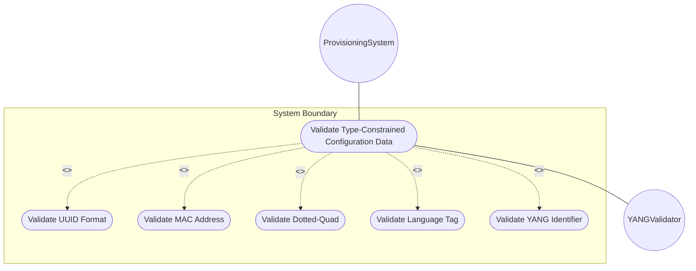
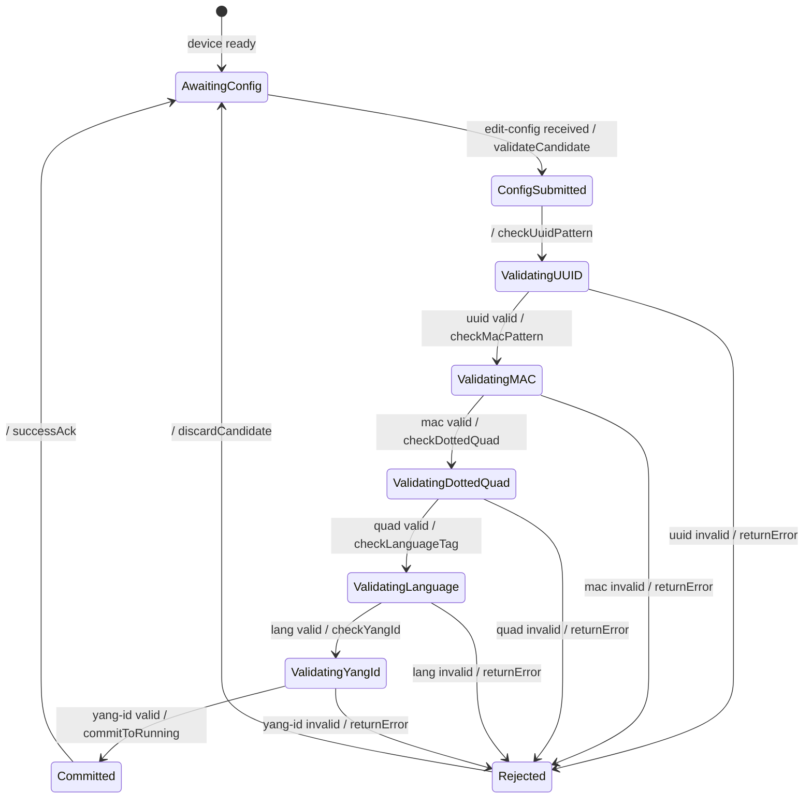

# Use Case: Validate Type-Constrained Configuration Data on Managed Devices

## Parent Epic
- [ ] #25 - [ietf-yang-types: Common YANG Data Types](https://github.com/gintatkinson/dep-tst40/blob/main/docs/epics/epic-02-ietf-yang-types.md) (String and identifier types enforce configuration data validity through pattern constraints)

## 1. Actors
- **Primary Actor:** ProvisioningSystem — pushes configuration data to managed devices and validates type constraints
- **Secondary Actors:** YANGValidator — validates configuration against the YANG schema at commit time

## 2. Preconditions
- The device YANG data model uses ietf-yang-types typedefs (uuid, dotted-quad, mac-address, language-tag, yang-identifier, etc.)
- The configuration data is prepared for a NETCONF edit-config or RESTCONF PATCH operation
- The device supports YANG schema validation

## 3. Trigger
A provisioning system needs to configure a device with a UUID, MAC address, dotted-quad IP, and language tag, all of which must pass pattern validation before the configuration is committed.

## 4. Main Success Scenario (Basic Flow)
1. ProvisioningSystem prepares configuration payload with typed values
2. System submits the configuration via NETCONF edit-config with the candidate datastore
3. YANGValidator intercepts the candidate and validates each leaf against its typedef constraints
4. YANGValidator validates the uuid field against the RFC 9562 pattern (8-4-4-4-12 hex with dashes)
5. YANGValidator validates the mac-address field against IEEE 802 48-bit pattern (6 colon-separated hex octets)
6. YANGValidator validates the dotted-quad field as 4 octets (0-255) separated by dots
7. YANGValidator validates the language-tag field as well-formed per BCP 47 (RFC 5646)
8. YANGValidator validates the yang-identifier field against the RFC 7950 identifier rule
9. All validations pass; system commits the configuration to the running datastore
10. ProvisioningSystem receives commit confirmation

## 5. Alternate and Exception Flows

- **5a. UUID Pattern Violation (Branches from step 4):**
  1. System detects uuid value does not match 8-4-4-4-12 hex format
  2. System rejects the configuration
  3. System returns error "INVALID_UUID: Value must match RFC 9562 UUID string representation"

- **5b. MAC Address Pattern Violation (Branches from step 5):**
  1. System detects mac-address is not exactly 6 colon-separated hex octets
  2. System rejects the configuration
  3. System returns error "INVALID_MAC: Value must be 48-bit IEEE 802 MAC address (6 octets)"

- **5c. Dotted-Quad Range Violation (Branches from step 6):**
  1. System detects an octet value > 255 in the dotted-quad
  2. System rejects the configuration
  3. System returns error "INVALID_DOTTED_QUAD: Each octet must be 0-255"

- **5d. Language Tag Not Well-Formed (Branches from step 7):**
  1. System detects language-tag violates BCP 47 well-formedness rules
  2. System rejects the configuration
  3. System returns error "INVALID_LANGUAGE_TAG: Value must be a well-formed BCP 47 language tag"

- **5e. YANG Identifier Violation (Branches from step 8):**
  1. System detects yang-identifier starts with a digit or contains invalid characters
  2. System rejects the configuration
  3. System returns error "INVALID_YANG_IDENTIFIER: Must start with alpha/underscore, followed by alphanumeric/underscore/hyphen/dot chars"

## 6. Postconditions
- **Success Guarantee:** Configuration is committed with all type-constrained values validated. The running datastore contains correctly formatted UUID, MAC address, dotted-quad, language tag, and YANG identifier values.
- **Failure Guarantee:** Configuration is rejected in its entirety. The running datastore is unchanged. A type-specific error message is returned to the ProvisioningSystem.

## UML Diagrams
### Use Case Diagram

### State Machine Diagram

## 7. Operational Context
> The uuid type represents a universally unique identifier in string representation per RFC 9562. The mac-address type represents a 48-bit IEEE 802 MAC address. The dotted-quad type is an unsigned 32-bit number in dotted-quad notation. The language-tag type is a language tag per BCP 47. The yang-identifier type is a YANG identifier as defined by RFC 7950.

## 8. Realization Matrix
### Required User Stories
- [ ] #27 - [Validate Date-Time Values per ISO 8601 and RFC 9557](https://github.com/gintatkinson/dep-tst40/blob/main/docs/user-stories/us-07-datetime-validation.md) (Pattern validation follows the same validation pipeline for all string-based types)
- [ ] #29 - [Map YANG Data Types to SMIv2 Equivalents](https://github.com/gintatkinson/dep-tst40/blob/main/docs/user-stories/us-09-smiv2-mapping.md) (Validated YANG types map to equivalent representations in other management protocols)

### Required Features
- [ ] #23 - [Define General String Types](https://github.com/gintatkinson/dep-tst40/blob/main/docs/features/feat-23-string-types.md) (UUID, dotted-quad, language-tag, and yang-identifier typedefs provide the pattern constraints)
- [ ] #22 - [Define Physical Address Types](https://github.com/gintatkinson/dep-tst40/blob/main/docs/features/feat-22-address-types.md) (The mac-address typedef provides the IEEE 802 48-bit validation pattern)

## Source References
Structural Schema: [ietf-yang-types@2025-12-22.yang](https://github.com/YangModels/yang/blob/main/standard/ietf/RFC/ietf-yang-types%402025-12-22.yang)
Normative Specification: [RFC 9911](https://datatracker.ietf.org/doc/rfc9911/)
