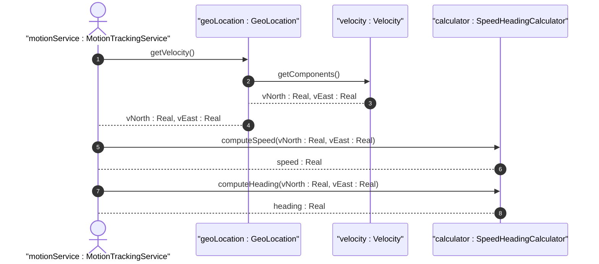
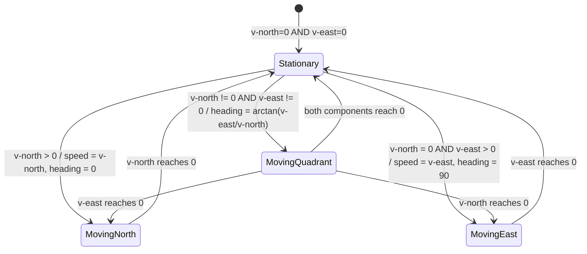

# User Story: Derive Speed and Heading from Velocity Vector

## Parent Epic
- [ ] #7 - [ietf-geo-location: Geographic Location](https://github.com/gintatkinson/dep-tst40/blob/main/docs/epics/epic-01-ietf-geo-location.md) (Speed and heading are derived behavioral outputs from the velocity vector data captured in the geolocation grouping)

## Domain Object Mapping
- **Primary Domain Objects:** Velocity (container with v-north, v-east, v-up leafs), GeoLocation (containing container)
- **Actor/Role:** MotionTrackingService — the system component responsible for computing derived navigational values from raw velocity components

## BDD Scenario (OOA/OOD Realization)
**Given** a geo-location object has velocity vector components v-north and v-east with defined values
**When** the system computes derived navigational parameters
**Then** the system returns speed as the Euclidean magnitude sqrt(v-north² + v-east²) and heading as the arctangent arctan(v-east / v-north) relative to true north

**As a** MotionTrackingService
**I want to** calculate 2D speed and heading from raw v-north and v-east velocity components
**So that** the object's motion can be expressed in standard navigational terms suitable for display, logging, and portability mapping

## UML Sequence Diagram

## UML State Machine Diagram

## Operational Context
> To derive the two-dimensional heading and speed, one would use the following formulas:
> - speed = sqrt(v_north² + v_east²)
> - heading = arctan(v_east / v_north)
> For some applications that demand high accuracy and where the data is infrequently updated, this velocity vector can track very slow movement such as continental drift.

## Required Features Matrix
- [ ] #5 - [Track Velocity Vector](https://github.com/gintatkinson/dep-tst40/blob/main/docs/features/feat-05-velocity-vector.md) (The velocity vector leafs v-north and v-east are the input values for speed and heading derivation formulas)

## Source References
Structural Schema: [ietf-geo-location@2022-02-11.yang](https://github.com/YangModels/yang/blob/main/standard/ietf/RFC/ietf-geo-location%402022-02-11.yang)
Normative Specification: [RFC 9179](https://datatracker.ietf.org/doc/rfc9179/)
