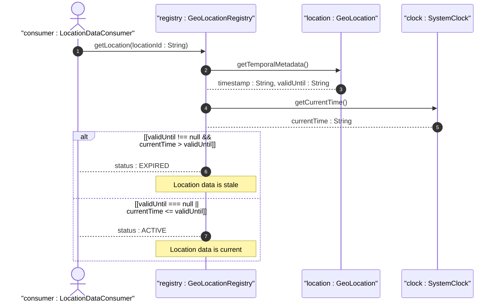
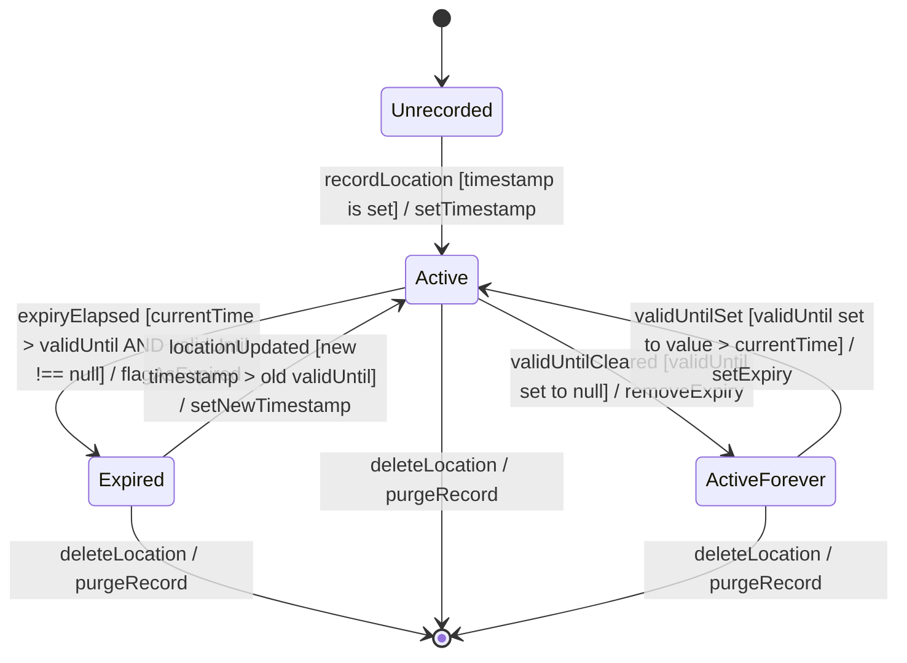

# User Story: Manage Location Data Temporal Lifecycle

## Parent Epic
- [ ] #7 - [ietf-geo-location: Geographic Location](https://github.com/gintatkinson/dep-tst40/blob/main/docs/epics/epic-01-ietf-geo-location.md) (Temporal lifecycle management governs the validity and staleness of all geolocation data within the grouping)

## Domain Object Mapping
- **Primary Domain Objects:** GeoLocation (container with timestamp and valid-until leafs)
- **Actor/Role:** LocationDataConsumer — the system component or external entity that queries location data and needs to determine whether it is current or expired

## BDD Scenario (OOA/OOD Realization)
**Given** a geo-location object has been recorded with a timestamp and an optional valid-until value
**When** the system evaluates the temporal state of the location data
**Then** the system returns the location as "active" if valid-until is absent or current-time <= valid-until, or as "expired" if current-time > valid-until

**As a** LocationDataConsumer
**I want to** know whether a geo-location record is still valid or has expired
**So that** I do not make decisions based on stale or obsolete position information

## UML Sequence Diagram

## UML State Machine Diagram

## Operational Context
> For some applications that demand high accuracy and where the data is infrequently updated, this velocity vector can track very slow movement such as continental drift. The instantaneous gml:TimeInstant is mappable to and from the YANG grouping 'timestamp' value, and values down to the resolution of seconds for gml:TimePeriod can be mapped using the 'valid-until' node.

## Required Features Matrix
- [ ] #6 - [Record Temporal Metadata](https://github.com/gintatkinson/dep-tst40/blob/main/docs/features/feat-06-temporal-metadata.md) (Temporal lifecycle state transitions are driven by the timestamp and valid-until leaf values)
- [ ] #5 - [Track Velocity Vector](https://github.com/gintatkinson/dep-tst40/blob/main/docs/features/feat-05-velocity-vector.md) (Velocity vector data is time-bound and must be interpreted relative to its recorded timestamp)

## Source References
Structural Schema: [ietf-geo-location@2022-02-11.yang](https://github.com/YangModels/yang/blob/main/standard/ietf/RFC/ietf-geo-location%402022-02-11.yang)
Normative Specification: [RFC 9179](https://datatracker.ietf.org/doc/rfc9179/)
