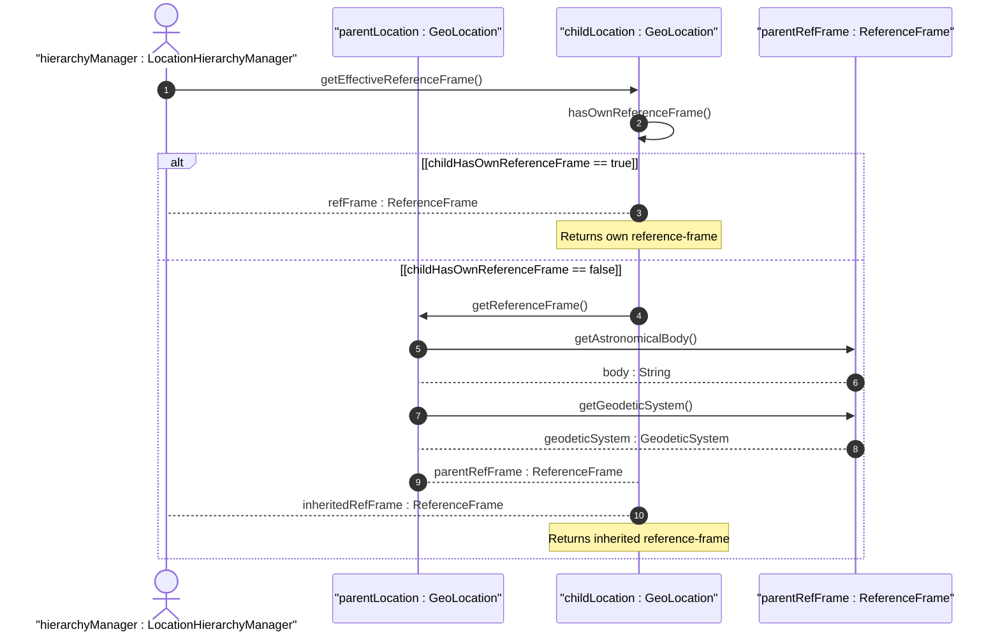

# User Story: Inherit Reference Frame in Nested Locations

## Parent Epic
- [ ] #7 - [ietf-geo-location: Geographic Location](https://github.com/gintatkinson/dep-tst40/blob/main/docs/epics/epic-01-ietf-geo-location.md) (Nested location reference-frame inheritance is a behavioral pattern for hierarchical location models using the geolocation grouping)

## Domain Object Mapping
- **Primary Domain Objects:** GeoLocation (containing reference-frame), ParentLocation (containing container for nested items)
- **Actor/Role:** LocationHierarchyManager — the system component managing hierarchical location structures where child locations may omit their reference-frame and rely on parent inheritance

## BDD Scenario (OOA/OOD Realization)
**Given** a parent location has a configured reference-frame with astronomical-body "mars" and geodetic-datum "mola"
**When** a nested child location omits its reference-frame configuration
**Then** the child location resolves its effective reference-frame from the parent, using "mars" as the astronomical body and "mola" as the geodetic-datum

**As a** LocationHierarchyManager
**I want to** allow nested child locations to inherit their reference-frame from the parent container
**So that** redundant reference-frame configuration is eliminated in hierarchical location models

## UML Sequence Diagram

## Operational Context
> When locations are nested (e.g., a building may have a location that houses routers that also have locations), the module using this grouping is free to indicate in its definition that the 'reference-frame' is inherited from the containing object so that the 'reference-frame' need not be repeated in every instance of location data.

## Required Features Matrix
- [ ] #1 - [Configure Reference Frame](https://github.com/gintatkinson/dep-tst40/blob/main/docs/features/feat-01-reference-frame.md) (The reference-frame container is the structural definition that may be inherited by nested child locations)
- [ ] #2 - [Configure Geodetic System](https://github.com/gintatkinson/dep-tst40/blob/main/docs/features/feat-02-geodetic-system.md) (The geodetic-system is a child of reference-frame and inherits alongside its parent container)

## Source References
Structural Schema: [ietf-geo-location@2022-02-11.yang](https://github.com/YangModels/yang/blob/main/standard/ietf/RFC/ietf-geo-location%402022-02-11.yang)
Normative Specification: [RFC 9179](https://datatracker.ietf.org/doc/rfc9179/)
