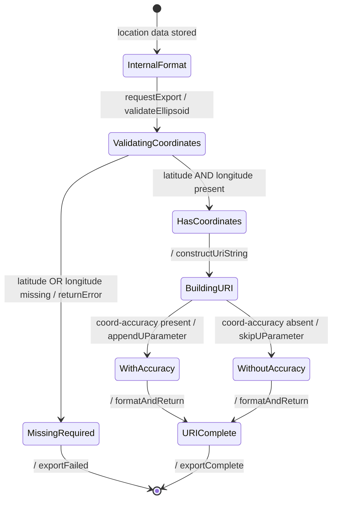

# User Story: Export Geolocation to IETF geo: URI Format

## Parent Epic
- [ ] #7 - [ietf-geo-location: Geographic Location](https://github.com/gintatkinson/dep-tst40/blob/main/docs/epics/epic-01-ietf-geo-location.md) (The geo: URI is a standard IETF format for geographic location data, providing portability and interoperability with URI-based systems)

## Domain Object Mapping
- **Primary Domain Objects:** GeoLocation (ellipsoid coordinates and geodetic system), URIGenerator (service for constructing geo: URI strings)
- **Actor/Role:** LocationExporter — the system component responsible for converting internal geolocation data to external standard formats

## BDD Scenario (OOA/OOD Realization)
**Given** a geo-location object contains ellipsoid coordinates (latitude=40.73297, longitude=-74.007696) with geodetic-datum "wgs-84" and coord-accuracy 10.0
**When** the system exports the location to IETF geo: URI format
**Then** the system generates the URI "geo:40.73297,-74.007696;crs=wgs-84;u=10.0"

**As a** LocationExporter
**I want to** convert YANG geolocation data to the IETF geo: URI format defined in RFC 5870
**So that** the location can be shared with and consumed by URI-based location services and applications

## UML Sequence Diagram
```mermaid
sequenceDiagram
    autonumber
    actor exporter as "exporter : LocationExporter"
    participant location as "location : GeoLocation"
    participant ellipsoid as "ellipsoidLocation : EllipsoidLocation"
    participant geodetic as "geodeticSystem : GeodeticSystem"
    participant uriBuilder as "uriBuilder : GeoUriBuilder"

    exporter->>location: getEllipsoidLocation()
    location->>ellipsoid: getCoordinates()
    ellipsoid-->location: (latitude : Real, longitude : Real, height : Real)
    location-->exporter: ellipsoidCoords : EllipsoidCoordinates

    exporter->>location: getGeodeticSystem()
    location->>geodetic: getDatum()
    geodetic-->location: datum : String
    location->>geodetic: getCoordAccuracy()
    geodetic-->location: accuracy : Real
    location-->exporter: (datum : String, accuracy : Real)

    exporter->>uriBuilder: build(latitude : Real, longitude : Real, datum : String, accuracy : Real, height : Real)
    
    alt [counterpart supports geo: URI cartesian]
        uriBuilder-->exporter: uri : String
        Note over uriBuilder: "geo:40.73297,-74.007696;crs=wgs-84;u=10.0"
    else [height is null]
        uriBuilder-->exporter: uri : String
        Note over uriBuilder: "geo:40.73297,-74.007696;crs=wgs-84;u=10.0"
    end
```

## UML State Machine Diagram


## Operational Context
> RFC 5870 defines a standard URI value for geographic location data. It includes the ability to specify the 'geodetic-value' (it calls this 'crs') with the default being 'wgs-84'. For the location data, it allows two to three coordinates defined by the 'crs' value. For accuracy, it has a single 'u' parameter for specifying uncertainty. The 'u' value is in fractions of meters and applies to all the location values. URI values can be mapped to and from the YANG grouping with the caveat that some loss of precision (in the extremes) may occur due to the YANG grouping using decimal64 values rather than strings.

## Required Features Matrix
- [ ] #3 - [Specify Ellipsoid Location Coordinates](https://github.com/gintatkinson/dep-tst40/blob/main/docs/features/feat-03-ellipsoid-location.md) (Ellipsoid latitude/longitude/height values form the coordinate portion of the geo: URI)
- [ ] #2 - [Configure Geodetic System](https://github.com/gintatkinson/dep-tst40/blob/main/docs/features/feat-02-geodetic-system.md) (The geodetic-datum maps to the CRS parameter and coord-accuracy maps to the uncertainty parameter in geo: URI)

## Source References
Structural Schema: [ietf-geo-location@2022-02-11.yang](https://github.com/YangModels/yang/blob/main/standard/ietf/RFC/ietf-geo-location%402022-02-11.yang)
Normative Specification: [RFC 9179](https://datatracker.ietf.org/doc/rfc9179/)
