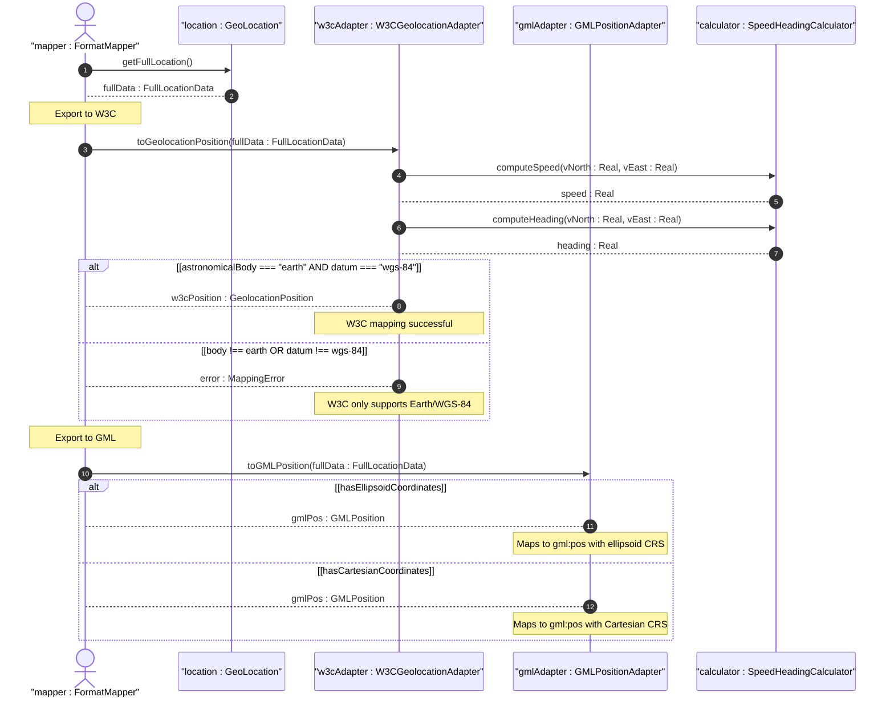

# User Story: Export Geolocation to W3C, GML, and KML Portability Formats

## Parent Epic
- [ ] #7 - [ietf-geo-location: Geographic Location](https://github.com/gintatkinson/dep-tst40/blob/main/docs/epics/epic-01-ietf-geo-location.md) (Portability format mappings enable the geolocation grouping to interoperate with W3C web APIs, OGC geography markup language, and Google KML visualization formats)

## Domain Object Mapping
- **Primary Domain Objects:** GeoLocation (coordinates, velocity, temporal data), W3CAdapter, GMLAdapter, KMLAdapter (portability mapping services)
- **Actor/Role:** FormatMapper — the system component responsible for converting internal geolocation data to and from external standard APIs and markup formats

## BDD Scenario (OOA/OOD Realization)
**Given** a geo-location object contains ellipsoid coordinates (latitude=48.8583424, longitude=2.3375084, height=35), velocity (v-north=0.5, v-east=0.3, v-up=0.0), timestamp="2012-03-31T16:00:00Z", and geodetic-datum="wgs-84"
**When** the system exports the location to W3C GeolocationPosition format
**Then** the system returns a W3C-compliant object with latitude=48.8583424, longitude=2.3375084, altitude=35, speed=0.583, heading=30.96, and DOMTimeStamp mapped from the RFC 3339 timestamp

**As a** FormatMapper
**I want to** convert YANG geolocation data to and from W3C Geolocation API, GML gml:pos, and KML kml:Point formats
**So that** the geolocation system interoperates with web browsers, geographic information systems, and earth visualization platforms

## UML Sequence Diagram

## Operational Context
> W3C API values can be mapped to the YANG grouping with the caveat that some loss of precision may occur. Only YANG values for Earth using the default 'wgs-84' can be directly mapped to W3C values. GML 'gml:pos' values can be mapped directly to the YANG grouping. The YANG grouping and KML values can be directly mapped in both directions when using a supported altitude mode.

## Required Features Matrix
- [ ] #3 - [Specify Ellipsoid Location Coordinates](https://github.com/gintatkinson/dep-tst40/blob/main/docs/features/feat-03-ellipsoid-location.md) (Latitude/longitude/height are the primary coordinate fields exported to W3C, GML, and KML formats)
- [ ] #4 - [Specify Cartesian Location Coordinates](https://github.com/gintatkinson/dep-tst40/blob/main/docs/features/feat-04-cartesian-location.md) (Cartesian coordinates map to GML Cartesian CRS types for non-Earth-based systems)
- [ ] #5 - [Track Velocity Vector](https://github.com/gintatkinson/dep-tst40/blob/main/docs/features/feat-05-velocity-vector.md) (Velocity vector provides speed and heading derivation for W3C API and KML mapping)
- [ ] #6 - [Record Temporal Metadata](https://github.com/gintatkinson/dep-tst40/blob/main/docs/features/feat-06-temporal-metadata.md) (Timestamp maps to W3C DOMTimeStamp and GML gml:validTime for observation data)

## Source References
Structural Schema: [ietf-geo-location@2022-02-11.yang](https://github.com/YangModels/yang/blob/main/standard/ietf/RFC/ietf-geo-location%402022-02-11.yang)
Normative Specification: [RFC 9179](https://datatracker.ietf.org/doc/rfc9179/)
