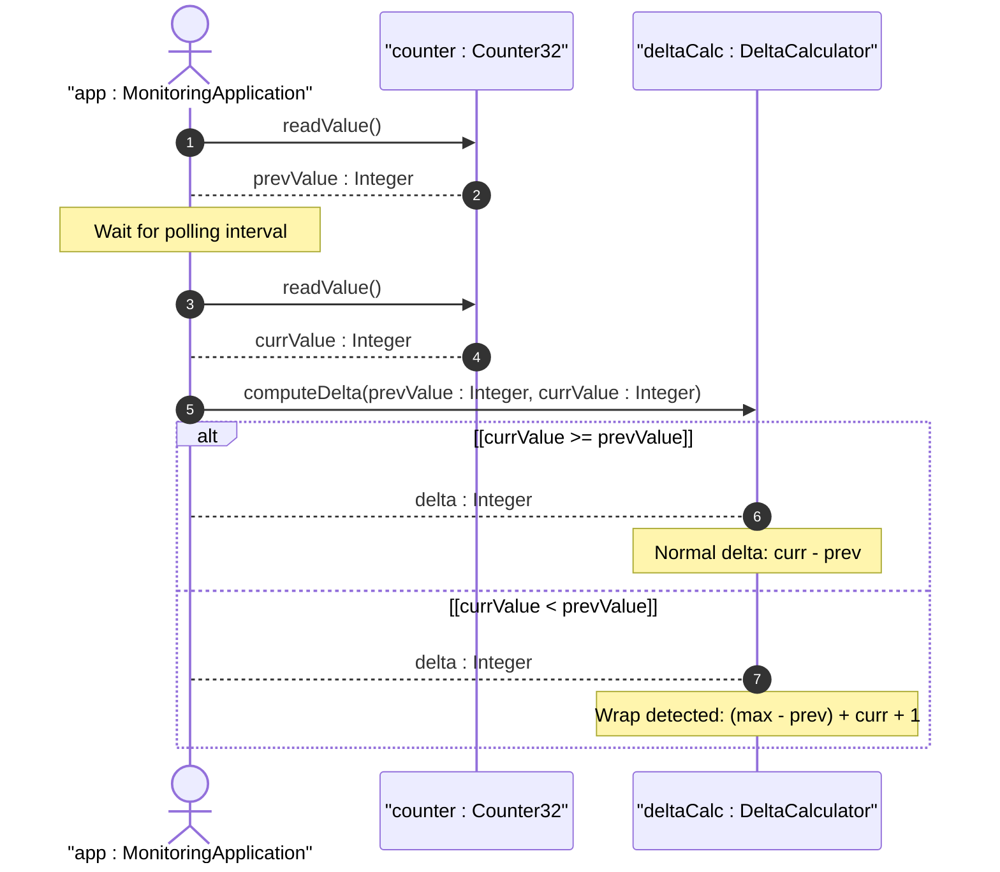

# User Story: Detect Counter Wrap and Compute Deltas

## Parent Epic
- [ ] #25 - [ietf-yang-types: Common YANG Data Types](https://github.com/gintatkinson/dep-tst40/blob/main/docs/epics/epic-02-ietf-yang-types.md) (Counter delta computation with wrap detection is a behavioral application of the counter typedefs)

## Domain Object Mapping
- **Primary Domain Objects:** Counter32 (typedef), Counter64 (typedef), ZeroBasedCounter32, ZeroBasedCounter64
- **Actor/Role:** MonitoringApplication — the system component that reads counter values and computes meaningful deltas

## BDD Scenario
**Given** a counter32 has value 4294967200 and a subsequent reading shows 500 after counter wrap
**When** the system computes the delta between the two readings
**Then** the system detects the wrap and returns delta = 500 + (4294967295 - 4294967200) + 1 = 596

**As a** MonitoringApplication
**I want to** accurately compute counter deltas across wrap boundaries
**So that** rate calculations (packets per second, bytes per second) remain correct even after counter overflow

## UML Sequence Diagram

## Operational Context
> Counters have no defined initial value and a single value of a counter has no information content. Provided that an application discovers a new data tree node using this type within the minimum time to wrap, it can use the initial value as a delta. It is important for a management station to be aware of this minimum time and the actual time between polls, and to discard data if the actual time is too long or there is no defined minimum time.

## Required Features Matrix
- [ ] #17 - [Define Counter Types](https://github.com/gintatkinson/dep-tst40/blob/main/docs/features/feat-17-counter-types.md) (Counter32 and Counter64 typedefs are the structural foundation for wrap-aware delta computation)

## Source References
Structural Schema: [ietf-yang-types@2025-12-22.yang](https://github.com/YangModels/yang/blob/main/standard/ietf/RFC/ietf-yang-types%402025-12-22.yang)
Normative Specification: [RFC 9911](https://datatracker.ietf.org/doc/rfc9911/)
