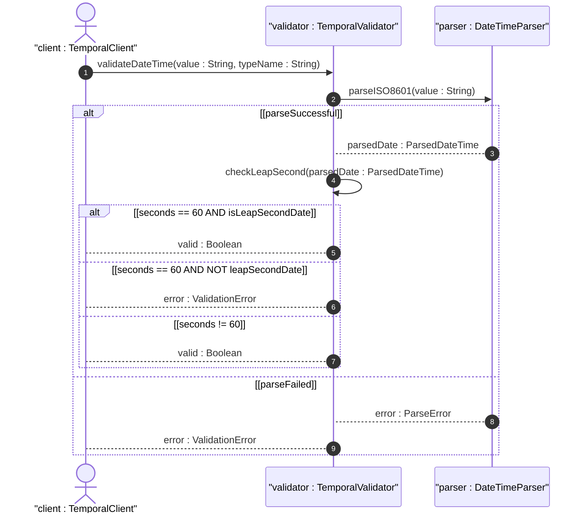

# User Story: Validate Date-Time Values per ISO 8601 and RFC 9557

## Parent Epic
- [ ] #25 - [ietf-yang-types: Common YANG Data Types](https://github.com/gintatkinson/dep-tst40/blob/main/docs/epics/epic-02-ietf-yang-types.md) (Date-time validation is a behavioral application of the date-and-time, date, time, and no-zone typedefs)

## Domain Object Mapping
- **Primary Domain Objects:** DateTime (typedef), Date (typedef), Time (typedef), DateNoZone, TimeNoZone
- **Actor/Role:** TemporalValidator — the system component that parses and validates date-time strings against schema patterns

## BDD Scenario
**Given** a date-and-time value "2025-12-31T23:59:60Z" representing a leap second at end of year
**When** the system validates the value against the date-and-time pattern
**Then** the system accepts the value because seconds=60 is allowed for leap seconds

**As a** TemporalValidator
**I want to** validate date-time strings against ISO 8601 profiles with RFC 9557 timezone semantics
**So that** invalid temporal data is rejected at parse time and leap seconds are correctly handled

## UML Sequence Diagram

## Operational Context
> The date-and-time type is a profile of the ISO 8601 standard defined by the date-time production in RFC 3339 and the update in RFC 9557. The value of 60 for seconds is allowed only in the case of leap seconds. The time-offset Z indicates UTC with unknown local time zone. The time-offset +00:00 indicates UTC with local time zone reference point UTC.

## Required Features Matrix
- [ ] #20 - [Define Date and Time Types](https://github.com/gintatkinson/dep-tst40/blob/main/docs/features/feat-20-date-time-types.md) (The date-and-time, date, time, date-no-zone, and time-no-zone typedefs are the structural foundation for temporal validation)

## Source References
Structural Schema: [ietf-yang-types@2025-12-22.yang](https://github.com/YangModels/yang/blob/main/standard/ietf/RFC/ietf-yang-types%402025-12-22.yang)
Normative Specification: [RFC 9911](https://datatracker.ietf.org/doc/rfc9911/)
