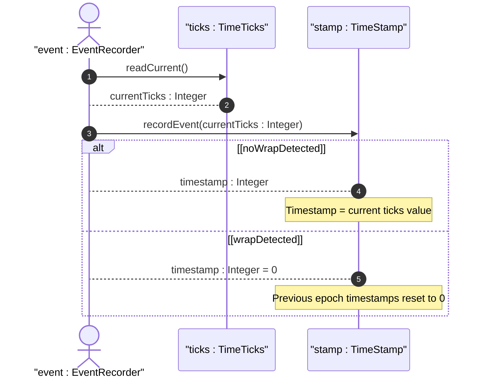
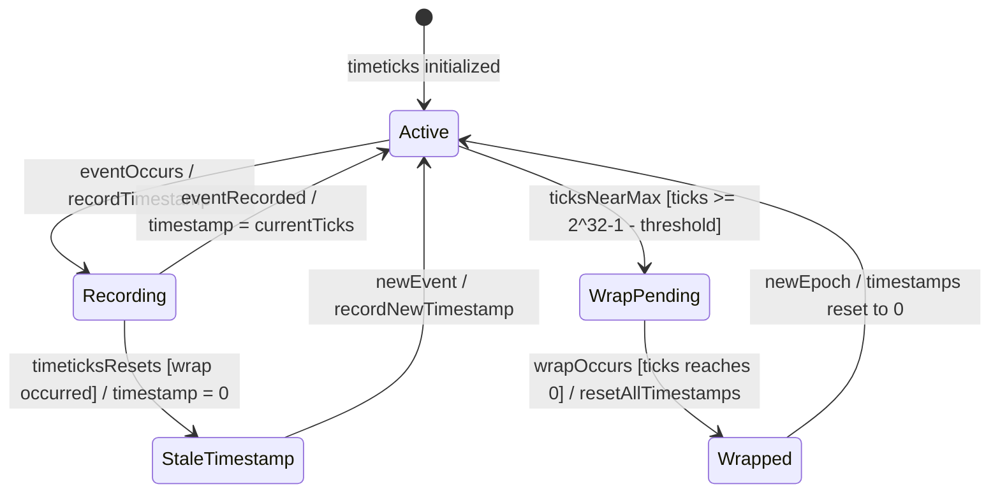

# User Story: Manage Timestamp Lifecycle Across Timeticks Wrap Cycles

## Parent Epic
- [ ] #25 - [ietf-yang-types: Common YANG Data Types](https://github.com/gintatkinson/dep-tst40/blob/main/docs/epics/epic-02-ietf-yang-types.md) (Timestamp lifecycle management is a behavioral application of the timeticks and timestamp typedefs)

## Domain Object Mapping
- **Primary Domain Objects:** TimeTicks (typedef), TimeStamp (typedef)
- **Actor/Role:** EventRecorder — the system component that records timestamps at event occurrences and manages their lifecycle across wrap boundaries

## BDD Scenario
**Given** an associated timeticks has value 4294967290 (near wrap) and a timestamp records an event at that value
**When** the timeticks wraps to 0 after ~1 second (100 centiseconds)
**Then** the timestamp resets to 0 along with all other timestamps associated with that timeticks, and any event predating the zeroing is indistinguishable

**As a** EventRecorder
**I want to** correctly interpret timestamp values across timeticks wrap boundaries
**So that** event ordering and time-since-event calculations remain valid within a single timeticks epoch

## UML Sequence Diagram

## UML State Machine Diagram

## Operational Context
> The timestamp type represents the value of an associated timeticks schema node instance at which a specific occurrence happened. When the specific occurrence occurred prior to the last time the associated timeticks was zero, then the timestamp value is zero. Note that this requires all timestamp values to be reset to zero when the value of the associated timeticks reaches 497+ days and wraps around to zero.

## Required Features Matrix
- [ ] #24 - [Define SNMP Temporal Types](https://github.com/gintatkinson/dep-tst40/blob/main/docs/features/feat-24-snmp-temporal-types.md) (The timeticks and timestamp typedefs are the structural foundation for timestamp lifecycle management)

## Source References
Structural Schema: [ietf-yang-types@2025-12-22.yang](https://github.com/YangModels/yang/blob/main/standard/ietf/RFC/ietf-yang-types%402025-12-22.yang)
Normative Specification: [RFC 9911](https://datatracker.ietf.org/doc/rfc9911/)
