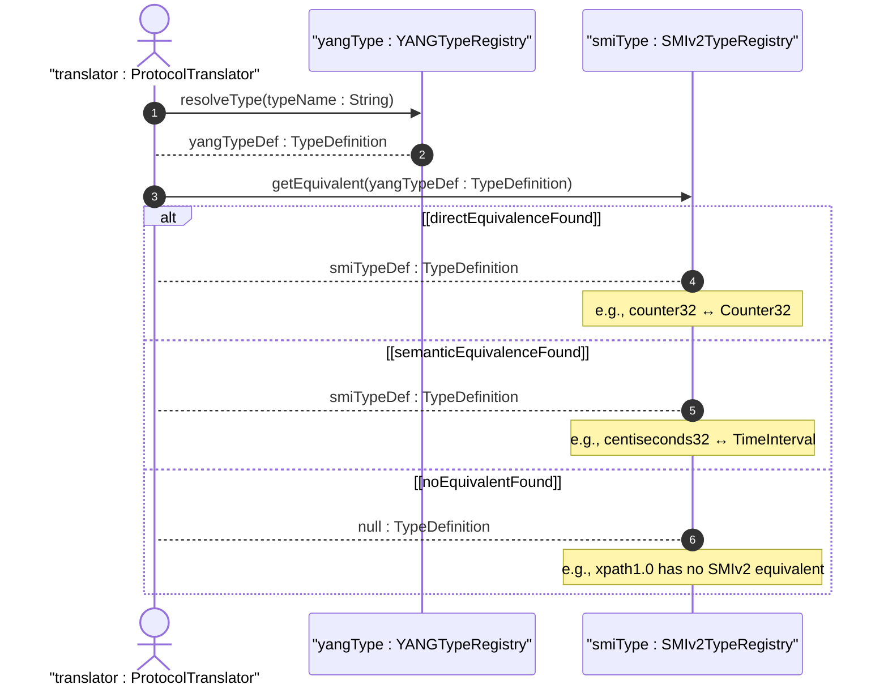

# User Story: Map YANG Data Types to SMIv2 Equivalents

## Parent Epic
- [ ] #25 - [ietf-yang-types: Common YANG Data Types](https://github.com/gintatkinson/dep-tst40/blob/main/docs/epics/epic-02-ietf-yang-types.md) (SMIv2 type mapping enables SNMP/YANG interoperability using the defined type equivalences)

## Domain Object Mapping
- **Primary Domain Objects:** All ietf-yang-types typedefs, SMIv2 type catalog
- **Actor/Role:** ProtocolTranslator — the system component that maps between YANG data models and SNMP MIB representations

## BDD Scenario
**Given** a YANG counter32 value of 2147483647
**When** the system translates the value to its SMIv2 equivalent for SNMP access
**Then** the system maps it to SMIv2 Counter32 with identical value 2147483647 and identical monotonic-increasing semantics

**As a** ProtocolTranslator
**I want to** map YANG data types to their equivalent SMIv2 types
**So that** YANG-modeled data can be accessed via SNMP and SNMP MIBs can be translated to YANG data models

## UML Sequence Diagram

## Operational Context
> Some types have an equivalent SMIv2 data type. A YANG data type is equivalent to an SMIv2 data type if the data types have the same set of values and the semantics of the values are equivalent. Table 3 lists the types defined in the ietf-yang-types YANG module with their corresponding SMIv2 types.

## Required Features Matrix
- [ ] #17 - [Define Counter Types](https://github.com/gintatkinson/dep-tst40/blob/main/docs/features/feat-17-counter-types.md) (Counter32/64 and zero-based variants map to SMIv2 Counter32/64/ZeroBasedCounter32/64)
- [ ] #18 - [Define Gauge Types](https://github.com/gintatkinson/dep-tst40/blob/main/docs/features/feat-18-gauge-types.md) (Gauge32 maps to SMIv2 Gauge32; Gauge64 maps to CounterBasedGauge64)
- [ ] #19 - [Define Object Identifier Types](https://github.com/gintatkinson/dep-tst40/blob/main/docs/features/feat-19-object-identifier-types.md) (Object-identifier-128 maps to SMIv2 OBJECT IDENTIFIER)
- [ ] #21 - [Define Time Duration Types](https://github.com/gintatkinson/dep-tst40/blob/main/docs/features/feat-21-duration-types.md) (Centiseconds32 maps to SMIv2 TimeInterval)
- [ ] #24 - [Define SNMP Temporal Types](https://github.com/gintatkinson/dep-tst40/blob/main/docs/features/feat-24-snmp-temporal-types.md) (TimeTicks and TimeStamp have direct SMIv2 equivalents)

## Source References
Structural Schema: [ietf-yang-types@2025-12-22.yang](https://github.com/YangModels/yang/blob/main/standard/ietf/RFC/ietf-yang-types%402025-12-22.yang)
Normative Specification: [RFC 9911](https://datatracker.ietf.org/doc/rfc9911/)
